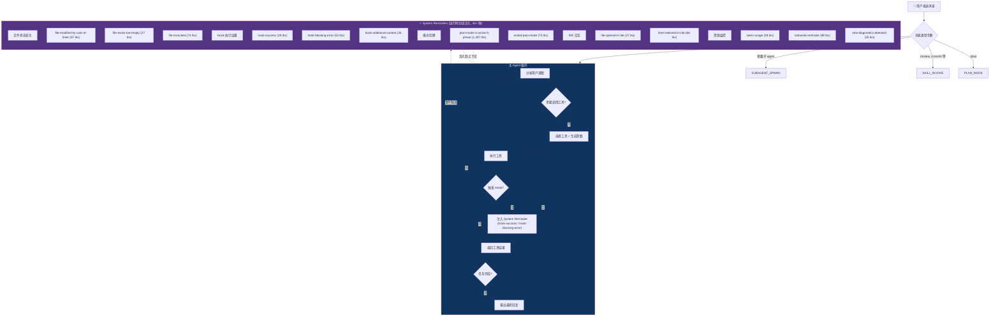
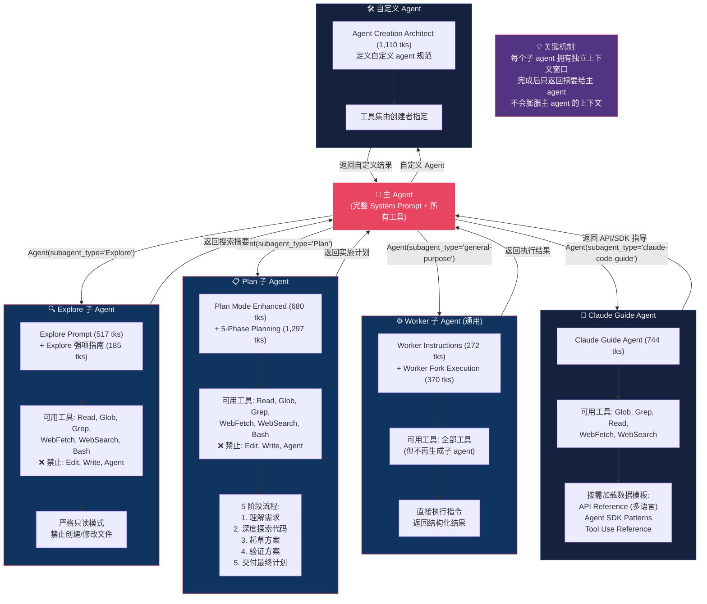
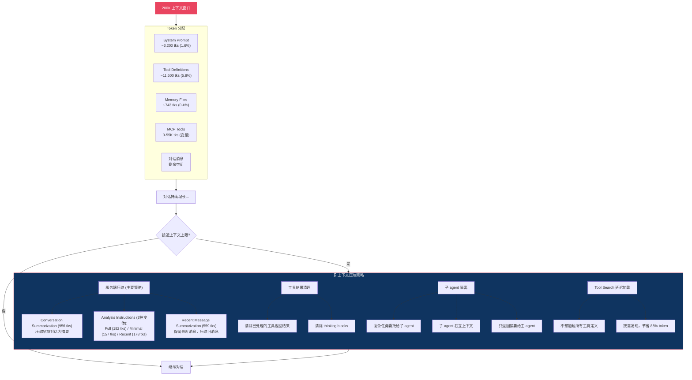
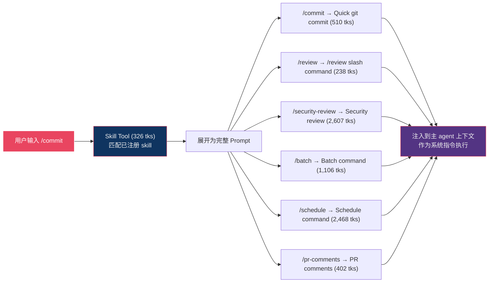
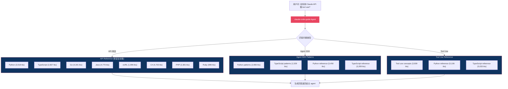
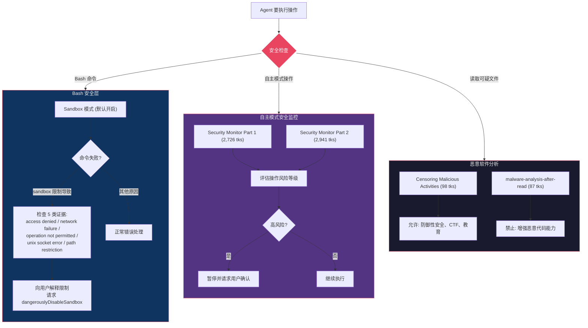
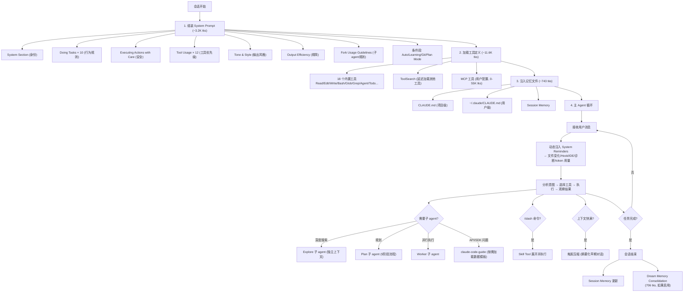

# Claude Code 提示词调用逻辑架构图

> 基于 [Piebald-AI/claude-code-system-prompts](https://github.com/Piebald-AI/claude-code-system-prompts) v2.1.81 分析

## 一、总体架构流程图

```mermaid
flowchart TB
    subgraph INIT["🚀 会话初始化 (每次会话开始时一次性加载)"]
        direction TB
        A[用户启动 Claude Code] --> B[组装 System Prompt]
        B --> B1["System Section (156 tks)<br/>身份声明 + 输出格式"]
        B --> B2["Doing Tasks 模块 (共 ~700 tks)<br/>10 个子文件拼接"]
        B --> B3["Executing Actions with Care (590 tks)<br/>安全操作规则"]
        B --> B4["Tool Usage 模块 (共 ~600 tks)<br/>12 个子文件拼接"]
        B --> B5["Tone & Style (55 tks)<br/>简洁 + 代码引用格式"]
        B --> B6["Output Efficiency (177 tks)<br/>输出精简指令"]
        B --> B7["Fork Usage Guidelines (326 tks)<br/>子 agent 规则"]
        B --> B8["条件段: Auto Mode / Learning Mode / Git Status / Plan Mode"]

        B1 & B2 & B3 & B4 & B5 & B6 & B7 & B8 --> C[完整 System Prompt<br/>~2,300-3,600 tks]
    end

    subgraph TOOLS["🔧 工具定义 (随 System Prompt 一起加载, ~11,600 tks)"]
        direction TB
        T1["核心工具 (始终加载)"]
        T1 --> T1a["Read (440 tks) — 读文件"]
        T1 --> T1b["Edit (246 tks) — 编辑文件"]
        T1 --> T1c["Write (129 tks) — 写文件"]
        T1 --> T1d["Bash (全部子文件 ~1,200 tks) — 执行命令"]
        T1 --> T1e["Glob (122 tks) — 文件搜索"]
        T1 --> T1f["Grep (300 tks) — 内容搜索"]
        T1 --> T1g["Agent/Task (879+186 tks) — 子 agent 调度"]
        T1 --> T1h["TodoWrite (2,161 tks) — 任务管理"]
        T1 --> T1i["WebFetch (297 tks) — 网页抓取"]
        T1 --> T1j["WebSearch (321 tks) — 网页搜索"]
        T1 --> T1k["Skill (326 tks) — 技能调用"]
        T1 --> T1l["AskUserQuestion (287 tks)"]
        T1 --> T1m["NotebookEdit (121 tks)"]

        T2["高级工具 (条件加载)"]
        T2 --> T2a["ToolSearch — 按需发现延迟工具"]
        T2 --> T2b["EnterPlanMode (878 tks)"]
        T2 --> T2c["ExitPlanMode (417 tks)"]
        T2 --> T2d["Computer (161 tks) — Chrome 自动化"]
        T2 --> T2e["TeammateTool (1,645 tks) — Swarm"]
        T2 --> T2f["CronCreate (754 tks)"]
        T2 --> T2g["EnterWorktree / ExitWorktree"]
        T2 --> T2h["LSP (255 tks)"]
        T2 --> T2i["Sleep (154 tks)"]

        T3["MCP 工具 (用户配置的外部工具)"]
        T3 --> T3a["每个 MCP server 额外增加 1K-10K+ tks"]
    end

    subgraph MEMORY["📝 记忆文件 (随 System Prompt 注入, ~743 tks)"]
        M1["CLAUDE.md — 项目级指令"]
        M2["~/.claude/CLAUDE.md — 用户级指令"]
        M3["Session Memory — 会话记忆"]
    end

    C --> TOOLS
    TOOLS --> MEMORY
    MEMORY --> READY["✅ 就绪：等待用户输入"]

    style INIT fill:#1a1a2e,stroke:#e94560,color:#eee
    style TOOLS fill:#16213e,stroke:#0f3460,color:#eee
    style MEMORY fill:#1a1a2e,stroke:#e94560,color:#eee
```

## 二、运行时动态注入流程

## 三、子 Agent 调度流程

## 四、上下文窗口管理流程

## 五、Skill / Slash Command 调用流程

## 六、数据模板按需加载（claude-code-guide agent 专用）

## 七、安全审查流程

## 八、完整调用逻辑汇总

---

## 关键设计启示（对构建类 Manus 产品的参考）

1. **模块化拼接 > 单体 Prompt**：66+ 个小文件按需拼接，而非一个巨大提示词
2. **工具定义即文档**：每个工具的 description 是给模型看的使用手册
3. **子 agent 隔离上下文**：复杂任务不膨胀主上下文，只返回摘要
4. **延迟加载**：ToolSearch 按需发现工具，数据模板按需加载
5. **动态注入 System Reminders**：40+ 种运行时事件通知，让模型感知环境变化
6. **分层安全**：Sandbox + Security Monitor + 用户确认，三层防护
7. **上下文预算意识**：System Prompt 只占 1.6%，为对话留足空间
