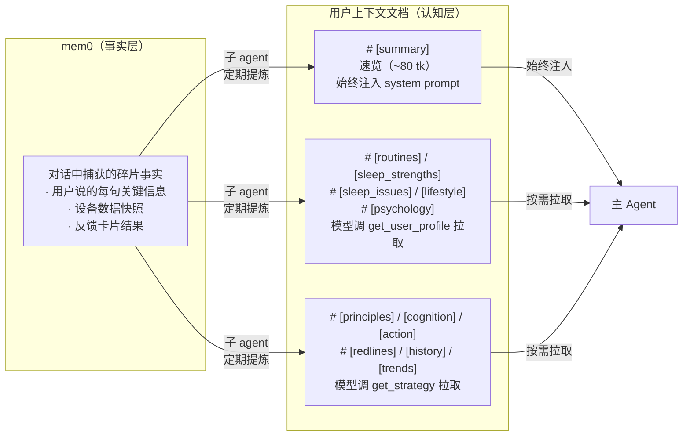

# 03 - 记忆系统

> mem0 存事实，子 agent 做提炼，一份文档按 section 供模型按需拉取

---

## 架构总览



**分工：**
- **mem0**：主 agent 在对话中随时写入，存原始事实碎片
- **子 agent**：定期从 mem0 + 健康数据中提炼，更新用户上下文文档（含速览）
- **主 agent**：速览始终可见；对话中根据需要调用 `get_user_profile` / `get_strategy` 按需拉取详细 section；只往 mem0 写事实，不直接改文档

---

## 用户速览（始终注入 system prompt）

速览是用户上下文文档的 `# [summary]` section，~80 token，始终注入 system prompt 的身份层之后。

### 职责

- 让模型在**不调任何工具时**也能做基本判断（纯闲聊场景）
- 红线关键词确保任何情况下不违反
- 沟通风格确保语气一致

### 格式

```
## 用户速览
30岁男/产品经理/晚型人/独居 | 核心问题:睡前手机→上床晚→时长不足 | 阶段:干预中期,手机放客厅试跑有效 | 红线:咖啡,早起运动 | 沟通:数据驱动,不喜鸡汤,偶尔自嘲
```

### 维护

由子 agent 在每次提炼时同步生成/更新。速览内容从各 section 中自动摘取关键信息压缩而成。

---

## Section 与工具 aspect 的映射

文档用 `# [section]` 标记分段。每个 section 对应一个工具的 aspect，服务端按映射提取返回。

```
文档 section          →  工具.aspect

# [summary]           →  始终注入 system prompt（不经工具）
# [routines]          →  get_user_profile.routines
# [sleep_strengths]   →  get_user_profile.sleep_strengths
# [sleep_issues]      →  get_user_profile.sleep_issues
# [lifestyle]         →  get_user_profile.lifestyle
# [psychology]        →  get_user_profile.psychology
# [principles]        →  get_strategy.principles
# [cognition]         →  get_strategy.cognition
# [action]            →  get_strategy.action
# [redlines]          →  get_strategy.redlines
# [history]           →  get_strategy.history
# [trends]            →  get_strategy.trends
```

---

## 完整文档示例

以下是子 agent 生成的完整用户上下文文档。模型不会一次看到全部内容——它只看到速览 + 本次调用请求的 sections。

```yaml
# [summary]
30岁男/产品经理/晚型人/独居 | 核心问题:睡前手机→上床晚→时长不足 | 阶段:干预中期,手机放客厅试跑有效 | 红线:咖啡,早起运动 | 沟通:数据驱动,不喜鸡汤,偶尔自嘲

# [routines]
常规工作日(一二四):
  工作 10:00-19:00, 晚餐~20:30, 刷手机→~01:30 入睡, 08:45 起床
加班日(周三固定, 偶尔其他):
  工作到~21:00, 外卖, 刷手机→~02:00 入睡, 需要"补偿性娱乐"
周五:
  常有聚餐, 社交→~02:30 入睡, 次日自然醒
周末:
  ~02:30 入睡, ~10:30 起床
备注:
  - 下午一杯咖啡是刚需
  - 周日晚会焦虑周一

# [sleep_strengths]
- 工作日起床时间稳定(08:45), 基本无赖床
- 入睡潜伏期正常(~15min), 上床后能较快入睡
- 夜间觉醒少, 睡眠连续性好
- 最近开始尝试行为干预, 执行日效果明显

# [sleep_issues]
- 睡眠时长不足(工作日均6.5h)
  ← 上床时间过晚(01:30+)
  ← 睡前刷手机1.5-2h无法自控停下(短视频、微信)
  ← 没有wind-down环节, 工作/手机→直接入睡
- 深睡占比偏低(18%, 正常20-25%)
  ← 可能与睡前高屏幕刺激有关(待确认)
- 周末作息后移(社交时差)
  ← 入睡晚1h+起床晚2h, 周一生物钟紊乱

# [lifestyle]
饮食: 晚餐~20:30, 偶尔加班日外卖; 下午咖啡(刚需,红线)
运动: 无固定运动习惯, 偶尔周末散步
环境: 独居, 最近换了遮光窗帘, 卧室温度偏高(夏天)
社交: 周五聚餐频繁, 偶尔周末约朋友

# [psychology]
压力源: 工作deadline、周日晚焦虑周一
情绪模式: 加班日需要"补偿性娱乐"来释放压力
性格: 理性, 数据导向, 不喜说教和鸡汤
沟通偏好: 直接说重点, 偶尔自嘲, 接受用数据说话的建议

# [principles]
核心杠杆:
  1. wind-down过渡 — 睡前刷手机1.5-2h直接入睡，大脑无缓冲，深睡占比仅18%(正常20-25%)
  2. 睡眠一致性 — 工作日vs周末就寝差2h+，每周一节律紊乱，是可预测的精力低谷
关联: wind-down解决深睡质量，一致性解决周初崩溃。先稳wind-down(已在推进)，再攻一致性。

# [cognition]
已建立:
  - 睡前手机影响入睡 [原理:wind-down] (认知有但行动未跟上→行动层解决)
  - 深睡的重要性 [原理:精力公式]
待建立:
  - 社交时差概念 [原理:睡眠一致性] ← 优先级:高, 直接影响周末行为决策
  - 酒精抑制深睡 [原理:兴奋剂管理] ← 优先级:中, 周五聚餐场景相关
引导策略:
  - 用他自己的数据做前后对比，不讲大道理
  - 触发器: 周末补觉数据出现时 → 用工作日vs周末深睡对比引入社交时差概念
  - 触发器: 周五聚餐后深睡数据明显差时 → 用当晚vs前一晚数据引入酒精与深睡的关系

# [action]
当前干预:
  名称: 手机放客厅
  原理锚点: wind-down过渡
  措施: 每晚23:00闹钟→手机放客厅充电
  状态: 试跑中(2026-03-23开始), 执行日入睡提前45min/深睡+3%
  阻力: 加班日(周三+偶发)"补偿性娱乐"需求强
偏好:
  接受: 环境改变、定时提醒、渐进式目标
  不接受: 需意志力的("忍住不刷手机")、大幅改作息的
  原则: 先小范围试跑, 数据证明有效再固化
下一步:
  有效路径: 固化→提前到22:30→引入轻度wind-down活动(拉伸/阅读)
  无效路径: 尝试手机定时锁屏工具辅助

# [redlines]
硬红线(用户明确拒绝):
  - 限制咖啡: "下午必须靠咖啡撑着" (2026-03-18)
  - 早起运动: "早上根本起不来" (2026-03-15)
软约束(建议谨慎):
  - 周五社交: 用户重视社交, 不要频繁建议减少
  - 饮酒话题: 用户表示不想讨论

# [history]
- 手机放客厅(03-20~03-22): 部分有效, 执行日入睡提前45min/深睡+3%, 加班日做不到
  学习: 环境设计对此用户有效[wind-down], 但加班日的补偿心理是独立阻力[psychology]
- 限制咖啡(03-18): 拒绝→红线
  学习: 咖啡是用户刚需, 兴奋剂管理杠杆不可从咖啡切入[兴奋剂管理]
- 早起运动(03-15): 拒绝→红线
  学习: 用户是晚型人, 早起本身逆节律, 不应从起床端施加压力[睡眠一致性]

# [trends]
本周(W13) vs 上周(W12):
  平均入睡: 01:15 → 01:05 (提前10min)
  平均时长: 6.5h → 6.8h (+18min)
  深睡占比: 16% → 18% (+2%)
  HRV均值: 42ms → 45ms (+3ms)
干预日 vs 非干预日(本周):
  入睡: 00:45 vs 01:25 (差40min)
  深睡: 21% vs 16% (差5%)
```

---

## 各 section 的设计说明

### 为什么速览 ~80 tk 就够

速览是"索引"，不是"全文"。它让模型在 0 工具调用时就能做到：
- 用对的语气说话（沟通风格）
- 不踩红线（红线关键词）
- 大致判断用户处于什么阶段（阶段描述）

需要详细信息时，模型会主动调工具拉取对应 section。

### 为什么睡眠拆为 strengths + issues

旧方案中"做得好的 + 待改善"一个 section 里面，模型每次都会看到全部。V3 拆开后：
- 需要夸用户 → 只拉 `sleep_strengths`（反馈卡"做到了"场景）
- 需要分析问题根因 → 只拉 `sleep_issues`
- 省 token，语义更精准

### 为什么策略拆 6 个 aspect（三层结构）

策略从"红线 + 当前干预 + 历史"的扁平结构，升级为三层结构：

- **原理层**（`principles`）：从 `睡眠第一性原理.md` 的 5 个杠杆中，定位对这个用户最重要的 2-3 个。所有认知引导和行动建议都锚定在这里。
- **认知+行动层**（`cognition` + `action`）：分别管理"用户理解了什么"和"用户在做什么"。认知层有学习路径和引导触发器；行动层合并了原 `active` + `preferences`，每个干预锚定到具体杠杆。
- **记录层**（`redlines` + `history` + `trends`）：边界、历史、数据，为上层决策提供依据。

每个 aspect 独立拉取，模型只在需要时才加载。详细结构定义见 `references/干预策略-structure.md`。

### 归因链 ← 符号

`sleep_issues` 中的归因链用 `←` 符号表示因果：
```
睡眠时长不足 ← 上床过晚 ← 刷手机 ← 没有 wind-down
```
一行看完因果链，模型不需要自己推导。

---

## mem0 写入规则

主 agent 在对话中捕获到以下类型信息时，通过 `save_memory` 写入 mem0：

| category | 说明 | 示例 |
|----------|------|------|
| `routine_detail` | 作息/生活细节 | "我周三固定要加班" |
| `sleep_positive` | 睡眠正向信息 | "昨晚试了放手机，觉得挺好的" |
| `sleep_negative` | 睡眠负向信息 | "昨晚翻来覆去睡不着" |
| `intervention_feedback` | 干预执行反馈 | "闹钟响了但我没理它，加班太晚了" |
| `preference` | 偏好或拒绝 | "别跟我说早睡早起那套" |
| `cognition` | 认知表达/误区 | "周末补回来就行了吧" |
| `environment` | 环境/设备变化 | "最近换了遮光窗帘" |

主 agent **不直接修改**上下文文档，只往 mem0 写事实。

---

## 子 Agent

子 agent 负责从 mem0 + 健康数据中提炼并更新用户上下文文档（含速览）。主 agent 不直接修改文档。

**核心约束：**
- 速览（`# [summary]`）控制在 ~80 token
- profile 类 sections 合计控制在 ~500 token
- strategy 类 sections 合计控制在 ~600 token（详见 `references/干预策略-structure.md` 的预算分配）
- 干预历史只保留最近 10 条
- 描述睡眠状况时必须同时覆盖 strengths 和 issues
- strategy 中的 `[principles]` 必须锚定到 `references/睡眠第一性原理.md` 的核心杠杆
- `[cognition]` 的引导触发器必须具体可判断，不用模糊表述
- `[action]` 中每个干预必须有原理锚点
- 文档的语气是"一个了解用户的睡眠顾问给同事做交接"

子 agent 的触发时机、输入输出规格、API 调用方式，详见 [08-orchestration.md](./08-orchestration.md) 的"子 Agent 编排"章节。
