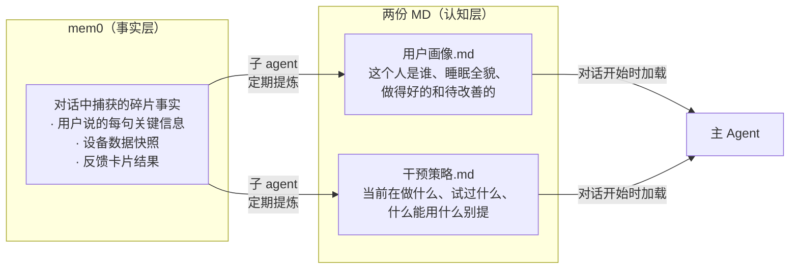

# 03 - 记忆系统

> mem0 存事实，子 agent 做提炼，两份 md 供对话加载

---

## 架构总览



**分工：**
- **mem0**：主 agent 在对话中随时写入，存原始事实碎片
- **子 agent**：定期从 mem0 + 健康数据中提炼，更新两份 md
- **主 agent**：对话开始时加载两份 md，获得完整上下文；对话中只往 mem0 写事实，不直接改 md

---

## 用户画像.md

描述"这个人是谁"以及"他的睡眠和精力状况全貌"——既有做得好的部分，也有待改善的部分。

### 格式规范

- 用缩进列表 / YAML 风格，不用 markdown 表格（省 token，agent 解析更快）
- 作息按**模式**归纳，不逐日列举（大部分工作日是相同的，只列出例外）
- 睡眠状况分"做得好的"和"待改善的"两面描述，不只找问题
- 待改善项给出归因链：现象 ← 直接原因 ← 根因

### 示例

```yaml
# 用户画像
# 更新于 2026-03-24 05:00

基本信息:
  男, 30岁, 夜猫子型, 互联网产品经理

作息模式:
  常规工作日(一二四):
    工作 10:00-19:00, 晚餐~20:30, 刷手机→~01:30 入睡, 08:45 起床
  加班日(周三固定, 偶尔其他):
    工作到~21:00, 外卖, 刷手机→~02:00 入睡, 需要"补偿性娱乐"
  周五:
    常有聚餐, 社交→~02:30 入睡, 次日自然醒
  周末:
    ~02:30 入睡, ~10:30 起床
  备注:
    - 下午一杯咖啡是刚需
    - 周日晚会焦虑周一

睡眠与精力状况:
  做得好的:
    - 工作日起床时间稳定(08:45), 基本无赖床
    - 入睡潜伏期正常(~15min), 上床后能较快入睡
    - 夜间觉醒少, 睡眠连续性好
    - 最近开始尝试行为干预, 执行日效果明显
  待改善:
    - 睡眠时长不足(工作日均6.5h)
      ← 上床时间过晚(01:30+)
      ← 睡前刷手机1.5-2h无法自控停下(短视频、微信)
      ← 没有wind-down环节, 工作/手机→直接入睡
    - 深睡占比偏低(18%, 正常20-25%)
      ← 可能与睡前高屏幕刺激有关(待确认)
    - 周末作息后移(社交时差)
      ← 入睡晚1h+起床晚2h, 周一生物钟紊乱

近期变化:
  - 深睡 16%→18%(W12 vs W11), 略有改善
  - "手机放客厅"干预执行2天, 入睡提前45min
```

### 为什么这样设计

**按模式归纳作息，不逐日列举：**
旧版 7 行表格 → 4 个模式。token 减少约 40%，且 agent 直接看到"这个人有哪几种典型日子"，不需要自己从 7 行中提取规律。

**"做得好的"必须有：**
- 如果用户睡眠本来不错，全是"做得好的"，agent 自然调整为肯定 + 微调的基调
- 如果用户问题很多，"做得好的"也提供了正面锚点——"你入睡速度其实很好，核心就是上床太晚"
- 避免 agent 陷入"找问题→给建议"的单一模式

**归因链用 ← 符号：**
`睡眠时长不足 ← 上床过晚 ← 刷手机 ← 没有 wind-down` 一行看完因果链，agent 不需要自己推导。

---

## 干预策略.md

描述"我们在做什么、试过什么、什么有效、什么别提"。

### 格式规范

- 同样用 YAML 风格
- 干预历史只保留最近 10 条
- 红线放在最前面（最重要的约束 agent 应最先看到）

### 示例

```yaml
# 干预策略
# 更新于 2026-03-24 05:00

红线:
  - 限制咖啡: "下午必须靠咖啡撑着"
  - 早起运动: "早上根本起不来"

当前干预:
  方向: 减少睡前手机使用, 建立wind-down环节
  活跃:
    - 每晚11点闹钟提醒放手机到客厅(3.23开始, 待反馈)
  下一步:
    - 有效 → 固化习惯, 逐步提前到10:30
    - 无效 → 尝试手机定时锁屏类工具辅助

干预历史:
  - 手机放客厅(3.20-3.22): 部分有效, 执行日入睡提前45min/深睡+3%, 加班日做不到
  - 限制下午咖啡(3.18): 用户拒绝 → 红线
  - 早起运动(3.15): 用户拒绝 → 红线
```

### 为什么红线放最前面

Claude 对 prompt 开头的内容关注度最高。红线是最容易违反、违反后果最严重的约束——用户被反复建议已经拒绝过的方向会非常恼火。放在最前面确保 agent 每次对话第一时间看到。

---

## mem0 写入规则

主 agent 在对话中捕获到以下类型信息时，写入 mem0：

| 信息类型 | 示例 |
|---------|------|
| 生活细节 | "我周三固定要加班" |
| 睡眠感受 | "昨晚翻来覆去睡不着" |
| 干预反馈 | "闹钟响了但我没理它" |
| 偏好/拒绝 | "别跟我说早睡早起那套" |
| 环境变化 | "最近换了遮光窗帘" |

主 agent **不直接修改** 两份 md，只往 mem0 写事实。

---

## 子 Agent

子 agent 负责从 mem0 + 健康数据中提炼并更新两份 md。主 agent 不直接修改 md。

**核心约束：**
- 两份 md 合计控制在 ~800 token 以内
- 干预历史只保留最近 10 条
- 描述睡眠状况时必须同时覆盖"做得好的"和"待改善的"
- md 的语气是"一个了解用户的睡眠顾问给同事做交接"

子 agent 的触发时机、输入输出规格、API 调用方式，详见 [08-orchestration.md](./08-orchestration.md) 的"子 Agent 编排"章节。
