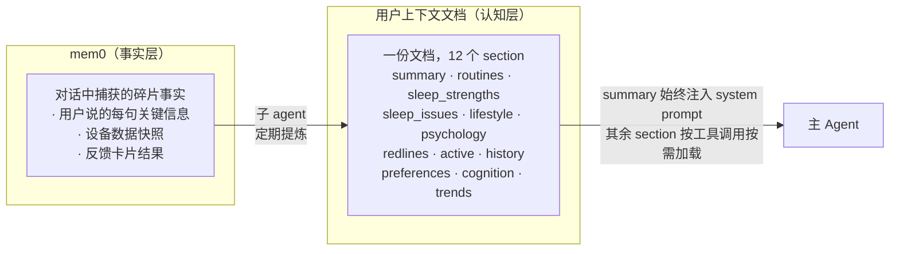

# 03 - 记忆系统

> mem0 存事实，子 agent 做提炼，一份用户上下文文档供工具按需加载

---

## 架构总览



**分工：**
- **mem0**：主 agent 在对话中随时写入，存原始事实碎片
- **子 agent**：定期从 mem0 + 健康数据中提炼，更新用户上下文文档
- **主 agent**：summary 始终可见（注入 system prompt）；其余 section 通过 `get_user_profile` / `get_strategy` 按需加载；对话中只往 mem0 写事实，不直接改文档

---

## 文档结构：12 个 section

一份文档，用 `# [section_name]` 标记。服务端按 section 名提取内容，映射到两个工具的 aspects 参数。

### section 与工具的映射

```
文档 section          →  工具.aspect

# [summary]           →  始终注入 system prompt（~80 tk）
# [routines]          →  get_user_profile.routines
# [sleep_strengths]   →  get_user_profile.sleep_strengths
# [sleep_issues]      →  get_user_profile.sleep_issues
# [lifestyle]         →  get_user_profile.lifestyle
# [psychology]        →  get_user_profile.psychology
# [redlines]          →  get_strategy.redlines
# [active]            →  get_strategy.active
# [history]           →  get_strategy.history
# [preferences]       →  get_strategy.preferences
# [cognition]         →  get_strategy.cognition
# [trends]            →  get_strategy.trends
```

### 两个工具的语义分工

| 工具 | 语义 | 包含的 section |
|------|------|---------------|
| `get_user_profile` | "这个人是谁" — 理解用户，做出恰当回应 | routines, sleep_strengths, sleep_issues, lifestyle, psychology |
| `get_strategy` | "我该怎么做" — 给建议、回应反馈、引导认知 | redlines, active, history, preferences, cognition, trends |

拆两个工具而非一个工具加 domain 参数，原因：
1. 工具描述可以精准引导模型"什么时候该调哪个"
2. 需要两类信息时可以并行调用
3. 语义更清晰——模型不需要在一个大 enum 里挑选

---

## summary 速览

始终注入 system prompt，~80 tk。让模型在不调任何工具时也能做基本判断。

**格式：** 一行式摘要，包含基本信息 / 核心问题 / 阶段 / 红线关键词 / 沟通风格。

**示例：**
```
## 用户速览
30岁男/产品经理/晚型人/独居 | 核心问题:睡前手机→上床晚→时长不足 | 阶段:干预中期,手机放客厅试跑有效 | 红线:咖啡,早起运动 | 沟通:数据驱动,不喜鸡汤,偶尔自嘲
```

**速览的职责：**
- 让模型在不调任何工具时也能做基本判断（纯闲聊场景）
- 红线关键词确保任何情况下不违反
- 沟通风格确保语气一致

---

## 各 section 格式规范与示例

以下用 profile-a（夜猫子上班族）作为示例。完整示例见 `eval/user-contexts/profile-a.yaml`。

### get_user_profile 相关 section

#### [routines] — 作息模式

按**典型日分类**的完整时间线，不逐日列举。

```yaml
# [routines]
常规工作日(一二四):
  09:50出门, 10:00-19:00坐班, 午餐外卖工位吃
  19:30到家, 外卖或简单做饭, ~20:30吃完
  20:30-22:00 沙发刷手机(抖音/B站/微信), 偶尔打一局游戏
  22:00-23:30 继续刷或看剧, 主观觉得在"放松"实际越刷越兴奋
  23:30-01:00 意识到该睡了但"再看最后一个"循环
  ~01:30放下手机, ~15min入睡
  08:30闹钟, 08:45起床, 无赖床但觉得没睡够
加班日(周三固定, 偶尔周一):
  工作到~21:00, 回家外卖, "今天太累了值得犒劳自己"→补偿性娱乐
  →~02:00入睡, 次日下午3-4点有明显困意低谷
周末:
  周六睡到10:00-10:30自然醒, 下午约朋友或宅家打游戏
  ~02:30入睡(无第二天起床压力)
  周日晚焦虑周一→入睡反而更晚(~03:00)
```

#### [sleep_strengths] — 睡眠做得好的

好习惯和正面表现，肯定用户时用。

```yaml
# [sleep_strengths]
- 入睡能力强: 放下手机后~15min入睡, 入睡潜伏期正常
- 睡眠连续性好: 夜间觉醒极少(月均<2次), 一觉到天亮
- 起床自律: 工作日08:45稳定起床, 从不用第二个闹钟
- 干预响应好: 手机放客厅执行日效果显著, 已有正反馈循环
```

#### [sleep_issues] — 睡眠待改善

问题 + 归因链：现象 ← 原因 ← 根因。

```yaml
# [sleep_issues]
- 睡眠时长不足(工作日均6.5h, 理想7-7.5h)
  ← 上床时间过晚(01:30+)
  ← 睡前刷手机1.5-2h, 主观在"放松"实际延迟入睡
  ← 无screen-off到入睡的过渡环节
  ← 深层: 白天压力→晚上用手机做情绪调节(逃避型)
- 深睡占比偏低(近7天均值18%, 正常20-25%)
  ← 与入睡前屏幕时间相关(r=0.72, 基于14天数据)
  ← 干预日深睡可达21-23%, 说明生理能力正常
```

#### [lifestyle] — 生活方式

饮食 / 运动 / 环境。

```yaml
# [lifestyle]
饮食:
  早餐基本不吃, 偶尔公司茶水间面包
  咖啡: 每天下午2-3点一杯美式, 刚需
  晚餐后偶尔零食, 无固定夜宵
运动:
  几乎不运动, 日均步数3000-4000(通勤+办公室)
  偶尔周末打羽毛球(月均1-2次)
环境:
  独居, 朝南卧室, 已安装遮光窗帘(3.19)
  手机原本充电在床头(已买小闹钟替代)
  养一只猫
```

#### [psychology] — 心理画像

压力 / 情绪 / 性格 / 沟通偏好。

```yaml
# [psychology]
压力与情绪:
  工作压力中等偏上, 近期有重要项目deadline(4月中)
  压力应对: 不是失眠型焦虑, 而是逃避型拖延——压力越大越想刷手机
  对"管不住手"有挫败感, 但看到干预数据改善后态度明显积极
性格沟通:
  理性, 偏好数据说服, 不喜欢鸡汤式表达
  偶尔自嘲式幽默("我就是管不住自己")
  对"被教育感"敏感, 不喜欢说教
对App态度:
  看到手机放客厅的深睡+3%数据后开始认真对待
  数据驱动型动力: 看到数字改善比道理更有驱动力
```

### get_strategy 相关 section

#### [redlines] — 红线与约束

区分硬红线（明确拒绝）和软约束（有顾虑但未完全拒绝），保留用户原话。

```yaml
# [redlines]
硬红线(用户明确拒绝, 不可触碰):
  - 限制/减少下午咖啡
    原话: "下午必须靠咖啡撑着, 不喝真的会困死"
    记录于3.18, 讨论咖啡对深睡影响时明确拒绝
  - 早起运动/晨跑
    原话: "早上根本起不来, 别跟我说晨跑"
    记录于3.15, 语气较强烈
软约束(有顾虑但未完全拒绝):
  - 周末保持工作日起床时间
    反应: "周末好不容易能多睡会, 不太想这么苛刻"
    判断: 暂不推, 等工作日作息稳定后视情况提
```

#### [active] — 当前活跃干预

方向 / 具体措施 / 状态 / 数据 / 阻力 / 下一步路径。

```yaml
# [active]
主线方向: 减少睡前手机使用 → 建立screen-off到入睡的过渡环节
核心逻辑: 入睡能力没问题(15min), 瓶颈是"放不下手机"→上床太晚→时长不够
活跃干预:
  - [手机放客厅] 每晚23:00闹钟提醒放手机到客厅充电
    开始: 3.23, 状态: 待反馈
    试跑数据(3.20-3.22): 执行2/3天, 入睡提前45min, 深睡+3%
    已知阻力: 加班日太晚回来→没精力执行; 用手机当闹钟(已购小闹钟替代)
下一步:
  路径A(有效): → 稳定1周后提醒从23:00→22:30 → 引入替代活动
  路径B(无效): → iOS屏幕时间限制 → 或手机调灰度
```

#### [history] — 干预历史

最近 10 条，每条含结果 / 数据 / 学习。

```yaml
# [history]
- 手机放客厅 v1(3.20-3.22, 试跑):
  部分有效, 执行2/3天, 入睡提前45min, 深睡16→19%
  加班日未执行(合理), 反馈"放了之后确实很快就困了"
- 限制下午咖啡(3.18): 拒绝→红线
- 早起运动(3.15): 拒绝→红线
- 遮光窗帘(3.12): 有效→已固化, 周末晨光唤醒消除
```

#### [preferences] — 干预偏好

用户接受什么类型的方法。

```yaml
# [preferences]
- 偏好"一步到位"物理手段(遮光窗帘/放手机到客厅), 不喜欢需要持续自控的方法
- 加班日/状态差时执行力低, 不应在这些日子设高要求
- 看到数据改善(深睡+3%)后明显更积极, 数据是核心驱动力
- 需要外部提醒(闹钟/推送), 单靠"自己记得"大概率做不到
```

#### [cognition] — 睡眠认知

用户已有的正确认知 + 误区及引导方向 + 适合的说服方式。

```yaml
# [cognition]
已有正确认知:
  - 知道自己是晚型人, 不强求"早睡早起"(和agent对话后接受的)
  - 理解"睡眠时长"和"睡眠质量"是两回事(看过深睡数据后自己总结的)
  - 认同手机是核心问题(多次对话中反复提到"管不住手")
存在的误区:
  - "周末补觉能还睡眠债"
    实际: 周末多睡无法完全弥补工作日欠的深睡和REM, 且加剧社交时差
    引导: 不直接否定, 等聊周一精力差时关联"周末作息偏移→周一时差感"
  - "只要睡够时长就行, 几点睡不重要"
    实际: 入睡时间的规律性影响昼夜节律稳定性
    引导: 等干预稳定后, 用他自己的数据"同样7h, 01:00 vs 02:30睡深睡差别大"
  - 把刷手机等同于"放松"
    引导: 不说教, 让干预日的体感(入睡更快/起来更清醒)自己说话
引导策略:
  - 数据驱动: 讲道理不如给数据("执行日深睡22%, 不执行16%")
  - 用"发现"语气而非"纠正"语气
```

#### [trends] — 近期趋势

周对比数据 + 干预日 vs 非干预日。

```yaml
# [trends]
W12 vs W11:
  入睡时间: 工作日均值01:22→01:05(干预日拉低均值)
  睡眠时长: 6h25m→6h48m(+23min)
  深睡占比: 16%→18%(+2pp)
  睡眠效率: 89%→91%
  精力主观评分: 5.2→5.8(满分10)
干预日 vs 非干预日(W12):
  入睡: 00:48 vs 01:35
  深睡: 22% vs 16%
  精力: 6.5 vs 5.2
```

---

## 设计说明

### 为什么从"两份 md"改为"一份文档 12 个 section"

旧设计是两份 md（画像 + 策略），每次对话开始由 orchestrator 一次性全部注入 system prompt（~800 tk）。新设计改为：

| 维度 | 旧设计（两份 md） | 新设计（12 section） |
|------|-----------------|-------------------|
| 注入方式 | orchestrator 自动全量注入 | summary 始终注入（~80 tk），其余按需加载 |
| 粒度 | 画像 vs 策略，两大块 | 12 个 section，按意图拆成两个工具的 aspects |
| token 消耗 | 每次对话固定 ~800 tk | 纯闲聊只需 ~80 tk，需要时再拉具体 section |
| 模型能力 | 模型被动接收全部信息 | 模型主动判断需要哪些信息，按需调用 |

### 按模式归纳作息，不逐日列举

旧版 7 行表格 → 按典型日分类。token 减少约 40%，且 agent 直接看到"这个人有哪几种典型日子"，不需要自己从 7 行中提取规律。

### sleep_strengths 和 sleep_issues 分开

- 需要肯定用户时，只拉 `sleep_strengths`——正面锚点不和问题混在一起
- 需要分析问题时，只拉 `sleep_issues`——归因链清晰，不被正面信息干扰
- 避免 agent 陷入"找问题→给建议"的单一模式

### 归因链用 ← 符号

`睡眠时长不足 ← 上床过晚 ← 刷手机 ← 没有 wind-down` 一行看完因果链，agent 不需要自己推导。

### 红线区分硬/软 + 保留原话

- 硬红线绝对不能碰，软约束可以在合适时机重新探讨
- 保留原话让 agent 理解用户拒绝的强度和语境

---

## mem0 写入规则

主 agent 在对话中捕获到以下类型信息时，写入 mem0：

| 信息类型 | 示例 |
|---------|------|
| 生活细节 | "我周三固定要加班" |
| 睡眠感受 | "昨晚翻来覆去睡不着" |
| 干预反馈 | "闹钟响了但我没理它" |
| 偏好/拒绝 | "别跟我说早睡早起那套" |
| 环境变化 | "最近换了遮光窗帘" |

主 agent **不直接修改**用户上下文文档，只往 mem0 写事实。

---

## 子 Agent

**触发时机：** 每天凌晨 05:00 + 每次对话结束后异步触发

**输入：** mem0 中该用户的所有记忆 + 最近 7 天健康数据 + 当前用户上下文文档

**职责：**
更新用户上下文文档的 12 个 section —— 补充生活细节、刷新作息模式、更新睡眠状况（strengths 和 issues）、记录干预结果、调整当前策略、维护红线、更新认知状态、刷新数据趋势。

**原则：**
- 文档是给主 agent 看的，写成"一个了解用户的睡眠顾问会怎么给同事做交接"的语气
- summary 控制在 ~80 token（一行式摘要）
- 各 section 按需详略，总文档不设硬上限，但单个 section 返回给模型时通常 100-300 tk
- 干预历史只保留最近 10 条，更早的提炼为规律后删除
- sleep_strengths 和 sleep_issues 必须都有内容，不能只挑问题
