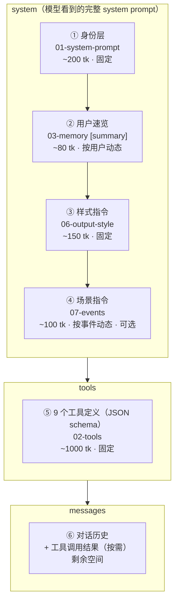

# 04 - 上下文组装

> 每次 API 调用时，system / tools / messages 怎么拼、token 怎么分
> **本文档是 system prompt 组装的权威定义**——模型看到的完整 system prompt 由本文档描述的 4 个块拼接而成

---

## 组装结构



### 各块来源与加载方式

| # | 块名 | 来源文档 | 性质 | 加载方式 |
|---|------|---------|------|------------|
| ① | 身份层 | [01-system-prompt](./01-system-prompt.md) | 固定 | 硬编码在代码中 |
| ② | 用户速览 | [03-memory](./03-memory.md) `# [summary]` | 按用户动态 | orchestrator 从数据库加载，注入 system |
| ③ | 样式指令 | [06-output-style](./06-output-style.md) | 固定 | 硬编码在代码中 |
| ④ | 场景指令 | [07-events](./07-events.md) | 按事件动态 | 状态机判定 INVOKE 后，按场景模板生成 |
| ⑤ | 工具定义 | [02-tools](./02-tools.md) | 固定 | API 的 tools 参数 |
| ⑥ | 对话历史 | 运行时 | 动态 | API 的 messages 参数 |

### 与旧方案的关键差异

旧方案中，**用户画像.md 和干预策略.md 整体注入 system prompt**（~800 tk）。V3 改为：
- **速览（~80 tk）始终注入 system**——模型在不调任何工具时也能做基本判断
- **详细 sections 由模型按需拉取**——通过 `get_user_profile` / `get_strategy` 工具调用，结果进入 messages（对话上下文）
- 好处：system 更轻量，模型只加载本次对话真正需要的信息

### 拼接顺序的设计理由

模型对 system prompt **开头和结尾**的内容关注度最高：

1. **身份层放最前**——agent 首先知道"我是谁、核心原则是什么"
2. **速览紧随其后**——agent 接着知道"我面对的用户基本情况、红线关键词、沟通风格"
3. **样式指令在中间**——约束输出行为，位置稳定
4. **场景指令放最后**——离对话历史最近，和当前上下文关联最强，模型更容易将其与用户消息联系起来

---

## 完整 System Prompt 模板

以下是模型在每次 API 调用中实际看到的 system prompt 全貌。工程团队按此模板拼接。

```
┌─────────────────────────────────────────────────────────────┐
│ ① 身份层（01-system-prompt，固定，~200 tk）                   │
│ → 完整内容见 01-system-prompt.md                              │
├─────────────────────────────────────────────────────────────┤
│ ② 用户速览（03-memory [summary]，按用户动态，~80 tk）          │
│ → 格式见 03-memory.md "用户速览" 章节                         │
├─────────────────────────────────────────────────────────────┤
│ ③ 样式指令（06-output-style，固定，~150 tk）                  │
│ → 完整内容见 06-output-style.md "注入 system prompt 的样式指令"│
├─────────────────────────────────────────────────────────────┤
│ ④ 场景指令（07-events，按事件动态，~100 tk，可选）             │
│ → 5 种场景模板见 07-events.md "场景指令" 章节                  │
│ → 用户主动发消息时此块为空                                     │
└─────────────────────────────────────────────────────────────┘
```

> **对标 Claude Code**：Claude Code 的 system prompt 合计 ~3,200 tk。精力管家的固定部分（① + ③）只有 ~350 tk，加上动态部分（② + ④）合计 ~530 tk——更轻量，因为详细上下文按需拉取而非预注入。

---

## Token 预算

以 Claude Sonnet 200K 上下文为基准，实际对话不会太长（非编程场景），预留 8K 足够：

| 区块 | 预算 | 性质 | 说明 |
|------|------|------|------|
| ① 身份层 | ~200 tk | 固定 | 不随用户变化 |
| ② 用户速览 | ~80 tk | 动态 | 子 agent 控制篇幅 |
| ③ 样式指令 | ~150 tk | 固定 | 不随用户变化 |
| ④ 场景指令 | ~100 tk | 动态 | 按触发场景注入，可能为空 |
| ⑤ 工具定义 | ~1000 tk | 固定 | 9 个工具的 JSON schema |
| **system + tools 合计** | **~1,530 tk** | | 比旧方案省 ~520 tk |
| 对话历史 + 工具结果 | ~4500 tk | 动态 | 包含 get_user_profile / get_strategy 返回的 sections |
| 模型输出 | ~2000 tk | | 单次回复上限 |
| **总计** | **~8,030 tk** | | 远低于上下文上限，无压缩需求 |

> 精力管家是短对话场景（用户聊几句就走），不像 Claude Code 动辄几百轮。
> 不需要设计对话压缩策略，如果未来对话变长再考虑。

---

## 组装流程（伪代码）

```python
# ── 固定部分（启动时加载一次）──

SYSTEM_PROMPT = load_file("01-system-prompt.txt")      # ① 身份层
STYLE_INSTRUCTION = load_file("06-style-instruction.txt")  # ③ 样式指令
TOOL_DEFINITIONS = load_file("02-tools.json")           # ⑤ 工具定义（9 个）


# ── 每次 API 调用时组装 ──

def assemble_context(user_id, trigger_event, conversation_history):
    system_parts = []

    # ① 身份层 — 固定
    system_parts.append(SYSTEM_PROMPT)

    # ② 用户速览 — 从数据库加载 [summary] section
    user_summary = db.get_user_summary(user_id)  # ~80 tk
    system_parts.append(user_summary)

    # ③ 样式指令 — 固定
    system_parts.append(STYLE_INSTRUCTION)

    # ④ 场景指令 — 根据触发事件注入（详见 07-events）
    if trigger_event:
        system_parts.append(render_scene_instruction(trigger_event))

    return {
        "model": "claude-sonnet-4-20250514",
        "max_tokens": 2048,
        "system": "\n\n".join(system_parts),    # ①②③④ 拼接
        "tools": TOOL_DEFINITIONS,               # ⑤
        "messages": conversation_history,        # ⑥
    }
```

> **注意**：旧方案中 `get_user_context(user_id)` 在此处自动注入画像+策略到 system。V3 不再这样做——模型在 agent 循环中按需调用 `get_user_profile` / `get_strategy`，结果作为 tool_result 进入 messages。

---

## 各场景下的组装差异

不同触发场景下，system prompt 的组成有细微差异：

| 场景 | ①身份 | ②速览 | ③样式 | ④场景指令 | 对话历史 |
|------|:-----:|:-----:|:-----:|:---------:|:-------:|
| 用户主动发消息 | ✅ | ✅ | ✅ | 空 | 携带 |
| 反馈卡提交 | ✅ | ✅ | ✅ | 反馈数据 | 携带 |
| 提醒推送被点击 | ✅ | ✅ | ✅ | 提醒上下文 | 空（新对话） |
| 子 agent 洞察 | ✅ | ✅ | ✅ | 洞察描述 | 空（新对话） |
| 新睡眠数据 | ✅ | ✅ | ✅ | 数据摘要 | 空（新对话） |
| 新用户首次对话 | ✅ | 空模板 | ✅ | 空 | 空 |

> **对话历史为空 vs 携带**：agent 主动开口的场景（推送点击、洞察、新数据）是新对话，不携带历史；用户主动发消息和反馈卡提交是在已有对话中，携带历史。详见 [07-events.md](./07-events.md)。

---

## 首次对话（新用户）

新用户没有上下文文档，② 速览使用空模板：

```
## 用户速览
暂无数据，请通过对话了解用户。
```

此时模型调用 `get_user_profile` 或 `get_strategy` 会返回空结果。agent 的行为由身份层原则 2 驱动——"如果你对用户的情况了解不够，先提问"。不需要额外的"新用户引导指令"，agent 自然会进入提问模式。

---

## 注意事项

- **`get_user_profile` 和 `get_strategy` 在模型工具列表中**（详见 [02-tools.md](./02-tools.md)），由模型在对话中按需调用，结果进入 messages 上下文。
- **速览始终注入 system**：即使模型不调任何工具，也能通过速览做基本判断（红线、沟通风格、用户阶段）。
- **场景指令是可选的**：没有特殊触发事件时（如用户主动发消息），④ 为空。
- **上下文文档的更新时机**：文档由子 agent 异步更新。模型通过工具拉取的是上次子 agent 运行后的版本。对话中新写入 mem0 的事实，要到下次子 agent 运行后才反映在文档中。
- **样式指令独立于身份层**：身份层定义"做什么"，样式指令定义"怎么做"。分开维护，修改输出风格不影响核心原则。
