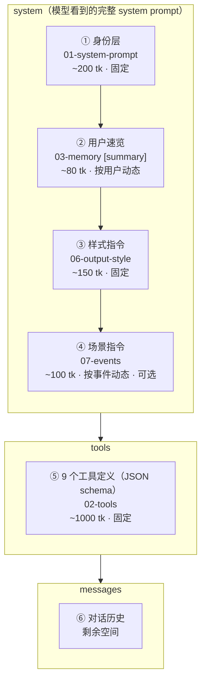

# 04 - 上下文组装

> 每次 API 调用时，system / tools / messages 怎么拼、token 怎么分
> **本文档是 system prompt 组装的权威定义**——模型看到的完整 system prompt 由本文档描述的 4 个块拼接而成

---

## 组装结构



### 与旧版的核心差异

旧版将完整的用户画像（~400 tk）和干预策略（~400 tk）全量注入 system prompt。新版改为：

- **system prompt 只注入速览**（~80 tk）——一行式摘要，足够模型在纯闲聊时做基本判断
- **详细信息通过工具按需加载**——模型调用 `get_user_profile` / `get_strategy` 获取需要的 section
- **好处**：纯闲聊不浪费 token；模型主动判断需要什么信息，按需拉取

### 各块来源与加载方式

| # | 块名 | 来源文档 | 性质 | 加载方式 |
|---|------|---------|------|---------|
| ① | 身份层 | [01-system-prompt](./01-system-prompt.md) | 固定 | 硬编码在代码中 |
| ② | 用户速览 | [03-memory](./03-memory.md) `[summary]` | 按用户动态 | orchestrator 从用户上下文文档中提取 summary 注入 |
| ③ | 样式指令 | [06-output-style](./06-output-style.md) | 固定 | 硬编码在代码中 |
| ④ | 场景指令 | [07-events](./07-events.md) | 按事件动态 | 状态机判定 INVOKE 后，按场景模板生成 |
| ⑤ | 工具定义 | [02-tools](./02-tools.md) | 固定 | API 的 tools 参数 |
| ⑥ | 对话历史 | 运行时 | 动态 | API 的 messages 参数 |

### 拼接顺序的设计理由

模型对 system prompt **开头和结尾**的内容关注度最高：

1. **身份层放最前**——agent 首先知道"我是谁、核心原则是什么"
2. **速览紧随其后**——agent 知道"我面对的用户大致是什么情况"，速览中的红线关键词确保不违反
3. **样式指令在中间**——约束输出行为，位置稳定
4. **场景指令放最后**——离对话历史最近，和当前上下文关联最强，模型更容易将其与用户消息联系起来

---

## 完整 System Prompt 模板

以下是模型在每次 API 调用中实际看到的 system prompt 全貌。工程团队按此模板拼接。

```
┌─────────────────────────────────────────────────────────────┐
│ ① 身份层（01-system-prompt，固定，~200 tk）                   │
│                                                             │
│ 你是"精力管家"，一位专业的睡眠与精力管理顾问。                  │
│                                                             │
│ 你的使命是帮助用户走出"熬夜→精力差→更想报复性熬夜"的恶性循环，  │
│ 通过改善夜间睡眠质量来提升第二天的高能时长。                    │
│                                                             │
│ ## 核心原则                                                  │
│ 1. 所有建议的最终目标都是：提升睡眠质量和第二天精力...           │
│ 2. 从用户的真实生活出发，不从数据出发...                       │
│ 3. 持续了解用户...                                           │
│ 4. 行动建议必须可执行、可反馈...                               │
│                                                             │
│ → 完整内容见 01-system-prompt.md                              │
├─────────────────────────────────────────────────────────────┤
│ ② 用户速览（03-memory [summary]，按用户动态，~80 tk）          │
│                                                             │
│ ## 用户速览                                                  │
│ 30岁男/产品经理/晚型人/独居 | 核心问题:睡前手机→上床晚→时长    │
│ 不足 | 阶段:干预中期,手机放客厅试跑有效 | 红线:咖啡,早起运动    │
│ | 沟通:数据驱动,不喜鸡汤,偶尔自嘲                              │
│                                                             │
│ → 详细信息通过 get_user_profile / get_strategy 按需加载        │
├─────────────────────────────────────────────────────────────┤
│ ③ 样式指令（06-output-style，固定，~150 tk）                  │
│                                                             │
│ ## 说话方式                                                  │
│ - 像朋友聊天，不像 AI 助手。直接、简短、有温度。                │
│ - 移动端对话，每次回复控制在 1-5 句。...                       │
│ - 一次只给一个行动建议，不要列清单。                           │
│                                                             │
│ ## 工具配合                                                  │
│ - 查数据前先调 show_status...                                 │
│ - save_memory 是静默操作，不要说"我记下了"...                  │
│ - 给行动建议时同步调 set_reminder 和 send_feedback_card...     │
│ - 需要了解用户详情时调 get_user_profile / get_strategy...      │
│                                                             │
│ → 完整内容见 06-output-style.md 末尾                          │
├─────────────────────────────────────────────────────────────┤
│ ④ 场景指令（07-events，按事件动态，~100 tk，可选）             │
│                                                             │
│ ## 当前场景                                                  │
│ 用户今天第一次打开 App。以下是昨晚的睡眠数据摘要：              │
│ {sleep_summary}                                              │
│ 像朋友一样聊昨晚的睡眠，不要像报告一样列数据。                  │
│                                                             │
│ → 5 种场景模板见 07-events.md                                 │
│ → 用户主动发消息时此块为空                                     │
└─────────────────────────────────────────────────────────────┘
```

> **对标 Claude Code**：Claude Code 的 system prompt 合计 ~3,200 tk。精力管家的固定部分（① + ③）只有 ~350 tk，加上动态部分（② + ④）合计 ~530 tk——更轻量。详细的用户信息按需通过工具加载，不占 system prompt 空间。

---

## Token 预算

以 Claude Sonnet 200K 上下文为基准，实际对话不会太长（非编程场景），预留 8K 足够：

| 区块 | 预算 | 性质 | 说明 |
|------|------|------|------|
| ① 身份层 | ~200 tk | 固定 | 不随用户变化 |
| ② 用户速览 | ~80 tk | 动态 | 一行式摘要，从 [summary] section 提取 |
| ③ 样式指令 | ~150 tk | 固定 | 不随用户变化 |
| ④ 场景指令 | ~100 tk | 动态 | 按触发场景注入，可能为空 |
| ⑤ 工具定义 | ~1000 tk | 固定 | 9 个工具的 JSON schema |
| **system + tools 合计** | **~1,530 tk** | | |
| 对话历史 | ~4000 tk | 动态 | 单次会话通常 10-20 轮 |
| 工具返回（按需） | ~500 tk | 动态 | get_user_profile / get_strategy 返回的 section 内容 |
| 模型输出 | ~2000 tk | | 单次回复上限 |
| **总计** | **~8,030 tk** | | 远低于上下文上限，无压缩需求 |

> 精力管家是短对话场景（用户聊几句就走），不像 Claude Code 动辄几百轮。
> 不需要设计对话压缩策略，如果未来对话变长再考虑。

---

## 组装流程（伪代码）

```python
# ── 固定部分（启动时加载一次）──

SYSTEM_PROMPT = load_file("01-system-prompt.txt")        # ① 身份层
STYLE_INSTRUCTION = load_file("06-style-instruction.txt")  # ③ 样式指令
TOOL_DEFINITIONS = load_file("02-tools.json")             # ⑤ 工具定义（9 个）


# ── 每次 API 调用时组装 ──

def assemble_context(user_id, trigger_event, conversation_history):
    system_parts = []

    # ① 身份层 — 固定
    system_parts.append(SYSTEM_PROMPT)

    # ② 用户速览 — 从用户上下文文档的 [summary] section 提取
    summary = get_user_summary(user_id)  # ~80 tk
    system_parts.append(f"## 用户速览\n{summary}")

    # ③ 样式指令 — 固定
    system_parts.append(STYLE_INSTRUCTION)

    # ④ 场景指令 — 根据触发事件注入（详见 07-events）
    if trigger_event:
        system_parts.append(render_scene_instruction(trigger_event))

    return {
        "model": "claude-sonnet-4-20250514",
        "max_tokens": 2048,
        "system": "\n\n".join(system_parts),    # ①②③④ 拼接
        "tools": TOOL_DEFINITIONS,               # ⑤
        "messages": conversation_history,        # ⑥
    }
```

---

## 各场景下的组装差异

不同触发场景下，system prompt 的组成有细微差异：

| 场景 | ①身份 | ②速览 | ③样式 | ④场景指令 | 对话历史 |
|------|:-----:|:-----:|:-----:|:---------:|:-------:|
| 用户主动发消息 | ✅ | ✅ | ✅ | 空 | 携带 |
| 反馈卡提交 | ✅ | ✅ | ✅ | 反馈数据 | 携带 |
| 提醒推送被点击 | ✅ | ✅ | ✅ | 提醒上下文 | 空（新对话） |
| 子 agent 洞察 | ✅ | ✅ | ✅ | 洞察描述 | 空（新对话） |
| 新睡眠数据 | ✅ | ✅ | ✅ | 数据摘要 | 空（新对话） |
| 新用户首次对话 | ✅ | 空速览 | ✅ | 空 | 空 |

> **对话历史为空 vs 携带**：agent 主动开口的场景（推送点击、洞察、新数据）是新对话，不携带历史；用户主动发消息和反馈卡提交是在已有对话中，携带历史。详见 [07-events.md](./07-events.md)。

---

## 首次对话（新用户）

新用户没有上下文数据，② 使用空速览：

```
## 用户速览
新用户, 刚注册尚未对话 | 核心问题:未知 | 阶段:零阶段 | 红线:无 | 沟通风格:未知
```

模型调用 `get_user_profile` / `get_strategy` 时，各 section 返回"暂无数据"。

此时 agent 的行为由身份层原则 2 驱动——"如果你对用户的情况了解不够，先提问"。不需要额外的"新用户引导指令"，agent 自然会进入提问模式。

---

## 注意事项

- **用户速览始终注入，详细信息按需加载**：速览由 orchestrator 从文档的 `[summary]` section 提取并注入 system。详细的画像和策略信息通过 `get_user_profile` / `get_strategy` 工具按需加载，不注入 system prompt。
- **场景指令是可选的**：没有特殊触发事件时（如用户主动发消息），④ 为空。
- **用户上下文文档的更新时机**：文档由子 agent 异步更新，主 agent 看到的是上次子 agent 运行后的版本。对话中新写入 mem0 的事实，要到下次子 agent 运行后才反映在文档中。
- **样式指令独立于身份层**：身份层定义"做什么"，样式指令定义"怎么做"。分开维护，修改输出风格不影响核心原则。
