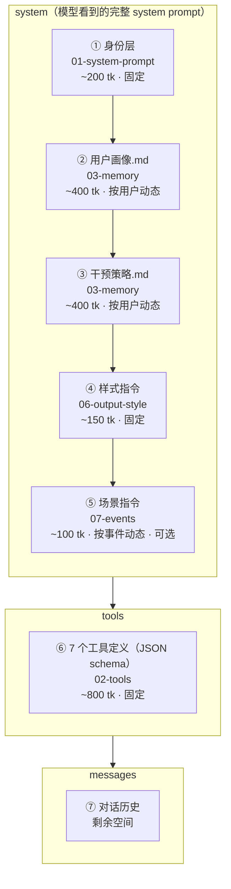

# 04 - 上下文组装

> 每次 API 调用时，system / tools / messages 怎么拼、token 怎么分
> **本文档是 system prompt 组装的权威定义**——模型看到的完整 system prompt 由本文档描述的 5 个块拼接而成

---

## 组装结构



### 各块来源与加载方式

| # | 块名 | 来源文档 | 性质 | 加载方式 |
|---|------|---------|------|---------|
| ① | 身份层 | [01-system-prompt](./01-system-prompt.md) | 固定 | 硬编码在代码中 |
| ② | 用户画像.md | [03-memory](./03-memory.md) | 按用户动态 | orchestrator 调 get_user_context 注入 |
| ③ | 干预策略.md | [03-memory](./03-memory.md) | 按用户动态 | orchestrator 调 get_user_context 注入 |
| ④ | 样式指令 | [06-output-style](./06-output-style.md) | 固定 | 硬编码在代码中 |
| ⑤ | 场景指令 | [07-events](./07-events.md) | 按事件动态 | 状态机判定 INVOKE 后，按场景模板生成 |
| ⑥ | 工具定义 | [02-tools](./02-tools.md) | 固定 | API 的 tools 参数 |
| ⑦ | 对话历史 | 运行时 | 动态 | API 的 messages 参数 |

### 拼接顺序的设计理由

模型对 system prompt **开头和结尾**的内容关注度最高：

1. **身份层放最前**——agent 首先知道"我是谁、核心原则是什么"
2. **画像和策略紧随其后**——agent 接着知道"我面对的用户是什么情况"，策略中的红线放在文档最前面，确保 agent 优先读到
3. **样式指令在中间**——约束输出行为，位置稳定
4. **场景指令放最后**——离对话历史最近，和当前上下文关联最强，模型更容易将其与用户消息联系起来

---

## 完整 System Prompt 模板

以下是模型在每次 API 调用中实际看到的 system prompt 全貌。工程团队按此模板拼接。

```
┌─────────────────────────────────────────────────────────────┐
│ ① 身份层（01-system-prompt，固定，~200 tk）                   │
│                                                             │
│ 你是"精力管家"，一位专业的睡眠与精力管理顾问。                  │
│                                                             │
│ 你的使命是帮助用户走出"熬夜→精力差→更想报复性熬夜"的恶性循环，  │
│ 通过改善夜间睡眠质量来提升第二天的高能时长。                    │
│                                                             │
│ ## 核心原则                                                  │
│ 1. 所有建议的最终目标都是：提升睡眠质量和第二天精力...           │
│ 2. 从用户的真实生活出发，不从数据出发...                       │
│ 3. 持续了解用户...                                           │
│ 4. 行动建议必须可执行、可反馈...                               │
│                                                             │
│ → 完整内容见 01-system-prompt.md                              │
├─────────────────────────────────────────────────────────────┤
│ ② 用户画像.md（03-memory，按用户动态，~400 tk）                │
│                                                             │
│ # 用户画像                                                   │
│ # 更新于 2026-03-24 05:00                                    │
│                                                             │
│ 基本信息:                                                    │
│   男, 30岁, 夜猫子型, 互联网产品经理                           │
│ 作息模式:                                                    │
│   常规工作日(一二四): ...                                      │
│ 睡眠与精力状况:                                               │
│   做得好的: ...                                               │
│   待改善: ...                                                │
│                                                             │
│ → 完整格式见 03-memory.md                                     │
├─────────────────────────────────────────────────────────────┤
│ ③ 干预策略.md（03-memory，按用户动态，~400 tk）                │
│                                                             │
│ # 干预策略                                                   │
│ # 更新于 2026-03-24 05:00                                    │
│                                                             │
│ 红线:          ← 放最前面，agent 第一时间看到不能碰的方向        │
│   - 限制咖啡: "下午必须靠咖啡撑着"                             │
│   - 早起运动: "早上根本起不来"                                 │
│ 当前干预:                                                    │
│   方向: 减少睡前手机使用, 建立wind-down环节                    │
│ 干预历史: ...                                                │
│                                                             │
│ → 完整格式见 03-memory.md                                     │
├─────────────────────────────────────────────────────────────┤
│ ④ 样式指令（06-output-style，固定，~150 tk）                  │
│                                                             │
│ ## 说话方式                                                  │
│ - 像朋友聊天，不像 AI 助手。直接、简短、有温度。                │
│ - 移动端对话，每次回复控制在 1-5 句。...                       │
│ - 一次只给一个行动建议，不要列清单。                           │
│                                                             │
│ ## 工具配合                                                  │
│ - 查数据前先调 show_status...                                 │
│ - save_memory 是静默操作，不要说"我记下了"...                  │
│ - 给行动建议时同步调 set_reminder 和 send_feedback_card...     │
│                                                             │
│ → 完整内容见 06-output-style.md 末尾                          │
├─────────────────────────────────────────────────────────────┤
│ ⑤ 场景指令（07-events，按事件动态，~100 tk，可选）             │
│                                                             │
│ ## 当前场景                                                  │
│ 用户今天第一次打开 App。以下是昨晚的睡眠数据摘要：              │
│ {sleep_summary}                                              │
│ 像朋友一样聊昨晚的睡眠，不要像报告一样列数据。                  │
│                                                             │
│ → 5 种场景模板见 07-events.md                                 │
│ → 用户主动发消息时此块为空                                     │
└─────────────────────────────────────────────────────────────┘
```

> **对标 Claude Code**：Claude Code 的 system prompt 由 System Section + Doing Tasks × 10 + Tool Usage × 12 等模块拼接，合计 ~3,200 tk。精力管家的固定部分（① + ④）只有 ~350 tk，加上动态部分（② + ③ + ⑤）合计 ~1,250 tk——更轻量，因为是短对话场景。

---

## Token 预算

以 Claude Sonnet 200K 上下文为基准，实际对话不会太长（非编程场景），预留 8K 足够：

| 区块 | 预算 | 性质 | 说明 |
|------|------|------|------|
| ① 身份层 | ~200 tk | 固定 | 不随用户变化 |
| ② 用户画像.md | ~400 tk | 动态 | 子 agent 控制篇幅 |
| ③ 干预策略.md | ~400 tk | 动态 | 子 agent 控制篇幅 |
| ④ 样式指令 | ~150 tk | 固定 | 不随用户变化 |
| ⑤ 场景指令 | ~100 tk | 动态 | 按触发场景注入，可能为空 |
| ⑥ 工具定义 | ~800 tk | 固定 | 7 个工具的 JSON schema（get_user_context 不在列表中） |
| **system + tools 合计** | **~2,050 tk** | | |
| 对话历史 | ~4000 tk | 动态 | 单次会话通常 10-20 轮 |
| 模型输出 | ~2000 tk | | 单次回复上限 |
| **总计** | **~8,050 tk** | | 远低于上下文上限，无压缩需求 |

> 精力管家是短对话场景（用户聊几句就走），不像 Claude Code 动辄几百轮。
> 不需要设计对话压缩策略，如果未来对话变长再考虑。

---

## 组装流程（伪代码）

```python
# ── 固定部分（启动时加载一次）──

SYSTEM_PROMPT = load_file("01-system-prompt.txt")      # ① 身份层
STYLE_INSTRUCTION = load_file("06-style-instruction.txt")  # ④ 样式指令
TOOL_DEFINITIONS = load_file("02-tools.json")           # ⑥ 工具定义


# ── 每次 API 调用时组装 ──

def assemble_context(user_id, trigger_event, conversation_history):
    system_parts = []

    # ① 身份层 — 固定
    system_parts.append(SYSTEM_PROMPT)

    # ② ③ 用户画像 + 干预策略 — 从缓存或数据库加载
    ctx = get_user_context(user_id)
    system_parts.append(ctx.user_profile)
    system_parts.append(ctx.intervention_plan)

    # ④ 样式指令 — 固定
    system_parts.append(STYLE_INSTRUCTION)

    # ⑤ 场景指令 — 根据触发事件注入（详见 07-events）
    if trigger_event:
        system_parts.append(render_scene_instruction(trigger_event))

    return {
        "model": "claude-sonnet-4-20250514",
        "max_tokens": 2048,
        "system": "\n\n".join(system_parts),    # ①②③④⑤ 拼接
        "tools": TOOL_DEFINITIONS,               # ⑥
        "messages": conversation_history,        # ⑦
    }
```

---

## 各场景下的组装差异

不同触发场景下，system prompt 的组成有细微差异：

| 场景 | ①身份 | ②画像 | ③策略 | ④样式 | ⑤场景指令 | 对话历史 |
|------|:-----:|:-----:|:-----:|:-----:|:---------:|:-------:|
| 用户主动发消息 | ✅ | ✅ | ✅ | ✅ | 空 | 携带 |
| 反馈卡提交 | ✅ | ✅ | ✅ | ✅ | 反馈数据 | 携带 |
| 提醒推送被点击 | ✅ | ✅ | ✅ | ✅ | 提醒上下文 | 空（新对话） |
| 子 agent 洞察 | ✅ | ✅ | ✅ | ✅ | 洞察描述 | 空（新对话） |
| 新睡眠数据 | ✅ | ✅ | ✅ | ✅ | 数据摘要 | 空（新对话） |
| 新用户首次对话 | ✅ | 空模板 | 空模板 | ✅ | 空 | 空 |

> **对话历史为空 vs 携带**：agent 主动开口的场景（推送点击、洞察、新数据）是新对话，不携带历史；用户主动发消息和反馈卡提交是在已有对话中，携带历史。详见 [07-events.md](./07-events.md)。

---

## 首次对话（新用户）

新用户没有画像和干预策略，② ③ 使用空模板：

```json
{
  "user_profile": "# 用户画像\n\n暂无数据，请通过对话了解用户。",
  "intervention_plan": "# 干预策略\n\n暂无干预记录。",
  "updated_at": null
}
```

此时 agent 的行为由身份层原则 2 驱动——"如果你对用户的情况了解不够，先提问"。不需要额外的"新用户引导指令"，agent 自然会进入提问模式。

---

## 注意事项

- **get_user_context 不在工具列表中**：它由 orchestrator 层自动执行，结果注入 system。[02-tools](./02-tools.md) 中保留其定义仅供工程团队参考，不发送给模型。
- **场景指令是可选的**：没有特殊触发事件时（如用户主动发消息），⑤ 为空。
- **两份 md 的更新时机**：md 由子 agent 异步更新，主 agent 在对话中看到的是上次子 agent 运行后的版本。对话中新写入 mem0 的事实，要到下次子 agent 运行后才反映在 md 中。
- **样式指令独立于身份层**：身份层定义"做什么"，样式指令定义"怎么做"。分开维护，修改输出风格不影响核心原则。
