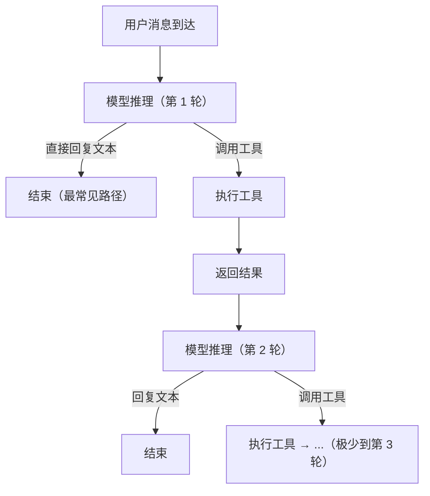
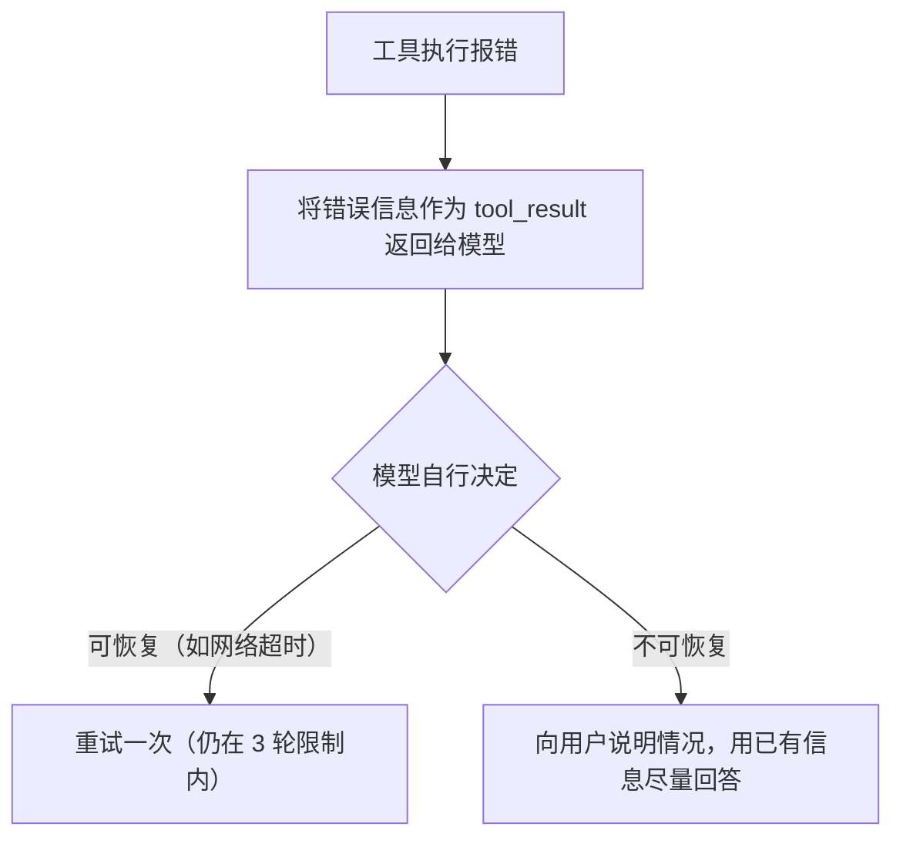

# 05 - Agent 循环

> 模型推理 → 工具调用 → 观察结果 → 继续/停止

---

## 精力管家的循环特点

精力管家不是 Claude Code。Claude Code 是重工具型 agent（读文件→改代码→跑测试→循环多轮），精力管家是**轻工具型、重对话型**——大部分价值在对话本身，工具调用少且轻。

典型对话中工具调用模式：
- 查数据 → 回复用户（1 次 get_health_data）
- 聊天中捕获信息 → 记下来（1 次 save_memory）
- 给建议 → 发反馈卡片（1 次 send_feedback_card）
- 做分析 → 查数据 + 渲染图表（get_health_data + render_analysis_card）

**绝大多数轮次只有 0-2 次工具调用，不需要复杂的循环控制。**

---

## 循环流程



---

## 终止条件

| 条件 | 说明 |
|------|------|
| 模型输出文本（无工具调用） | 正常结束，最常见 |
| 达到最大轮次（3 轮） | 强制终止，要求模型用已有信息回复 |
| 工具执行报错 | 将错误信息返回模型，让模型决定是重试还是向用户说明 |

**最大 3 轮的理由：**
- 精力管家的工具调用是简单的"查→用"模式，不存在需要多轮迭代的场景
- 如果 3 轮还没完成，说明出了问题，不应该让 agent 自己转圈

---

## 常见调用模式

### 模式 1：纯对话（0 次工具调用）

用户日常聊天、问问题、闲聊，agent 直接回复。

```
用户: "今天感觉特别困"
→ 模型推理 → 直接回复（共情 + 追问原因）
```

### 模式 2：查数据后回复（1 次工具调用）

用户问自己的数据，或 agent 需要数据支撑分析。

```
用户: "我最近睡得怎么样？"
→ 模型推理 → 调用 get_health_data(metrics=[sleep_stages, sleep_debt], date_range="7d")
→ 拿到结果 → 模型推理 → 回复文本（结合画像做解读）
```

### 模式 3：记录 + 回复（1 次工具调用）

用户透露了新的生活细节，agent 记下来并继续对话。

```
用户: "我最近换了个更暗的窗帘"
→ 模型推理 → 调用 save_memory(content="用户换了遮光窗帘", category="life_detail")
→ 写入成功 → 模型推理 → 回复文本
```

### 模式 4：给建议 + 发反馈卡（2 次工具调用）

agent 给出行动建议，同时安排反馈卡片。

```
用户反馈说手机放客厅有效，agent 决定推进：
→ 模型推理 → 调用 save_memory(content="手机放客厅有效", category="intervention_feedback")
→ 写入成功 → 模型推理 → 回复建议文本 + 调用 send_feedback_card(...)
→ 结束
```

### 模式 5：数据分析 + 图表（2 次工具调用）

agent 查数据后用图表呈现。

```
用户: "给我看看这周的睡眠趋势"
→ 调用 get_health_data(metrics=[sleep_stages], date_range="7d")
→ 拿到数据 → 调用 render_analysis_card(chart=..., summary=...)
→ 结束
```

---

## 并行工具调用

Claude 支持单轮返回多个工具调用。精力管家中的并行场景：

- `save_memory` + `send_feedback_card`：记录反馈的同时安排下一次反馈卡
- `get_health_data` 多指标查询：已通过 metrics 数组在单次调用中解决，不需要并行

不需要特殊处理，使用 Claude API 默认的并行工具调用能力即可。

---

## 错误处理



不需要 orchestrator 层的重试逻辑——让模型判断是否值得重试，比硬编码重试策略更灵活。
