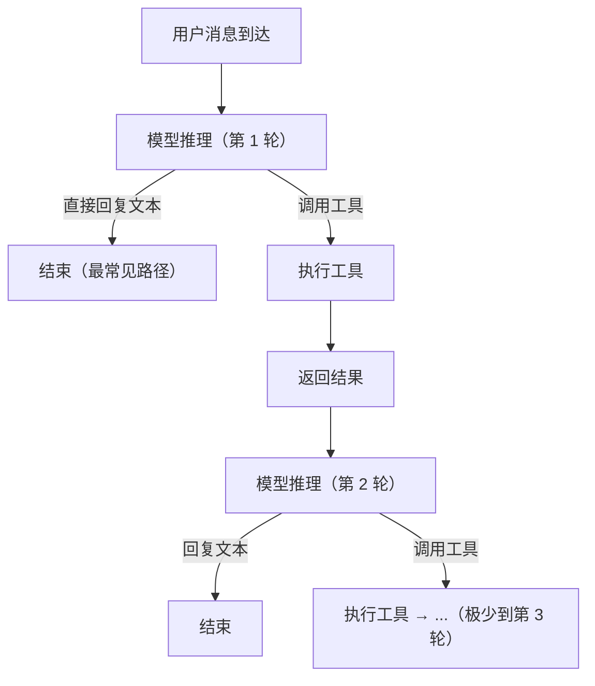

# 05 - Agent 循环

> 模型推理 → 工具调用 → 观察结果 → 继续/停止

---

## 精力管家的循环特点

精力管家不是 Claude Code。Claude Code 是重工具型 agent（读文件→改代码→跑测试→循环多轮），精力管家是**轻工具型、重对话型**——大部分价值在对话本身，工具调用少且轻。

典型对话中工具调用模式：
- 查数据 → 回复用户（1 次 get_health_data）
- 聊天中捕获信息 → 记下来（1 次 save_memory）
- 给建议 → 发反馈卡片（1 次 send_feedback_card）
- 做分析 → 查数据 + 渲染图表（get_health_data + render_analysis_card）

**绝大多数轮次只有 0-2 次工具调用，不需要复杂的循环控制。**

---

## 循环流程

---

## 终止条件

| 条件 | 说明 |
|------|------|
| 模型输出文本（无工具调用） | 正常结束，最常见 |
| 达到最大轮次（3 轮） | 强制终止，要求模型用已有信息回复 |
| 工具执行报错 | 将错误信息返回模型，让模型决定是重试还是向用户说明 |

**最大 3 轮的理由：**
- 精力管家的工具调用是简单的"查→用"模式，不存在需要多轮迭代的场景
- 如果 3 轮还没完成，说明出了问题，不应该让 agent 自己转圈

---

## 常见调用模式

大部分对话属于以下模式之一：

| 模式 | 工具调用次数 | 典型场景 |
|------|:-----------:|---------|
| 纯对话 | 0 | 日常聊天、闲聊 |
| 查数据后回复 | 1 | 用户问"最近睡得怎么样" |
| 记录 + 回复 | 1 | 用户透露新的生活细节 |
| 给建议 + 反馈卡 | 2 | 行动建议 + 安排反馈收集 |
| 数据分析 + 图表 | 2 | 查数据 + 渲染图表卡片 |

每种模式下完整的工具调用链和用户侧体验，详见 [06-output-style.md](./06-output-style.md) 的"工具组合输出"章节。

---

## 并行工具调用

Claude 支持单轮返回多个工具调用。精力管家中的并行场景：

- `save_memory` + `send_feedback_card`：记录反馈的同时安排下一次反馈卡
- `get_health_data` 多指标查询：已通过 metrics 数组在单次调用中解决，不需要并行

不需要特殊处理，使用 Claude API 默认的并行工具调用能力即可。
