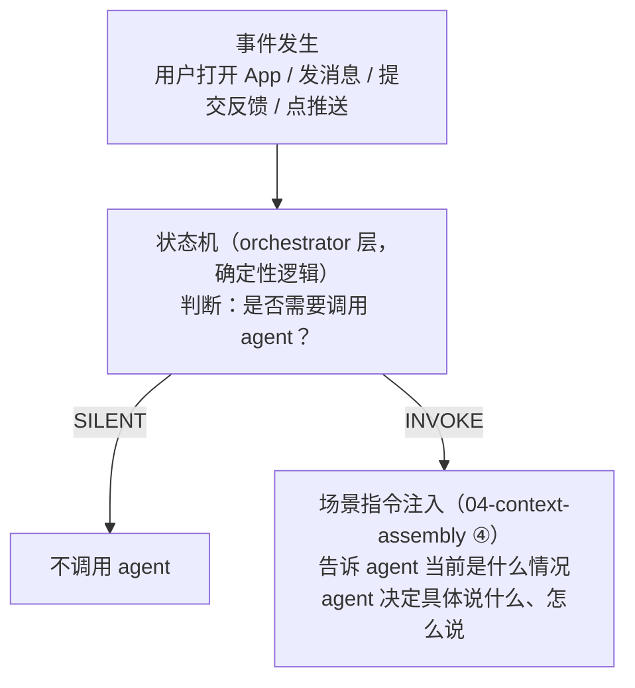
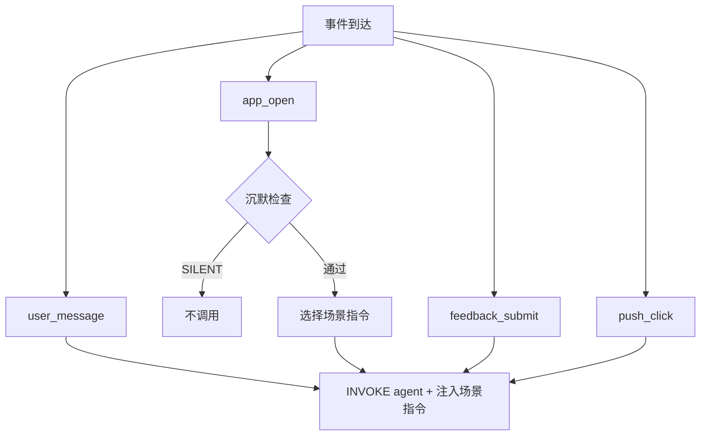
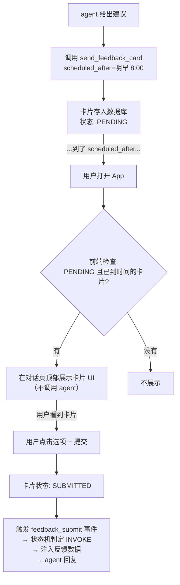

# 07 - 动态事件注入

> 状态机决定"调不调 agent"，场景指令决定"agent 说什么"。这两层必须分开。

---

## 两层分离



**状态机管"调不调"**：确定性的，不花 token，毫秒级判断。
**agent 管"说什么"**：一旦被调用，agent 一定会产出回复——不存在"调了 agent 但 agent 决定不说话"的情况。

---

## 状态机

### 输入信号

orchestrator 在每次事件发生时，收集以下状态：

```python
@dataclass
class EventContext:
    # 事件本身
    event_type: str           # "user_message" | "app_open" | "feedback_submit" | "push_click"
    timestamp: datetime

    # 用户状态
    minutes_since_last_conversation: int
    last_conversation_initiator: str   # "user" | "agent"
    last_conversation_user_replied: bool

    # 待处理事项（按优先级排列）
    has_pending_insight: bool          # 子 agent 标记的待推送洞察
    has_unseen_sleep_data: bool        # 昨晚数据已同步 && 用户今天没看过
    # 注意：反馈卡不在这里。反馈卡通过 UI 展示，用户主动提交后变成 feedback_submit 事件
```

### 状态转移



### 判定规则（伪代码）

```python
def decide(ctx: EventContext) -> tuple[str, dict | None]:
    """
    返回 ("INVOKE", scene_data) 或 ("SILENT", None)
    """

    # ── 用户主动行为：一律调用，无需检查 ──

    if ctx.event_type == "user_message":
        return ("INVOKE", None)  # 无场景指令，走标准对话

    if ctx.event_type == "feedback_submit":
        return ("INVOKE", ctx.feedback_data)

    if ctx.event_type == "push_click":
        return ("INVOKE", ctx.reminder_data)

    # ── app_open：需要沉默检查 ──

    assert ctx.event_type == "app_open"

    # 规则 1：上次 agent 主动说了，用户没回——不追
    if (ctx.last_conversation_initiator == "agent"
            and not ctx.last_conversation_user_replied):
        return ("SILENT", None)

    # 规则 2：30 分钟内无新事项——不打扰
    if ctx.minutes_since_last_conversation <= 30:
        if not ctx.has_pending_insight:
            return ("SILENT", None)
        # 有紧急洞察，即使 30 分钟内也说

    # 规则 3：有待处理事项——按优先级取一个
    if ctx.has_pending_insight:
        return ("INVOKE", {"scene": "agent_insight", **ctx.insight_data})

    if ctx.has_unseen_sleep_data:
        return ("INVOKE", {"scene": "new_sleep_data", **ctx.sleep_summary})

    # 规则 4：什么都没有——沉默
    return ("SILENT", None)
```

### 判定规则汇总表

| 事件 | 沉默检查 | 结果 |
|------|---------|------|
| user_message | 不检查 | 一律 INVOKE，无场景指令 |
| feedback_submit | 不检查 | 一律 INVOKE，注入反馈数据 |
| push_click | 不检查 | 一律 INVOKE，注入提醒上下文 |
| app_open + agent 上次说了用户没回 | 检查 | SILENT |
| app_open + 30 分钟内 + 无紧急洞察 | 检查 | SILENT |
| app_open + 有待推送洞察 | 检查通过 | INVOKE，注入洞察 |
| app_open + 有未看睡眠数据 | 检查通过 | INVOKE，注入数据摘要 |
| app_open + 什么都没有 | 检查通过 | SILENT |

---

## 场景指令

状态机决定 INVOKE 之后，根据 scene 类型生成一段短文本，注入 04-context-assembly 的第 ④ 块。

**agent 被调用后一定会产出回复**，场景指令的作用是告诉 agent "当前是什么情况"，agent 决定具体说什么。

### 指令 1：用户发消息（无注入）

用户主动发消息时，不注入场景指令。agent 直接响应用户消息。

### 指令 2：反馈卡提交

```
## 当前场景

用户刚提交了一张反馈卡：
- 关联建议：{suggestion_description}
- 用户选择：{completion_value}
- 用户补充：{follow_up_text | "无"}

基于反馈推进对话：
- 做到了 → 具体肯定，考虑固化或推进下一步
- 没做到 → 理解原因，考虑调整方法或降低难度
- 部分做到 → 肯定已做到的，了解困难点
```

### 指令 3：提醒推送被点击

```
## 当前场景

用户点击了一条提醒推送进入 App：
- 提醒内容：{reminder_message}
- 关联干预：{intervention_description}

顺着提醒的上下文和用户聊。如果用户接着说了别的话题，跟随用户。
```

### 指令 4：子 agent 洞察

```
## 当前场景

以下是最近发现的一个值得关注的变化：
{insight_description}

用你自己的话和用户聊这个发现。不要说"系统检测到"。
```

### 指令 5：新的睡眠数据

```
## 当前场景

用户今天第一次打开 App。以下是昨晚的睡眠数据摘要：
{sleep_summary}

像朋友一样聊昨晚的睡眠，不要像报告一样列数据。
如果数据和干预策略中的当前干预相关，可以关联起来聊。
```

---

## 关键状态的精确定义

### has_unseen_sleep_data

```python
has_unseen_sleep_data = (
    sleep_data_synced_today                    # 设备数据已同步（通常早上 6-8 点）
    and not user_has_seen_sleep_today          # 用户今天没有触发过包含睡眠数据的对话
)

# 用户"看过"的判定：agent 回复中调用了 get_health_data 且 metrics 包含 sleep 相关指标
# 一旦看过，当天不再重复推送
```

### has_pending_insight

```python
has_pending_insight = (
    sub_agent_flagged_insight                  # 子 agent 运行后标记了待推送
    and not insight_already_delivered           # 还没推送过
)

# 子 agent 标记洞察的条件（在子 agent 的 prompt 中定义）：
# - 连续 N 天某指标持续恶化
# - 某个干预产生了显著效果（数据印证）
# - 用户画像发生了重大变化（如作息模式改变）
#
# 日常小波动不标记。标记意味着"值得专门和用户聊一次"。
```

### last_conversation_user_replied

```python
last_conversation_user_replied = (
    last_conversation.initiator == "agent"     # 上次是 agent 主动开口
    and last_conversation.has_user_message     # 用户在那轮对话中回复了至少一条消息
)

# 如果 agent 说了"昨晚睡得不错"，用户看了但没回复就走了
# → last_conversation_user_replied = False
# → 下次 app_open 时不追着说
```

---

## 反馈卡的完整生命周期

上一版把"反馈卡提交"和"反馈卡待收集"混在了一起。这里理清：



**关键区分：**
- **卡片展示**：前端行为，不涉及 agent，不涉及状态机
- **卡片提交**：用户主动行为，触发 feedback_submit 事件，一律调用 agent

agent 不会主动问"你反馈卡填了吗"——反馈卡是 UI 层的收集手段，用户提交后才进入对话流。

---

## orchestrator 实现

```python
class EventOrchestrator:

    def handle_event(self, user_id: str, event: EventContext):
        """事件入口，所有事件从这里进入"""

        decision, scene_data = self.state_machine.decide(event)

        if decision == "SILENT":
            return None

        # 生成场景指令
        scene_instruction = None
        if scene_data:
            scene_instruction = self.render_scene_instruction(
                scene_data["scene"], scene_data
            )

        # 组装上下文
        context = assemble_context(
            user_id=user_id,
            trigger_event=scene_instruction,
            conversation_history=self.get_history(user_id, event)
        )

        # 调用 agent
        response = call_agent(context)

        # 更新状态（用于下次沉默判定）
        self.update_conversation_state(
            user_id=user_id,
            initiator="user" if event.event_type == "user_message" else "agent",
            timestamp=event.timestamp
        )

        # 消费已处理的事项
        if scene_data:
            self.mark_delivered(user_id, scene_data)

        return response

    def get_history(self, user_id, event):
        """根据事件类型决定是否携带对话历史"""
        if event.event_type in ("user_message", "feedback_submit"):
            return get_conversation_history(user_id)
        else:
            # app_open / push_click：agent 主动开口，开启新对话
            return []
```

---

## 设计说明

| 设计决策 | 理由 |
|---------|------|
| 状态机和 agent 两层分离 | "调不调"是确定性逻辑，不该花 token 让 LLM 判断 |
| 用户主动行为一律 INVOKE | 用户发消息、提交反馈、点推送都是明确意图，不需要犹豫 |
| 只有 app_open 需要沉默检查 | 其他事件都有明确的用户意图驱动 |
| agent 被调用后一定产出回复 | 消除"调了但不说话"的浪费，沉默在状态机层解决 |
| 反馈卡展示是前端行为 | 不涉及 agent，避免 agent 追着用户要反馈 |
| 每次只注入一个场景指令 | 多个指令会让 agent 输出混乱 |
| 30 分钟冷却 + 不追着说 | 短时间重复打开是正常行为；agent 主动说了用户没回就别追 |
| has_unseen_sleep_data 当天只触发一次 | 看过就标记为 seen，避免反复推送同一天的数据 |
