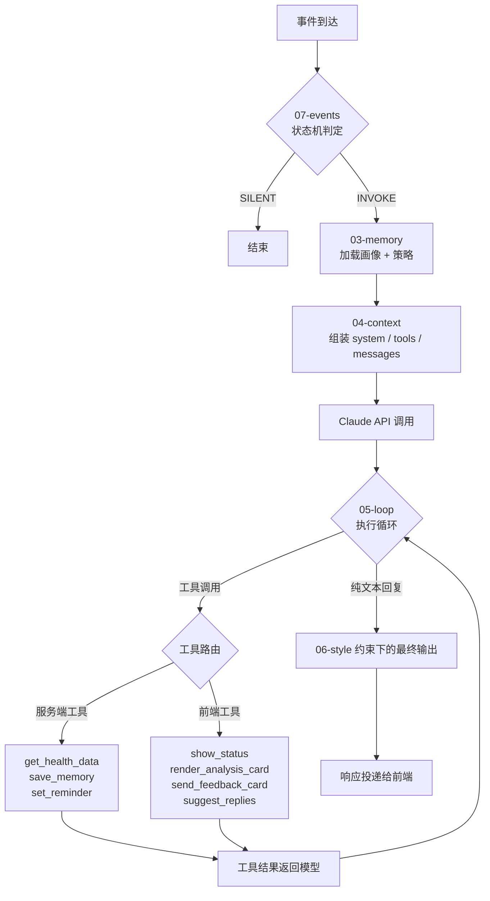
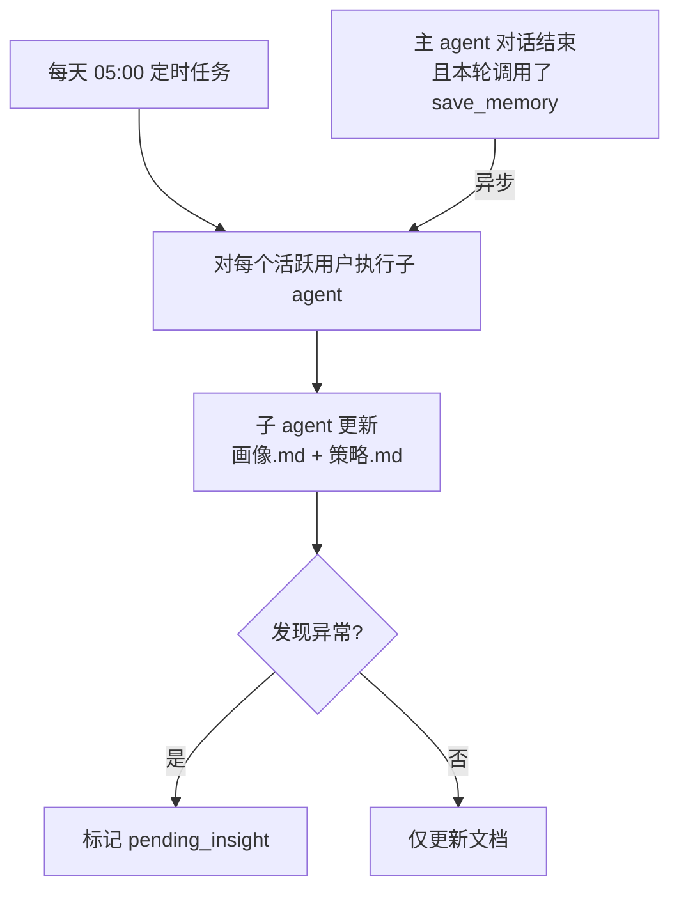
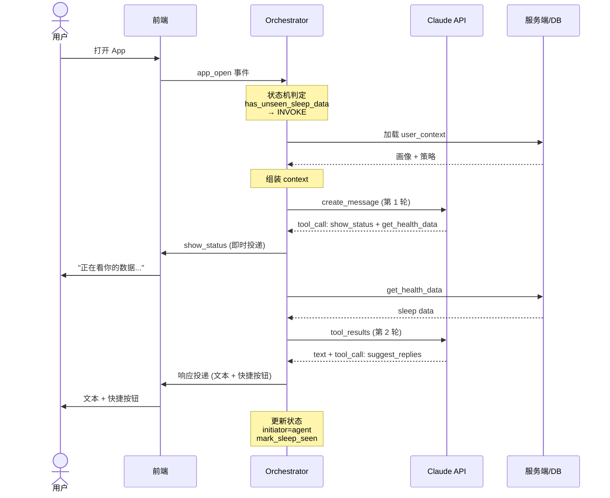
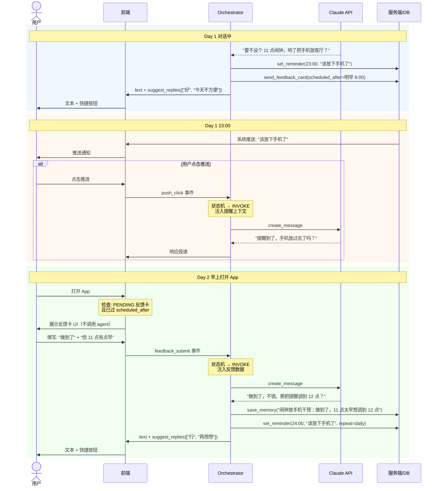

# 08 - 完整编排流程

> 从事件到达到用户看到回复，端到端的调用链路。本文档是 01-07 的胶水层。

---

## 全局视角



---

## 主 Agent 请求生命周期

### 阶段 1：事件到达 → 状态机判定

```python
# 入口：所有事件统一进入
event = EventContext(
    event_type="app_open",       # or "user_message" / "feedback_submit" / "push_click"
    timestamp=now(),
    minutes_since_last_conversation=480,
    last_conversation_initiator="user",
    last_conversation_user_replied=True,
    has_pending_insight=False,
    has_unseen_sleep_data=True,
)

decision, scene_data = state_machine.decide(event)
# → ("INVOKE", {"scene": "new_sleep_data", "sleep_summary": "..."})
```

详见 [07-events.md](./07-events.md)。SILENT 直接结束，INVOKE 继续。

### 阶段 2：加载记忆

```python
user_context = db.get_user_context(user_id)
# → {
#     user_profile: "# 用户画像\n...",       ~400 tk
#     intervention_plan: "# 干预策略\n...",   ~400 tk
#     updated_at: "2026-03-24T05:00:00+08:00"
#   }
```

get_user_context 由 orchestrator 自动执行，不在模型的工具列表中。结果注入 system。

详见 [03-memory.md](./03-memory.md)。

### 阶段 3：组装上下文

```python
request = {
    "model": "claude-sonnet-4-20250514",
    "max_tokens": 2048,
    "system": "\n\n".join([
        SYSTEM_PROMPT,                    # 01-system-prompt ~200 tk
        user_context.user_profile,        # 03-memory        ~400 tk
        user_context.intervention_plan,   # 03-memory        ~400 tk
        STYLE_INSTRUCTION,                # 06-output-style  ~150 tk
        scene_instruction or "",          # 07-events        ~100 tk
    ]),
    "tools": TOOL_DEFINITIONS,            # 02-tools         ~800 tk
    "messages": conversation_history,     #                  ≤4000 tk
}
```

详见 [04-context-assembly.md](./04-context-assembly.md)。

### 阶段 4：Agent 循环

```python
for turn in range(MAX_TURNS := 3):
    response = claude_api.create_message(**request)

    # 检查是否有工具调用
    tool_calls = extract_tool_calls(response)

    if not tool_calls:
        # 纯文本回复 → 循环结束
        break

    # 执行工具，收集结果
    tool_results = []
    for call in tool_calls:
        result = execute_tool(call)
        tool_results.append(result)

    # 将工具结果追加到 messages，进入下一轮
    request["messages"].append({"role": "assistant", "content": response.content})
    request["messages"].append({"role": "user", "content": tool_results})

else:
    # 达到最大轮次，强制要求模型用已有信息回复
    request["messages"].append({
        "role": "user",
        "content": "请用已有信息直接回复用户。"
    })
    response = claude_api.create_message(**request)
```

详见 [05-agent-loop.md](./05-agent-loop.md)。

### 阶段 5：响应投递

agent 循环结束后，orchestrator 收集所有输出（文本 + 工具调用结果），统一投递给前端。

```python
delivery = {
    "text": response.text_content,             # agent 的文本回复
    "tool_outputs": collect_frontend_outputs(), # 前端工具的渲染指令
}

# 前端按以下顺序渲染：
# 1. show_status（如果有）→ 先显示加载态
# 2. text → 替换加载态，展示文本
# 3. render_analysis_card（如果有）→ 文本下方展示图表卡片
# 4. send_feedback_card（如果有）→ 存入待展示队列，到 scheduled_after 再展示
# 5. suggest_replies（如果有）→ 文本/卡片下方展示按钮
# 6. set_reminder → 静默注册到系统推送，不在当前界面展示
```

### 阶段 6：状态更新

```python
# 更新对话状态（供下次沉默判定）
db.update_conversation_state(
    user_id=user_id,
    initiator="user" if event.event_type == "user_message" else "agent",
    user_replied=event.event_type == "user_message",
    timestamp=event.timestamp,
)

# 消费已处理的事项
if scene_data:
    db.mark_event_delivered(user_id, scene_data)

# 如果数据相关对话发生了，标记为已看
if any_sleep_data_queried:
    db.mark_sleep_data_seen(user_id, today())
```

---

## 工具路由

模型返回工具调用后，orchestrator 根据工具名路由到不同执行端。

```python
def execute_tool(call: ToolCall) -> ToolResult:
    match call.name:
        # 服务端执行
        case "get_health_data":
            return health_service.query(call.params)
        case "save_memory":
            return mem0.add(user_id, call.params)
        case "set_reminder":
            return reminder_service.schedule(user_id, call.params)

        # 前端渲染（结果暂存，随最终响应一起投递）
        case "show_status":
            frontend_outputs.append(("status", call.params))
            return {"success": True}
        case "render_analysis_card":
            frontend_outputs.append(("analysis_card", call.params))
            return {"success": True}
        case "send_feedback_card":
            # 存数据库 + 标记给前端
            db.create_feedback_card(user_id, call.params)
            frontend_outputs.append(("feedback_card", call.params))
            return {"success": True}
        case "suggest_replies":
            frontend_outputs.append(("suggest_replies", call.params))
            return {"success": True}
```

**服务端工具**返回实际数据，模型在下一轮推理中可以使用。
**前端工具**返回 `{"success": True}`，模型不需要看到渲染结果——它只需要知道"卡片已安排"。

---

## 子 Agent 编排

子 agent 和主 agent 是独立的。子 agent 不参与用户对话，负责离线提炼记忆。

### 触发时机



### 子 Agent 的 API 调用

```python
sub_agent_request = {
    "model": "claude-sonnet-4-20250514",
    "max_tokens": 4096,
    "system": SUB_AGENT_PROMPT,
    "messages": [
        {
            "role": "user",
            "content": f"""
请更新以下用户的画像和干预策略。

## 当前画像
{current_user_profile}

## 当前策略
{current_intervention_plan}

## mem0 新增记忆（自上次更新后）
{new_memories}

## 最近 7 天健康数据摘要
{health_summary}

## 输出要求
1. 输出更新后的完整画像.md
2. 输出更新后的完整策略.md
3. 如果发现值得主动推送给用户的异常，输出 insight（一句话描述）
4. 两份 md 合计不超过 800 token
"""
        }
    ]
}
```

子 agent 不需要工具——它的输入和输出都是文本。orchestrator 解析输出后写回数据库。

---

## 错误处理

### Claude API 层

```python
try:
    response = claude_api.create_message(**request)
except RateLimitError:
    # 排队重试，对用户显示 show_status("稍等一下...")
    retry_with_backoff()
except APIError:
    # 返回兜底回复
    return fallback_response("暂时有点问题，过会儿再试试？")
```

### 工具执行层

```python
try:
    result = execute_tool(call)
except ToolExecutionError as e:
    # 错误信息作为 tool_result 返回给模型
    # 模型自行决定：重试（仍在 3 轮内）或用已有信息回复
    result = {"error": str(e)}
```

不在 orchestrator 层硬编码重试逻辑——让模型判断是否值得重试。

### 前端工具失败

前端工具本质是"存一条渲染指令"，几乎不会失败。如果真的失败（如参数校验不通过），返回错误让模型知道，但不阻塞整体回复。

---

## 完整时序图：给建议场景

从用户打开 App 到看到完整回复的全流程。



---

## 完整时序图：反馈卡闭环场景

从建议→提醒→反馈→调整的全链路。



---

## 各文档职责边界

| 文档 | 谁看 | 决定什么 |
|------|------|---------|
| 01-system-prompt | 模型 | agent 是谁、核心原则 |
| 02-tools | 模型 | 能用什么工具、怎么用 |
| 03-memory | 模型（读）+ 子 agent（写） | 用户是谁、当前在做什么干预 |
| 04-context-assembly | 工程团队 | prompt 怎么拼、token 怎么分 |
| 05-agent-loop | 工程团队 | 循环怎么跑、什么时候停 |
| 06-output-style | 模型 + 工程团队 | 文本怎么写、工具怎么配合 |
| 07-events | 工程团队 | 什么时候调 agent、注入什么场景 |
| **08-orchestration** | **工程团队** | **以上所有如何串起来** |

---

## 设计说明

| 设计决策 | 理由 |
|---------|------|
| 前端工具返回 success 而非渲染结果 | 模型不需要知道 UI 长什么样，只需知道"已安排" |
| show_status 在 agent 循环中即时投递 | 不等整轮结束，用户尽早看到加载态 |
| 子 agent 不用工具 | 纯文本输入输出，降低复杂度和成本 |
| 对话结束后异步触发子 agent | 新写入的 mem0 尽快反映在画像/策略中，不用等每日定时 |
| 兜底回复不经过模型 | API 挂了就不该再调 API，直接返回固定文案 |
| 时序图画两个典型场景 | 比抽象描述更直观，工程团队照着实现即可 |
