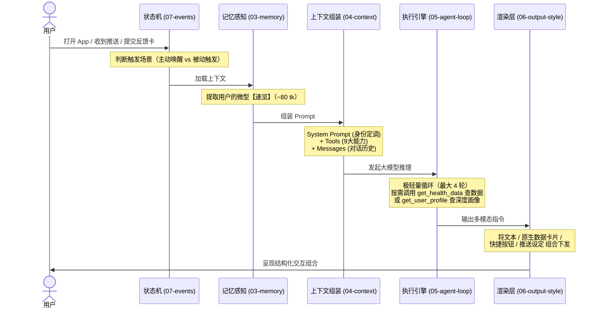

# 精力管家 (iSho Agent) 产品与架构白皮书

> 从"静态数据展示"到"主动式健康干预"：基于 LLM 与 Agent 架构构建的新一代睡眠与精力管理中枢。

## 一、产品定位与业务价值 (Why)

### 1.1 背景：为什么需要 Agent？
传统的健康 App（包括早期版本的基于卡片的 Energy Deck Engine）普遍面临一个痛点：**"数据过载，而干预不足"**。用户可以看到精美的睡眠曲线和心率折线，但往往看完后产生一个疑问——"然后我该怎么做？"
- 静态卡片是**单向**推送，且各场景（晨起/日间/睡前）相互割裂。
- 用户需要的不是更多的数据，而是**个性化的建议和执行监督**。

### 1.2 产品定位
**精力管家** 不是一个可以随意闲聊的通用大模型聊天伴侣，而是一个**目标导向型的健康教练**。
它连接了 App 的底层健康数据与用户的真实生活场景，通过对话的形式，完成"发现问题 → 提出建议 → 辅导执行 → 反馈追踪"的完整闭环。

### 1.3 核心业务理念："一切为了睡眠"
- **北极星指标**：提升用户的夜间睡眠质量，从而增加次日的【高能时长】。
- **干预逻辑**："从人出发，不从数据出发"。我们不简单生硬地建议"早睡"，而是通过对话深挖用户晚睡的真实社会学/心理学原因（如：常态化加班、压力焦虑、报复性熬夜），并利用这套 Agent 引擎给出符合其生活轨迹的微循环干预（如：下午3点后少喝咖啡、睡前1小时放下手机）。

---

## 二、交互形态与体验设计 (What)

为了降低用户的交互门槛，Agent 的外在表现形态是 **Agent Chatflow（结构化数据流对话）**。纯文本无法承载健康数据的密度，因此我们的输出是**自然语言与 App 原生组件的深度融合**。

在用户视角，一次典型的交互包含：
1. **数据与分析同步送达**：除了 AI 生成的洞察文本，对话流中会直接无缝嵌入 App 原生图表卡片（如：心率卡片、睡眠趋势图）。
2. **零阻力互动**：通过提供 `快捷回复按钮 (suggest_replies)`，将开放式问答收敛为点击选择，极大地降低移动端的打字成本。
3. **闭环执行**：当给出干预建议时，Agent 会直接调用系统底层能力，设置 `定时提醒 (set_reminder)`，并在次日推送 `结构化反馈卡片 (send_feedback_card)` 追踪执行情况。

---

## 三、系统架构与技术大脑 (How)

要支撑上述的高度个性化和极简体验，我们在底层设计了一套轻量、高效、防幻觉的 Agent 架构（受 Claude Code 架构启发，但为 C 端短对话场景深度优化）。

### 3.1 核心架构流转图

### 3.2 三层记忆与认知体系 (Memory V3)
传统 Agent 往往将海量历史强行塞入 Context Window，导致成本高昂且重点丢失。我们采用了 **"速览 + 按需拉取"** 的 V3 记忆架构：
- **事实碎片 (mem0)**：主 Agent 在对话中随手记录客观事实（调用 `save_memory`）。
- **认知画像 (Sub-Agent Digestion)**：后台子系统将碎片提炼为结构化的多维画像。
- **按需加载机制**：
  - **速览 (Glance)**：强制注入，只有约 80 tokens，让模型能做基础判断。
  - **深钻 (Deep Dive)**：模型自主决定通过 `get_user_profile`（生活/心理）或 `get_strategy`（干预红线/趋势）精准拉取所需的某一个 section。

### 3.3 工具驱动网络 (Tools)
Agent 的手脚，目前定义了 9 个高内聚的工具，涵盖读数据、读上下文、写记忆和跨端 UI 渲染（详情见 `02-tools.md`）：
- **读取系**：`get_health_data`（一条指令可穿透查询 14 种健康指标趋势）、`get_user_profile`、`get_strategy`。
- **渲染与交互系**：`render_analysis_card`（拒绝对大模型生成图表数据，直接调用原生客户端高保真组件防幻觉）、`suggest_replies`（快捷按钮）、`send_feedback_card`。
- **系统系**：`set_reminder`（设置推送）、`show_status`（异步全链路的加载感知）、`save_memory`（无感知碎片写入）。

### 3.4 演进对比：专为 C 端设计
| 维度 | 常规生产力 Agent (如 Claude Code) | iSho 精力管家 Agent |
|------|-----------------------------------|---------------------|
| 会话模式 | 10+轮深度执行，以完成复杂任务为主 | **极短对话 (轻工具)**，通常0-2轮，不超过4轮 |
| 上下文策略 | 海量窗口，依赖长文检索与压缩策略 | **~8K Token 封顶**，V3级结构化按需加载机制 |
| 交互展现 | 纯代码流/Markdown 文本 | **文本 + 原生卡片 UI + 反馈流组件** 的立体组合 |

---

## 四、工程与设计文档索引 (Index)

本目录包含了驱动该 Agent 运行的所有细节声明，供研发与产品复查模型行为边界：

| 文件 | 内容与作用 | 状态 |
|------|-----------|------|
| [01-system-prompt.md](./01-system-prompt.md) | **身份层**：奠定"精力管家"的语调与 4 条不可逾越的沟通红线 | ✅ 已完成 |
| [02-tools.md](./02-tools.md) | **工具箱**：9个核心工具的 Schema 定义、参数限制与全局错误恢复规范 | ✅ 已完成 |
| [03-memory.md](./03-memory.md) | **记忆流**：认知体系的形成、碎片存储分类与提炼策略 | ✅ 已完成 |
| [04-context-assembly.md](./04-context-assembly.md) | **拼装线**：Token 预算管理、速览注入及下发 Prompt 结构 | ✅ 已完成 |
| [05-agent-loop.md](./05-agent-loop.md) | **执行引擎**：单轮与多轮工具调用循环的终态控制逻辑 | ✅ 已完成 |
| [06-output-style.md](./06-output-style.md) | **UI 渲染**：定义大模型流式文本输出与工具复合作用时的体验编排 | ✅ 已完成 |
| [07-events.md](./07-events.md) | **事件总线**：基于状态机处理冷热启动、消息触发及异步反馈 | ✅ 已完成 |
| [08-orchestration.md](./08-orchestration.md) | **后台编排**：系统底层的端到端时序与服务侧降级策略 | ✅ 已完成 |

> **最后更新：2026-03**
