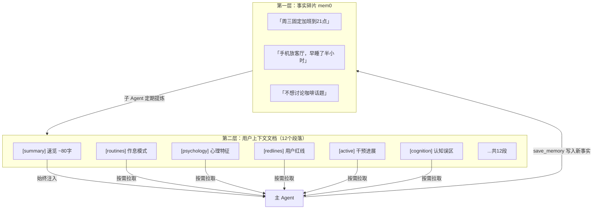
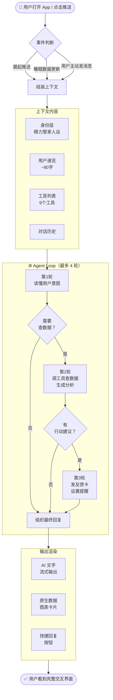
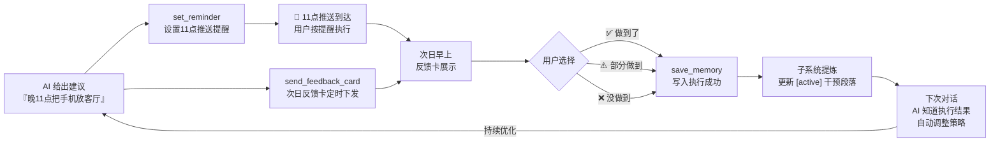

# 精力管家 Agent —— 产品与架构说明

> 写给第一次接触 AI Agent 的产品、设计、研发同学。看完这篇，你就能搞懂「精力管家」是什么、为什么这么设计、它是怎么跑起来的。

---

## 一、我们做了一个什么样的 Agent？

**精力管家**是一个内嵌在 iSho App 里的 AI 健康教练。

它不是一个可以随意闲聊的通用 AI，而是一个**目标明确的专项 Agent**：帮助用户走出「熬夜 → 精力差 → 更想报复性熬夜」的恶性循环，通过改善睡眠质量来提升每天的高能时长。

### 和普通 AI 聊天有什么不同？

| 普通 AI 聊天（如 ChatGPT） | 精力管家 Agent |
|--------------------------|---------------|
| 通用回答，不了解你 | 记得你的作息、偏好、上次干预效果 |
| 只能输出文字 | 文字 + App 原生数据卡片 + 快捷按钮 |
| 说完建议就结束了 | 设置提醒、次日追踪执行、根据反馈调整策略 |
| 每次对话从零开始 | 跨对话积累用户认知，越用越懂你 |

用一句话概括：**精力管家能记住你、能看你的数据、能做后续跟进，是一个真正跑起来的闭环教练，而不是一个会说话的搜索框。**

---

## 二、我们借鉴了谁的架构思路？

这套 Agent 的架构设计，核心受到了 **Claude Code** 的启发。

Claude Code 是 Anthropic 发布的一款 AI 编程助手，它最大的工程创新之一是：**用「工具（Tools）+ 结构化记忆（Memory）+ 多轮循环执行（Agent Loop）」三件套，让 AI 从「回答问题」升级为「完成任务」。**

我们借鉴了这套思路，并针对 C 端短对话健康场景做了大量裁剪和优化。

下面逐一解释这三件套在精力管家里是什么、怎么用。

---

## 三、什么是工具（Tools）？

### 直觉理解

AI 大模型本身只能「说话」——它无法自己去数据库查数据、无法给你发推送通知、也无法在 App 里渲染一张图表。**工具就是 AI 的「手脚」**，让它能做到这些事。

每个工具就像一个 API 接口：AI 决定「我需要查一下这个用户最近 7 天的睡眠数据」，于是调用 `get_health_data` 工具，工具返回数据，AI 再根据数据说话。

### 精力管家的 9 个工具

```
读数据类（AI 的眼睛）
├── get_health_data      查健康数据：心率、睡眠分期、HRV、步数等 14 种指标
├── get_user_profile     了解用户：作息模式、心理特征、生活方式
└── get_strategy         了解策略：当前干预进展、用户红线、认知误区

写记忆类（AI 的笔记本）
└── save_memory          把对话中捕获的用户新信息存下来

前端渲染类（AI 的嘴和手）
├── render_analysis_card 在对话里嵌入原生数据图表卡片 + AI 分析文字
├── suggest_replies      展示快捷回复按钮，减少用户打字
├── send_feedback_card   发送结构化反馈卡片，收集建议执行情况
├── show_status          显示「正在分析你的数据...」进度提示
└── set_reminder         设置定时推送提醒，帮用户执行建议
```

### 工具调用的一个完整例子

用户发消息：「我最近睡得怎么样？」

```
① AI 判断：需要看数据
   → 调用 show_status("正在分析你过去一周的睡眠数据...")

② AI 调用工具查数据：
   → get_health_data(metrics=["sleep_stages", "hrv_sdnn"], date_range="7d")
   → get_strategy(aspects=["trends"])

③ 工具返回数据，AI 分析后调用：
   → render_analysis_card(
       cards=[{metric_key: "sleep_detail", view_mode: "weekly"}],
       summary="这周深睡占比从 16% 涨到 19%，手机放客厅那两天效果最明显。",
       highlights=["深睡连续 3 天达标", "入睡比上周早了 40 分钟"]
     )
   → suggest_replies(["给我个建议", "看心率数据", "知道了"])
```

用户看到：一张原生睡眠图表 + AI 分析文字 + 底部三个快捷回复按钮。

### 防幻觉设计

你可能会想：为什么不让 AI 直接「画」图表？因为 AI 生成数字极易出错（俗称「幻觉」）。所以 `render_analysis_card` 工具**不要求 AI 提供图表数据**，只让 AI 选择「展示哪张卡片」——实际数据由 App 本地从 Apple Health 取，100% 真实。AI 的价值在于分析和解读，不在于生成数字。

---

## 四、什么是记忆（Memory）？

### 直觉理解

AI 大模型天生是「失忆的」——每次对话结束，它就忘了你是谁。**记忆系统就是让 AI 跨对话认识你、记住你的机制。**

但记忆不是越多越好。如果把用户所有历史对话都塞给 AI，不仅费钱（按 token 计费），还会让 AI 在海量无关信息中迷失重点。所以精力管家采用了一套**「速览 + 按需拉取」**的分层记忆架构（Memory V3）。

### 三层记忆架构



### 速览长什么样？

```
30岁男/产品经理/晚型人/独居 | 核心问题:睡前手机→上床晚→时长不足 |
阶段:干预中期,手机放客厅试跑有效 | 红线:咖啡,早起运动 |
沟通:数据驱动,不喜鸡汤,偶尔自嘲
```

只有约 80 个字，但 AI 读完就知道：这个用户是谁、现在在干什么、有什么禁区、怎么和他说话。这样即使用户只是随便发条消息，AI 也不会语气出错或踩红线。

### 按需拉取的好处

只有当 AI 判断需要时，才调用工具拉取对应段落。比如：

- 用户表达焦虑 → AI 拉取 `[psychology]` 了解心理特征
- 要给行动建议 → AI 拉取 `[redlines]` 确认不踩雷 + `[active]` 看当前干预进展
- 纯闲聊 → 只用速览，不拉任何段落

这样每次对话消耗的 token 控制在 8K 以内，成本低、速度快、重点突出。

---

## 五、Agent 是怎么运转的？

### 一次完整的对话流程



### 闭环是怎么形成的？

精力管家不是「说完就算」的建议机器，它会主动追踪每一条建议的执行情况，并在下次对话中调整策略：



这就是从「建议」→「执行」→「反馈」→「优化」的完整闭环，每轮循环 AI 对用户的理解都会加深一点。

---

## 六、和 Claude Code 的关键区别

我们借鉴了 Claude Code 的架构思路，但为 C 端健康场景做了深度裁剪：

| 维度 | Claude Code（编程助手） | 精力管家（健康教练） |
|------|----------------------|--------------------|
| 对话长度 | 10+ 轮，深度执行复杂任务 | **极短，通常 1-2 轮，上限 4 轮** |
| 上下文 | 海量，依赖长文检索与压缩 | **~8K token 封顶**，速览 + 按需拉取 |
| 输出形态 | 纯文字 / 代码 | **文字 + 原生数据卡片 + 按钮 + 推送** |
| 工具数量 | 18+ 个内置工具 | **精简为 9 个高内聚工具** |
| 防幻觉策略 | Sandbox 执行环境 | **不生成图表数据，直接调原生卡片** |
| 核心价值 | 完成复杂工程任务 | **个性化干预 + 跨对话认知积累** |

---

## 七、工程文档索引

本目录包含了驱动 Agent 运行的所有细节规范：

| 文件 | 内容 |
|------|------|
| [01-system-prompt.md](./01-system-prompt.md) | 身份层：精力管家的人设与 4 条核心原则 |
| [02-tools.md](./02-tools.md) | 工具箱：9 个工具的完整 Schema 定义与调用规范 |
| [03-memory.md](./03-memory.md) | 记忆系统：V3 分层记忆架构与 12 个段落设计 |
| [04-context-assembly.md](./04-context-assembly.md) | 上下文组装：Token 预算管理与 Prompt 拼装逻辑 |
| [05-agent-loop.md](./05-agent-loop.md) | 执行引擎：单轮与多轮工具调用的终态控制 |
| [06-output-style.md](./06-output-style.md) | 渲染层：文字流 + 工具调用的体验编排规范 |
| [07-events.md](./07-events.md) | 事件总线：冷热启动、推送触发、反馈回流 |
| [08-orchestration.md](./08-orchestration.md) | 后台编排：子 Agent 调度与端到端时序 |

> **最后更新：2026-03**
