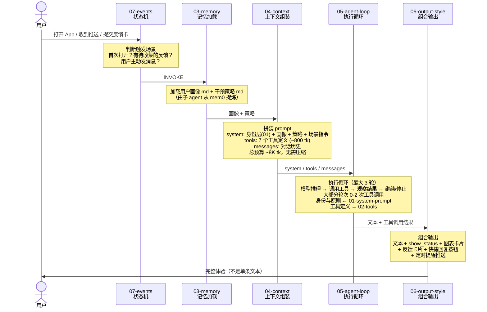

# 精力管家 Agent 架构设计文档

> 基于 Claude API 构建的睡眠与精力管理 agent，参考 Claude Code 的提示词架构

## 目录

| 文件 | 内容 | 状态 |
|------|------|------|
| [01-system-prompt.md](./01-system-prompt.md) | 身份层：角色定义 + 4 条核心原则 | ✅ 已完成 |
| [02-tools.md](./02-tools.md) | 工具集：8 个工具的完整定义（含 JSON schema 和 UI 示意） | ✅ 已完成 |
| [03-memory.md](./03-memory.md) | 记忆系统：mem0 事实层 + 子 agent 提炼 + 两份 md 认知层 | ✅ 已完成 |
| [04-context-assembly.md](./04-context-assembly.md) | 上下文组装：每次 API 调用的 prompt 拼装 + token 预算 | ✅ 已完成 |
| [05-agent-loop.md](./05-agent-loop.md) | Agent 循环：轻工具型循环，最大 3 轮，5 种调用模式 | ✅ 已完成 |
| [06-output-style.md](./06-output-style.md) | 输出样式：语气规范 + 工具组合输出（用户看到的完整体验） | ✅ 已完成 |
| [07-events.md](./07-events.md) | 动态事件注入：状态机 + 场景指令 + 反馈卡生命周期 | ✅ 已完成 |
| [08-orchestration.md](./08-orchestration.md) | 完整编排：端到端调用流程 + 工具路由 + 子 agent + 时序图 | ✅ 已完成 |

## 架构概览

## 核心设计决策

### 记忆：两层分离
- **事实层（mem0）**：主 agent 对话中随手记，存原始碎片
- **认知层（两份 md）**：子 agent 定期提炼，主 agent 只读
- 主 agent 不需要"整理记忆"，只需要"记下来"和"读取结论"

### 工具：8 个，扁平列表
| 工具 | 方向 | 用途 |
|------|------|------|
| get_health_data | 读数据 | 查询睡眠/运动/心率等 14 种指标 |
| get_user_context | 读记忆 | 加载画像 + 策略（orchestrator 自动执行） |
| save_memory | 写记忆 | 对话中捕获的事实写入 mem0 |
| send_feedback_card | 写→用户 | 行动建议后收集执行反馈 |
| render_analysis_card | 写→用户 | 数据可视化图表卡片 |
| show_status | 写→用户 | 加载进度提示 |
| suggest_replies | 写→用户 | 快捷回复按钮 |
| set_reminder | 写→系统 | 定时提醒推送 |

### 输出：文本 + 工具的组合体验
不只定义"说什么"，还定义"说的同时做什么"——用户看到的是文本、卡片、按钮、提醒的完整组合：
- 查数据 → show_status + 文本解读 + suggest_replies
- 给建议 → 文本 + set_reminder + send_feedback_card + suggest_replies
- 记信息 → save_memory（静默）+ 自然对话
- 收反馈 → save_memory + 调整策略 + suggest_replies

### Agent 循环：轻量
- 最大 3 轮，大部分 1 轮（直接回复或 1 次工具调用后回复）
- 不需要对话压缩——短对话场景，总 token ~8K
- 错误处理交给模型判断，不硬编码重试逻辑

## 与 Claude Code 的对比

| 维度 | Claude Code | 精力管家 |
|------|-------------|---------|
| 对话模式 | 重工具、长会话 | 轻工具、短对话 |
| 工具调用 | 每轮 1-5 次，常 10+ 轮 | 每轮 0-2 次，最多 3 轮 |
| 记忆 | CLAUDE.md 手动维护 | mem0 + 子 agent 自动提炼 |
| 上下文 | 200K，需压缩策略 | ~8K，无需压缩 |
| 输出 | 纯文本 + 代码 | 文本 + UI 卡片 + 推送 |
| 身份 | 开发工具 | 懂睡眠的朋友 |
