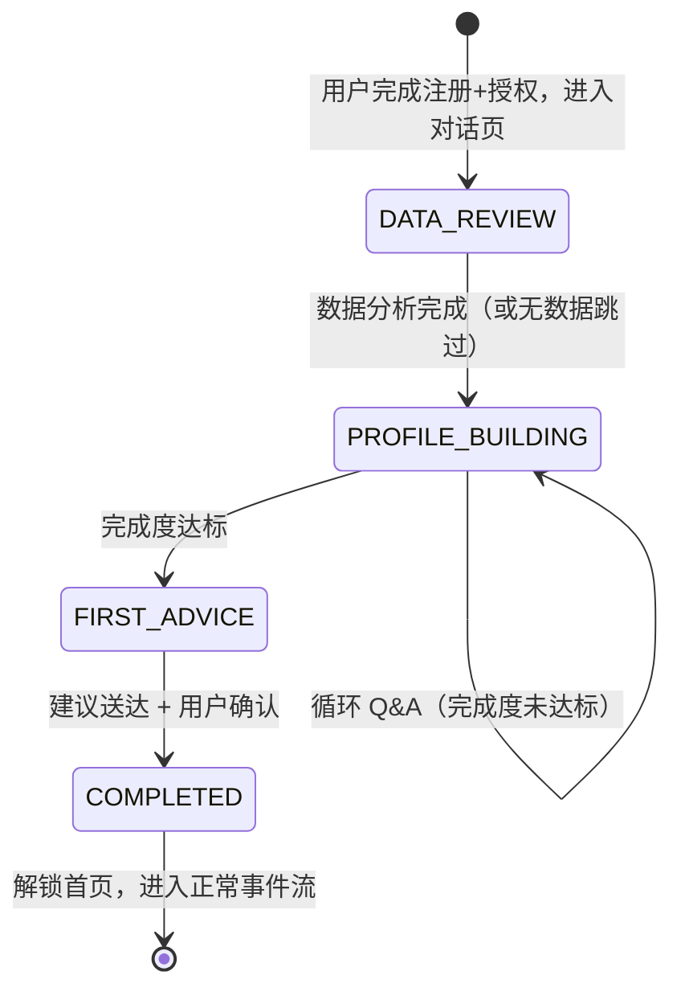
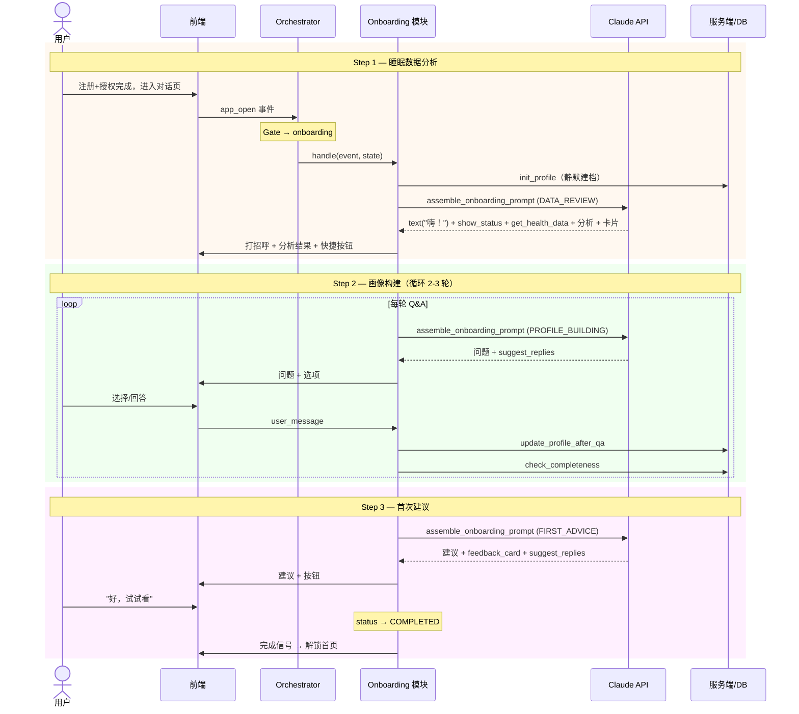

# Onboarding 研发 PRD

> 新用户注册后，在对话 UI 中完成睡眠分析、画像构建和首次干预建议的 3 步引导流程。
> 本文档定义工程规格——状态机、接口契约、自有逻辑模块、编排逻辑和边界情况。
> 前置条件：用户已完成 Apple ID 注册和 Apple Health 授权（在更前置的环节完成）。

---

## 1. 概述

### 1.1 问题

现有精力管家架构（01-08）假设用户已完成注册和数据授权：

- [04-context-assembly.md](../04-context-assembly.md) 的「首次对话」处理仅提供空的速览模板
- [07-events.md](../07-events.md) 的状态机不区分新用户和已建档用户

结果：新用户注册后无画像、无策略，核心功能无法运转。

### 1.2 目标

构建一个**完全独立的 onboarding 模块**：

- 用户完成注册 + Health 授权后，锁定在对话页面
- 通过 3 步对话完成：睡眠数据分析 → 画像构建 → 首次干预建议
- 完成后解锁首页，进入正常事件流

### 1.3 前置条件

进入 onboarding 对话流时，以下条件**已满足**：

- ✅ Apple ID 注册完成
- ✅ Apple Health 数据授权已完成（在注册流程或独立授权页面中处理）
- ✅ 健康数据可读取

### 1.4 设计原则

| 原则 | 说明 |
|------|------|
| 独立 gate | onboarding 逻辑作为前置 gate，不修改现有 07-events / 08-orchestration 的正常事件流 |
| 完全解耦 | onboarding 拥有自己的 prompt 模板、逻辑模块和工具子集。主架构的提示词、skill、tool 修改不影响 onboarding |
| Agent 驱动 | 流程在对话中完成，Agent 控制节奏和上下文解释，而非前端硬编码流程 |
| 可删改 | onboarding 模块独立可拆，未来如果产品方向变化可以整体替换，不影响主架构 |

---

## 2. 解耦架构

### 2.1 耦合边界

Onboarding 模块与主 Agent 架构之间**仅有 2 个共享接口**，其余完全独立：

```
┌─────────────────────────────────────────────────────────────────┐
│                      Onboarding 模块（独立）                     │
│                                                                 │
│  ┌─────────────┐  ┌─────────────┐  ┌───────────┐  ┌─────────┐ │
│  │ 冻结身份     │  │ 步骤指令     │  │ 工具子集   │  │逻辑模块  │ │
│  │ Prompt      │  │ Templates   │  │ Subset    │  │Modules  │ │
│  └─────────────┘  └─────────────┘  └───────────┘  └─────────┘ │
│                                                                 │
└─────────────────────┬───────────────────┬───────────────────────┘
                      │                   │
              共享接口 ①            共享接口 ②
           Gate 检查              画像 DB Schema
          (orchestrator           (12 section 结构
           入口 if/else)           兼容 03-memory)
                      │                   │
┌─────────────────────┴───────────────────┴───────────────────────┐
│                     主 Agent 架构（01-08）                        │
└─────────────────────────────────────────────────────────────────┘
```

| 共享接口 | 说明 | 约束 |
|---------|------|------|
| ① Gate 检查 | orchestrator 入口处 `if not user.onboarding_completed` 的 if/else | 仅 1 行代码 |
| ② 画像 DB Schema | onboarding 写入的画像遵循 [03-memory.md](../03-memory.md) 的 12 section 结构 | 只依赖 schema 格式 |

### 2.2 不共享的内容

| 维度 | 主架构 | Onboarding |
|------|--------|-----------|
| System Prompt | `01-system-prompt.md`（持续迭代） | **冻结版身份 prompt** |
| 场景指令 | `04-context-assembly.md` 的 6 种场景 | **自有步骤指令模板**（3 步） |
| 工具定义 | `02-tools.md` 的 9 个工具 | **自有工具子集**（从 02-tools 快照） |
| Skill 逻辑 | `prompt-library/skills/*.md` | **自有逻辑模块**（不引用任何 skill） |
| 上下文组装 | `04-context-assembly.md` 的 4 层管线 | **独立组装函数** |

---

## 3. Onboarding 状态机

### 3.1 状态定义



### 3.2 状态持久化

```python
@dataclass
class OnboardingState:
    status: str                   # DATA_REVIEW | PROFILE_BUILDING | FIRST_ADVICE | COMPLETED
    profile_completeness: dict    # {section: "filled" | "empty" | "pending"}
    completed_steps: list[str]    # ["data_review", "profile_building", ...]
    current_step_context: dict    # 当前步骤的上下文数据
    created_at: datetime
    updated_at: datetime
```

### 3.3 Gate 入口（唯一耦合点）

```python
def handle_event(event: EventContext, user: User):
    # ── Onboarding Gate（唯一耦合点：1 行 if/else）──
    if not user.onboarding_completed:
        return onboarding.handle(event, user.onboarding_state)

    # ── 正常事件流（07-events 状态机）──
    decision, scene_data = state_machine.decide(event)
    if decision == "SILENT":
        return None
    return invoke_agent(event, scene_data)
```

---

## 4. Onboarding 独立 Prompt 系统

### 4.1 冻结身份 Prompt

```
# onboarding/prompts/identity.md（冻结版本）

你是"精力管家"——用户的 AI 健康教练。
你帮用户改善睡眠和精力管理。
你的语气亲切自然，像一个懂健康的朋友。
```

### 4.2 步骤指令模板

```
onboarding/prompts/steps/
├── step1-data-review.md
├── step2-profile-building.md
└── step3-first-advice.md
```

#### Step 1：睡眠数据分析（DATA_REVIEW）

```
你正在分析一个新用户的睡眠数据。这是你们第一次对话。

行为指令：
1. 先打招呼，简短自我介绍（你是精力管家，帮他改善睡眠和精力）
2. 使用 show_status 告知用户"正在分析你的睡眠数据..."
3. 调用 get_health_data 获取可用的睡眠数据
4. 找出 1-3 个值得关注的发现，用自然语言说
5. 如果有数据，调用 render_analysis_card 展示 sleep_detail 卡片
6. 过渡语引导到下一步："要进一步分析，我需要更了解你"
7. 调用 suggest_replies 提供选项

数据可用天数：{available_days}

降级策略：
- 7天以上数据：正常周对比分析
- 1-6天数据：做单晚/短期分析，跳过模式识别
- 0天数据：跳过数据分析，打招呼后告知"目前还没有睡眠数据，我会在你戴设备睡一晚后再来分析"，直接进入画像构建

语气：热情但不啰嗦，像一个新认识的朋友。
禁止：不要给行动建议——建议在 Step 3。
```

#### Step 2：画像构建（PROFILE_BUILDING）

```
你正在通过问答了解用户，构建用户画像。

行为指令：
1. 每轮问 3-4 个问题，每个问题提供 suggest_replies 选项
2. 选项设计：3 个预设选项 + 1 个"其他（请补充）"选项
3. 如果用户选"其他"，前端会激活输入框让用户补充，你需要等待用户的补充内容
4. 用户回答后简短回应（"明白了"、"了解"），然后出下一轮问题
5. 每轮 Q&A 结束后，系统会自动更新画像并检查完成度

当前画像完成度：{completeness_status}
必填缺失：{missing_required}
已完成轮次：{qa_round}

问题设计原则：
- 优先补充影响策略方向的信息（作息、睡前习惯、偏好）
- 问题自然，融入对话，不像问卷

跑题处理：简短回应用户的话题，然后自然引导回当前步骤。
连续 2 轮未获新信息：检查必填 4 项是否满足，满足则提前进入 FIRST_ADVICE。
```

#### Step 3：首次建议（FIRST_ADVICE）

```
画像构建完成。你现在要给用户第一个具体的行为建议。

行为指令：
1. 先总结你对用户的了解（1-2 句话）
2. 基于画像和数据分析（对话历史中 Step 1 的结果），给一个具体、可执行的行为建议
3. 调用 send_feedback_card 设置反馈追踪
4. 调用 suggest_replies 提供 ["好，试试看", "换个建议"]
5. 用户确认后，完成引导

禁止：不要给多个建议，只给一个最重要的。
```

### 4.3 独立工具子集

```python
ONBOARDING_TOOLS = [
    "get_health_data",       # 获取健康数据
    "show_status",           # 展示加载状态
    "render_analysis_card",  # 渲染数据卡片
    "suggest_replies",       # 快捷回复按钮
    "save_memory",           # 保存记忆
    "send_feedback_card",    # 反馈追踪卡
]
```

### 4.4 独立 Prompt 组装

```python
def assemble_onboarding_prompt(onboarding_state, conversation_history):
    system = (
        ONBOARDING_IDENTITY_PROMPT
        + "\n\n"
        + ONBOARDING_STEP_INSTRUCTIONS[onboarding_state.status]
        + "\n\n"
        + render_step_context(onboarding_state)
    )
    return {
        "model": "claude-sonnet-4-20250514",
        "max_tokens": 2048,
        "system": system,
        "tools": ONBOARDING_TOOL_DEFINITIONS,
        "messages": conversation_history,  # 跨步骤保留
    }
```

### 4.5 对话历史跨步骤保留

onboarding 期间的对话历史**跨步骤保留**。Step 3 的建议需要 Step 1 的数据分析结果作为上文依据。

---

## 5. Onboarding 自有逻辑模块

### 5.1 模块概览

```
onboarding/
├── prompts/
│   ├── identity.md
│   └── steps/
│       ├── step1-data-review.md
│       ├── step2-profile-building.md
│       └── step3-first-advice.md
├── modules/
│   ├── init_profile.py      # 静默建档
│   ├── analyze_data.py      # 数据分析
│   ├── build_profile.py     # 画像构建
│   └── generate_advice.py   # 首次建议
├── tools.py                 # 独立工具定义（快照）
├── tool_router.py           # 独立工具路由
├── state.py                 # 状态机定义
└── handler.py               # 主入口 handle()
```

### 5.2 init_profile — 静默建档

**触发时机**：onboarding 启动时自动调用（用户已授权 Health 数据）。

```python
def init_profile(user_id):
    """读取已授权的健康数据，创建初始画像"""
    health_data = fetch_health_data(user_id, days=14)
    initial_profile = {
        "summary": generate_initial_summary(health_data),
        "routines": extract_routines(health_data),
    }
    db.write_user_profile(user_id, initial_profile)
    return {"available_days": len(health_data.days)}
```

### 5.3 analyze_data — 数据分析（含降级）

| 可用数据量 | 分析策略 |
|-----------|---------|
| ≥ 7 天 | 正常周对比分析 |
| 1-6 天 | 短期分析，跳过模式识别 |
| 0 天 | 跳过分析，直接进入 PROFILE_BUILDING |

### 5.4 build_profile — 画像构建

```python
def update_profile_after_qa(user_id, conversation):
    new_info = extract_profile_info(conversation)
    db.merge_user_profile(user_id, new_info)
    return check_profile_completeness(user_id)
```

### 5.5 generate_advice — 首次建议

由 Agent 在 Step 3 中通过步骤指令生成，依赖对话历史中 Step 1 的分析结果。

---

## 6. 完成度判定

### 6.1 Section 分级

| 级别 | Sections | 要求 |
|------|----------|------|
| **必填** | `summary`, `routines`, `sleep_issues`, `psychology` | 有实质内容（非空、非纯 `[待确认]`） |
| **推荐** | `sleep_strengths`, `lifestyle`, `principles` | 应有内容但不阻塞 |
| **延后** | `cognition`, `action`, `redlines`, `history`, `trends` | 可空（新用户无历史） |

### 6.2 判定逻辑

```python
def check_profile_completeness(user_id):
    REQUIRED = ["summary", "routines", "sleep_issues", "psychology"]
    profile = db.get_user_profile_all(user_id)
    section_status = {}
    for s in REQUIRED:
        content = profile.get(s, "")
        if not content or content.strip() == "":
            section_status[s] = "empty"
        elif "[待确认]" in content and len(content.replace("[待确认]", "").strip()) < 20:
            section_status[s] = "pending"
        else:
            section_status[s] = "filled"
    return {
        "all_required_filled": all(section_status[s] == "filled" for s in REQUIRED),
        "missing_required": [s for s in REQUIRED if section_status[s] != "filled"],
    }
```

### 6.3 提前结束条件

连续 2 轮 Q&A 未获新信息 → 必填 4 项满足则提前进入 FIRST_ADVICE，否则再尝试一轮后降级。

---

## 7. 完整编排流程

### 7.1 handle 伪代码

```python
def handle(event, state):
    match state.status:
        case "DATA_REVIEW":
            if state.completed_steps == []:
                # 首次进入：静默建档
                onboarding.modules.init_profile(user_id)
            response = invoke_onboarding_agent(state, event)
            state.status = "PROFILE_BUILDING"
            state.completed_steps.append("data_review")
            return response

        case "PROFILE_BUILDING":
            response = invoke_onboarding_agent(state, event)
            completeness = onboarding.modules.update_profile_after_qa(user_id, conversation)
            state.profile_completeness = completeness
            if completeness["all_required_filled"]:
                state.status = "FIRST_ADVICE"
                state.completed_steps.append("profile_building")
            return response

        case "FIRST_ADVICE":
            response = invoke_onboarding_agent(state, event)
            if user_confirmed_advice(response):
                state.status = "COMPLETED"
                state.completed_steps.append("first_advice")
                user.onboarding_completed = True
            return response
```

### 7.2 完整时序图



---

## 8. 边界情况

| 场景 | 处理 |
|------|------|
| **无睡眠数据**（新设备/未佩戴） | 跳过数据分析，打招呼后直接进入 PROFILE_BUILDING |
| **中途退出 App** | OnboardingState 持久化到 DB，下次打开恢复 |
| **用户跑题** | 步骤指令包含"简短回应后引导回当前步骤" |
| **连续 2 轮未获新信息** | 检查最低可行画像，满足则提前进入 FIRST_ADVICE |
| **Step 3 选"换个建议"** | Agent 基于上文给另一个方向的建议 |
| **用户选"其他（请补充）"** | 前端激活输入框，用户自由输入后作为回答发送 |

---

## 9. 预估对话长度

| 步骤 | 预估轮次 | 预估时间 | 消息数 |
|------|---------|---------|--------|
| Step 1 数据分析 | 1-2 轮 | ~1min | 3-5 |
| Step 2 画像构建 | 3-5 轮 Q&A | ~5-10min | 8-15 |
| Step 3 首次建议 | 1-2 轮 | ~1min | 2-4 |
| **总计** | | **~7-12 分钟** | **13-24 条** |

---

## 10. 与主架构的关系

### 10.1 耦合点（仅 2 个）

| 耦合点 | 说明 |
|--------|------|
| Gate 检查 | orchestrator 入口处 1 行 if/else |
| 画像 DB Schema | onboarding 写入兼容 03-memory 的 12 section 格式 |

### 10.2 不影响关系

| 主架构变更 | 对 onboarding 的影响 |
|-----------|---------------------|
| 修改 `01-system-prompt.md` | ❌ 无影响 |
| 修改/新增/删除 skill | ❌ 无影响 |
| 修改 `02-tools.md` | ❌ 无影响 |
| 修改 `04-context-assembly.md` | ❌ 无影响 |
| 修改 `03-memory.md` 的 section 格式 | ⚠️ 需同步画像写入格式 |

---

## 11. 设计决策记录

| 设计决策 | 理由 |
|---------|------|
| Health 授权放在前置环节 | 授权是注册流程的一部分，不在对话 onboarding 中处理 |
| 冻结版身份 prompt | 主 prompt 频繁迭代，冻结版确保 onboarding 对话质量稳定 |
| 自有逻辑模块而非引用 skill | skill 是主架构的实现细节，onboarding 不应依赖其接口 |
| 同步画像更新 | onboarding 需立即检查完成度，异步会导致判断滞后 |
| 仅 2 个共享接口 | 最小化耦合面，确保两个系统可以独立演进 |
| "其他"选项激活输入框 | 给用户补充描述的机会，而非直接发送 |
