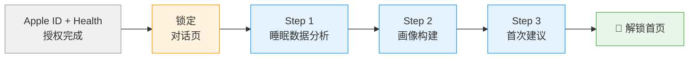

# Onboarding UI/设计 PRD

> 新用户注册及授权后在对话页面中完成 3 步引导的 UI 规格。
> 本文档定义设计规格——用户旅程、页面状态、UI 组件、加载状态和交互细节。

---

## 1. 用户旅程总览



**核心路径**：Apple ID 注册及授权 → 锁定在对话页 → 3 步 onboarding → 解锁首页 + Tab bar

---

## 2. 导航锁定

### 2.1 锁定规则

| 状态 | Tab Bar | 返回手势 | 顶部导航 |
|------|---------|---------|---------|
| onboarding 未完成 | **隐藏**或**置灰不可点** | **禁用** | 显示 onboarding 进度条 |
| onboarding 完成 | 正常显示（带出现动画） | 正常 | 正常导航栏 |

### 2.2 控制机制

```
if user.onboarding_completed == false:
    hide_tab_bar()
    disable_back_gesture()
    show_onboarding_progress_bar()
else:
    show_tab_bar(animated: true)
    enable_back_gesture()
    hide_onboarding_progress_bar()
```

### 2.3 进度条设计

```
┌──────────────────────────────────────────────┐
│       ●━━━━━━━○━━━━━━━○                      │
│      分析     了解你    建议                  │
└──────────────────────────────────────────────┘
```

- 位置：对话页顶部，状态栏下方
- 样式：3 个节点 + 连接线
- 已完成节点：品牌绿色实心圆 ●
- 当前节点：品牌绿色空心圆（带脉冲动画）○
- 未达节点：灰色空心圆 ○
- 连接线：已完成段为品牌绿色，未完成段为浅灰
- 每个节点下方有简短标签（分析 / 了解你 / 建议）
- 步骤完成时，连接线从左到右填充动画（duration: 0.3s）

---

## 3. Step 1：睡眠分析 UI

### 3.1 加载状态

```
┌─ 加载状态 ─────────────────────────────┐
│  ⏳ 正在分析你的睡眠数据...              │
│  ░░░░░░░░░░░░░░░░░░░░                  │
└────────────────────────────────────────┘
```

- 加载指示器：品牌色渐变进度条（无限循环）
- 文案下方可选加一行小字（灰色）："通常需要几秒钟"
- 最短显示时间：1.5s（避免闪烁）

### 3.2 分析结果展示

```
┌─ Agent ────────────────────────────────┐
│  看了你最近 7 天的睡眠数据，             │
│  有几个发现：                           │
│                                        │
│  1. 你工作日平均睡 6.5 小时，            │
│     周末跳到 8.4 小时——差距有点大        │
│                                        │
│  2. 深睡占比 18%，偏低了一些             │
│                                        │
│  3. 好消息是你入睡速度很快，             │
│     说明入睡能力没问题 👍               │
└────────────────────────────────────────┘
```

### 3.3 数据卡片

`render_analysis_card` 渲染的原生 SleepDetailCard，嵌入对话流中：

```
┌──────────────────────────────────────────┐
│  ┌──────────────┐ ┌──────────────┐       │
│  │ 深睡偏低 18%  │ │ 入睡快 15min │       │
│  └──────────────┘ └──────────────┘       │
│                                          │
│  ┌────────────────────────────────────┐  │
│  │                                    │  │
│  │     [ 原生 SleepDetailCard ]       │  │
│  │     简化版 — 最近 7 天柱状图        │  │
│  │                                    │  │
│  └────────────────────────────────────┘  │
│                                          │
│                       精力管家 · 睡眠概览 │
└──────────────────────────────────────────┘
```

### 3.4 过渡到 Step 2

```
┌─ Agent ────────────────────────────────┐
│  要进一步分析，我需要更了解你 😊        │
└────────────────────────────────────────┘

┌─ 快捷按钮 ────────────────────────────┐
│  ┌──────────┐  ┌──────────┐           │
│  │  好呀 👋  │  │ 问吧 💬   │           │
│  └──────────┘  └──────────┘           │
└───────────────────────────────────────┘
```

### 3.5 无数据场景

```
┌─ Agent ────────────────────────────────┐
│  目前还没有你的睡眠数据。               │
│  可能是 Apple Watch 还没同步，          │
│  或者你还没戴设备睡过。                 │
│                                        │
│  没关系！我先通过聊天了解你，            │
│  等数据到了我再帮你分析。               │
└────────────────────────────────────────┘
```

进度条 Step 1 标记为跳过（虚线圆 ◌），直接进入 Step 2。

---

## 4. Step 2：画像构建 UI（最长步骤）

### 4.1 问题选项卡片

每个问题独立气泡 + `suggest_replies` 选项按钮。这是增强版的 suggest_replies，包含题目文本 + 选项按钮 + "其他"文本输入：

```
┌─ Agent ────────────────────────────────┐
│  你的工作节奏大概是？                   │
└────────────────────────────────────────┘

┌─ 选项 ────────────────────────────────┐
│  ┌──────────────────────────────────┐ │
│  │  朝九晚六，比较规律               │ │
│  └──────────────────────────────────┘ │
│  ┌──────────────────────────────────┐ │
│  │  经常加班，到家比较晚             │ │
│  └──────────────────────────────────┘ │
│  ┌──────────────────────────────────┐ │
│  │  时间自由，没有固定上下班          │ │
│  └──────────────────────────────────┘ │
│  ┌──────────────────────────────────┐ │
│  │  📝 其他（请补充）                │ │
│  └──────────────────────────────────┘ │
└───────────────────────────────────────┘
```

**选项按钮规格**：

| 属性 | 值 |
|------|---|
| 布局 | 纵向排列，每个选项占一行 |
| 尺寸 | 宽度撑满气泡，高度 44px |
| 圆角 | 10px |
| 默认态 | 浅灰背景 + 深色文字 |
| 点击态 | 品牌绿色背景 + 白色文字 + 弹性缩放 |
| 已选态 | 品牌绿色描边 + 绿色文字 + ✓ 图标 |

**"其他（请补充）"选项的特殊交互**：

1. 用户点击"📝 其他（请补充）"→ 选项按钮高亮（绿色描边 + ✓），其他选项置灰
2. 底部输入栏从 readonly 变为可编辑，placeholder 变为"请补充你的情况..."
3. 输入栏自动聚焦，发送按钮变为可点击态（opacity: 1）
4. 用户输入自定义内容后，点击发送或按 Enter
5. 自定义文本作为用户消息气泡发送，流程继续到下一题
6. 输入栏恢复为 readonly 状态

### 4.2 用户选择后的反馈

用户点击选项后：

```
                    ┌─ 用户 ──────────────┐
                    │  经常加班，到家比较晚 │
                    └────────────────────┘

┌─ Agent ────────────────────────────────┐
│  明白了，加班的话到家时间不太固定。      │
└────────────────────────────────────────┘

┌─ Agent ────────────────────────────────┐
│  睡前最后一个小时通常在干嘛？           │
└────────────────────────────────────────┘

┌─ 选项 ────────────────────────────────┐
│  ...下一个问题的选项...                │
└───────────────────────────────────────┘
```

### 4.3 轮间过渡

每轮 3-4 题回答完后：

```
┌─ 加载状态 ─────────────────────────────┐
│  ⏳ 正在更新你的档案...                 │
└────────────────────────────────────────┘
```

- 显示 1-2 秒（sub-agent 同步更新画像）
- 进度指示器更新（"了解你 2/4"或"了解你 3/4"）
- 加载完成后 Agent 出下一轮问题或进入 Step 3

### 4.4 进度指示

在进度条的 Step 2 节点下方显示子进度：

```
●━━━━━━◉━━━━━━○
分析    了解你    建议
         2/4
```

- 子进度文案："了解你 N/M"（N=已完成轮次，M=预估总轮次）
- M 动态调整：如果画像很快达标，M 可能小于初始预估

---

## 5. Step 3：首次建议 UI

### 5.1 分析总结

```
┌─ Agent ────────────────────────────────┐
│  根据你的睡眠数据和刚才的了解：          │
│                                        │
│  你的核心问题是睡前刷手机导致上床太晚    │
│  （工作日平均 01:30），但好消息是你       │
│  入睡速度快、睡眠连续性好——               │
│  只要上床时间提前，睡眠质量就能起来。     │
└────────────────────────────────────────┘
```

### 5.2 行为建议

```
┌─ Agent ────────────────────────────────┐
│  💡 第一步建议：                        │
│                                        │
│  今晚试试 23:00 设个闹钟，响了之后      │
│  把手机放到客厅充电。不需要马上睡，       │
│  就是让手机离开卧室。                   │
│                                        │
│  明天早上我来问你情况。                  │
└────────────────────────────────────────┘
```

### 5.3 反馈卡片 UI

`send_feedback_card` 渲染的反馈追踪卡：

```
┌──────────────────────────────────────────┐
│  🔄 精力管家想跟进                        │
│                                          │
│  今晚试试 23:00 把手机放客厅？             │
│                                          │
│                         明早 08:00 提醒   │
└──────────────────────────────────────────┘
```

### 5.4 确认按钮

```
┌─ 快捷按钮 ────────────────────────────┐
│  ┌──────────────┐  ┌──────────────┐   │
│  │ 好，试试看 ✅ │  │  换个建议 🔄  │   │
│  └──────────────┘  └──────────────┘   │
└───────────────────────────────────────┘
```

---

## 6. 完成过渡

### 6.1 完成消息

用户点击"好，试试看"后：

```
┌─ Agent ────────────────────────────────┐
│  🎉 引导完成！                          │
│                                        │
│  我已经对你的情况有了初步了解。           │
│  你可以随时回来找我聊——                  │
│  不管是看数据、调整建议，还是随便聊聊。   │
└────────────────────────────────────────┘
```

### 6.2 解锁动画

```
动画序列（总时长 ~2s）：

1. 进度条所有节点填满绿色（0.5s）
2. 进度条向上滑出视野（0.3s）
3. Tab bar 从底部滑入（0.5s，带弹性效果）
4. 短暂停留（0.5s）
5. 自动跳转首页，或等待用户主动点击 Tab
```

**动画规格**：

| 动画 | 类型 | 时长 | 缓动 |
|------|------|------|------|
| 进度条填满 | 线性填充 | 0.5s | ease-out |
| 进度条滑出 | translateY → -100% | 0.3s | ease-in |
| Tab bar 出现 | translateY 100% → 0 | 0.5s | spring(damping: 0.7) |
| 完成 confetti（可选） | 粒子效果 | 1.5s | — |

---

## 7. 新增 UI 组件清单

| 组件 | 说明 | 使用步骤 |
|------|------|---------|
| **Onboarding 进度条** | 对话页顶部，3 步节点 + 连接线 + 标签 | 全流程 |
| **问题选项卡片** | 增强版 suggest_replies：题目文本 + 纵向选项按钮 + "其他" | Step 2 |
| **子进度指示** | 进度条 Step 2 下方的"了解你 N/M" | Step 2 |
| **完成庆祝动画** | 进度条填满 + Tab bar 滑入 + 可选 confetti | 完成过渡 |
| **加载状态组件** | 品牌色渐变加载条 + 文案 | Step 1-3 |

---

## 8. 加载状态文案

| 阶段 | 文案 | 显示时机 |
|------|------|---------|
| 数据分析中 | "正在分析你的睡眠数据..." | Step 1 Agent 调工具时 |
| 画像更新中 | "正在更新你的档案..." | Step 2 每轮问答后 sub-agent 运行时 |
| 生成建议中 | "正在为你制定改善方案..." | Step 2 → Step 3 过渡 |

**加载状态的通用规格**：

| 属性 | 值 |
|------|---|
| 容器 | 与 Agent 气泡同宽，居左 |
| 背景 | 浅灰 (#F5F5F7) |
| 圆角 | 12px |
| 内边距 | 16px |
| 图标 | 品牌色旋转 spinner（24x24px） |
| 文字 | 14px，灰色 (#8E8E93) |
| 最短显示 | 1.5s（避免闪烁） |
| 消失方式 | 上推动画，被后续消息替代 |

---

## 9. 对话气泡样式

### 9.1 Agent 气泡

| 属性 | 值 |
|------|---|
| 对齐 | 左对齐 |
| 背景色 | 深色（#1C1C1E 或设计系统的 agent 气泡色） |
| 文字色 | 白色 |
| 圆角 | 16px（左下角 4px） |
| 最大宽度 | 屏幕宽度 - 80px |
| 字号 | 16px |
| 行高 | 1.5 |
| 左侧 | 可选 Agent 头像（32x32，品牌 icon） |

### 9.2 用户气泡

| 属性 | 值 |
|------|---|
| 对齐 | 右对齐 |
| 背景色 | 品牌绿色或浅色（#E8F5E9 或设计系统的用户气泡色） |
| 文字色 | 深色 |
| 圆角 | 16px（右下角 4px） |
| 最大宽度 | 屏幕宽度 - 80px |

### 9.3 消息出现动画

| 动画 | 值 |
|------|---|
| 类型 | 从下方滑入 + 淡入 |
| 位移 | translateY: 20px → 0 |
| 透明度 | 0 → 1 |
| 时长 | 0.3s |
| 缓动 | ease-out |
| 逐条延迟 | 每条消息延迟 0.4s，模拟打字感 |

---

## 10. 底部输入栏

onboarding 期间的底部输入栏：

```
┌──────────────────────────────────────────┐
│  ┌──────────────────────────────┐ ┌───┐ │
│  │  输入消息...                  │ │ ↑ │ │
│  └──────────────────────────────┘ └───┘ │
└──────────────────────────────────────────┘
```

- **Step 1/3**：输入栏正常显示，用户可自由输入
- **Step 2 有选项时**：输入栏仍可用，但选项按钮是主交互方式
- 选项按钮出现时，输入栏轻微弱化（opacity: 0.6），被点击时恢复
- "其他（请补充）"选项点击时，自动聚焦输入栏

---

## 11. 错误状态 UI

### 11.1 数据加载失败

```
┌─ Agent ────────────────────────────────┐
│  数据暂时读不到，可能手表还在同步。      │
│  没关系，我们先聊聊，数据到了我再分析。  │
└────────────────────────────────────────┘
```

自动跳过 Step 1，进入 Step 2。

### 11.2 网络异常

```
┌─ 系统提示 ────────────────────────────┐
│  ⚠️ 网络连接异常，请检查后重试           │
│  ┌──────────────┐                     │
│  │    重试       │                     │
│  └──────────────┘                     │
└───────────────────────────────────────┘
```

---

## 12. 中途退出与恢复

| 场景 | UI 行为 |
|------|---------|
| 下滑退出 App | 下次打开恢复到上次步骤，对话历史保留，进度条状态恢复 |
| 杀掉 App 进程 | 同上，OnboardingState 已持久化 |
| 切换到其他 App 后返回 | 页面保持不变 |
| Step 2 中途退出 | 恢复后显示上次未完成的问题，Agent 继续当前轮次 |

---

## 13. 响应式适配

| 设备 | 适配要点 |
|------|---------|
| iPhone SE (375px) | 选项按钮文字不超过 2 行，缩小内边距 |
| iPhone 14/15 (390px) | 主设计尺寸 |
| iPhone 14/15 Pro Max (430px) | 对话气泡最大宽度保持不变，两侧留白增大 |
| Dynamic Island 机型 | 进度条避开 Dynamic Island 区域 |
| 大字体 / 无障碍 | 选项按钮高度自适应文字行数 |

---

## 14. 设计说明

| 设计决策 | 理由 |
|---------|------|
| 进度条用节点+连接线而非数字 | 3 步足够少，可视化比数字更直觉 |
| Step 2 选项纵向排列而非横向 | 选项文字可能较长，纵向避免截断 |
| 加载状态最短 1.5s | 工具调用可能极快（<100ms），太短会闪烁让用户觉得不可靠 |
| Tab bar 出现用弹性动画 | 强调"解锁"的仪式感 |
| 输入栏始终可用 | 不阻止用户自由输入，Agent 场景指令处理跑题 |
| 消息逐条延迟出现 | 模拟真人打字节奏，对话感更强 |
