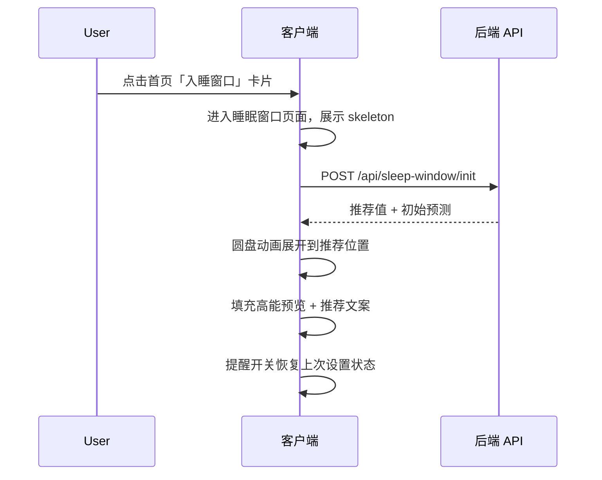
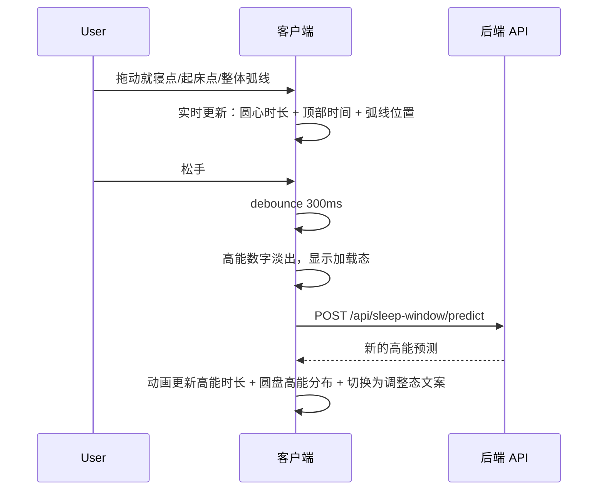

# 睡眠窗口 (Sleep Window) PRD

> 文档版本：v1.0 | 创建日期：2026-04-09
> 状态：**正式 PRD**
> 所属模块：首页 · 独立原生功能页

---

## 一、功能定义

### 1.1 核心定义

用户从首页「入睡窗口」卡片进入独立页面，系统基于过去 7 天的睡眠数据，推荐今晚的最佳就寝和起床时间。用户可拖动圆盘调整时间，实时预览不同睡眠方案对次日高能时长（时长 + 分布）的影响，并可一键设置入睡提醒和起床闹钟。

### 1.2 与现有系统的关系

> 睡眠窗口是**独立的原生功能页面**，不经过 Agent 对话流，不使用 Agent 工具。所有数据获取和提醒设置均由客户端直接调用后端 API 或系统原生能力完成。

| 维度 | Agent Chatflow | 睡眠窗口 |
|:---|:---|:---|
| 定位 | 完整对话引擎 | 独立功能页，纯原生交互 |
| 数据获取 | 通过 Agent 工具 (get_health_data) | 客户端直接调用后端 API |
| 提醒设置 | 通过 Agent 工具 (set_reminder) | 客户端本地推送 + 系统闹钟 |
| 触发方式 | 事件状态机 (07-events) | 用户点击首页卡片进入 |
| 输出形态 | 文字 + 原生卡片 + 按钮 | 圆盘交互 + 数据预览 + 开关 |

**数据一致性**：睡眠窗口的推荐入睡时间与首页 Smart Digest 中的 `sleep_window` 字段保持一致，两者读取同一后端数据源。

### 1.3 设计理念

| 原则 | 说明 |
|:---|:---|
| **数据驱动，不猜测** | 推荐基于过去 7 天实际睡眠数据，不靠通用公式 |
| **拖动即见，所见即所得** | 用户调整时间后立即预览高能变化，直观感知早睡/晚睡的影响 |
| **闭环执行** | 推荐 → 提醒 → 执行，不停留在「知道了但做不到」 |
| **口语化表达** | 文案直接说重点，不用技术术语，让人一读就懂 |

---

## 二、推荐算法与接口

### 2.1 推荐睡眠窗口的确定逻辑

**目标**：找到今晚能让明天高能时长最大化的入睡时间。

**步骤**：

1. **确定常规起床时间**
   - 取过去 3 周「同星期几」的起床时间均值
   - 例：今天是周三，则取过去 3 个周三的平均起床时间
   - 降级：若同星期几数据不足 3 天，降级为过去 7 天整体起床时间均值

2. **计算最优入睡时间**
   - 在常规起床时间固定的前提下，调用高能预测模型，倒推能获得次日最大高能时长的**最晚**入睡时间

3. **生成推荐入睡时间**
   - 推荐入睡时间 = 最优入睡时间 - 30 分钟
   - 预留 30 分钟入睡缓冲（从上床到真正入睡的过渡时间）

4. **推荐起床时间** = 常规起床时间

### 2.2 页面初始化接口

页面打开时调用一次，返回推荐值和初始预测结果。

```
POST /api/sleep-window/init

Response:
{
  "regular_wake_time": "06:30",        // 过去3周同星期几起床均值
  "recommended_bedtime": "23:00",      // 最优入睡 - 30min（展示给用户的推荐）
  "optimal_bedtime": "23:30",          // 最优入睡时间（内部计算用）
  "predicted_high_energy": {
    "total_hours": 7.5,                // 推荐方案下的预测高能时长
    "windows": [                       // 高能时段分布（用于圆盘可视化）
      { "start": "09:00", "end": "11:30" },
      { "start": "14:00", "end": "17:00" }
    ]
  },
  "basis": {                           // 用于 UI 展示说明文案
    "data_days": 7,                    // 基于多少天数据计算
    "avg_sleep_duration_min": 420,     // 过去7天平均睡眠时长（分钟）
    "avg_deep_pct": 19                 // 过去7天平均深睡占比（%）
  }
}
```

**错误响应**：

| 错误码 | 含义 | 客户端处理 |
|:---|:---|:---|
| `NO_SLEEP_DATA` | 用户无任何睡眠数据 | 首页不展示入睡窗口卡片 |
| `INSUFFICIENT_DATA` | 睡眠数据不足 7 天 | 正常展示，`basis.data_days` 反映实际天数 |
| `INTERNAL_ERROR` | 服务端异常 | 页面展示加载失败态，提供重试按钮 |

### 2.3 高能预测接口

用户拖动拨盘松手后调用，返回该时间方案下的高能预测。

```
POST /api/sleep-window/predict

Request:
{
  "selected_bedtime": "00:30",         // 用户选择的就寝时间
  "selected_wake_time": "06:30"        // 用户选择的起床时间
}

Response:
{
  "predicted_high_energy": {
    "total_hours": 5.2,                // 预测高能时长
    "windows": [                       // 高能时段分布
      { "start": "09:30", "end": "11:00" },
      { "start": "14:30", "end": "16:00" }
    ]
  },
  "delta_vs_recommended": -2.3         // 与推荐方案的高能时长差值（小时）
}
```

**调用策略**：
- 入参只需 `selected_bedtime` / `selected_wake_time`，过去 7 天睡眠特征由服务端自行获取
- 拨盘拖动过程中**不调用**，松手后 debounce 300ms 再调用
- 超时阈值：3 秒未返回 → 显示降级态
- 不重试（用户会继续拖动，新请求自动覆盖旧请求）

---

## 三、页面交互

### 3.1 整体页面布局

| 属性 | 说明 |
|:---|:---|
| 刻度盘 | 24 小时制，标注 0/3/6/9/12/15/18/21 |
| 睡眠弧线 | 蓝色弧线表示睡眠区间 |
| 就寝拖动点 | 弧线起点，床图标 |
| 起床拖动点 | 弧线终点，太阳图标 |
| 圆心文字 | 当前睡眠时长，格式：`Nh Mmin` |
| 高能分布 | 在圆盘上可视化次日高能时段，具体样式参考 Figma 设计稿 |

**拖动规则**：
- 拖动就寝点：起床时间不变，睡眠时长随之变化
- 拖动起床点：就寝时间不变，睡眠时长随之变化
- 拖动弧线整体：睡眠时长固定不变，就寝和起床时间同步平移
- 时间精度：15 分钟为一档（拖动时吸附到最近的 15 分钟刻度）
- 最小睡眠时长限制：不低于 2 小时（拖动到极限时停止）
- 最大睡眠时长限制：不超过 10 小时（拖动到极限时停止）

### 3.3 高能预览区

#### 文案方案（口语化风格）

**推荐态**（页面初始 / 用户拖回推荐位置）：

> 预估明日高能时长 **7.5h**
>
> 基于你过去 {data_days} 天的睡眠数据，{recommended_bedtime} 入睡可实现明日高能最大化。

**调整态 — 晚睡**（用户将就寝时间拖晚于推荐）：

> 预估明日高能时长 **5.2h**
>
> 比推荐时间晚 {delta_min} 分钟，明日高能减少 {delta_hours} 小时。

**调整态 — 早睡**（用户将就寝时间拖早于推荐）：

> 预估明日高能时长 **7.3h**
>
> 比推荐时间早 {delta_min} 分钟，明日高能增加 {delta_hours} 小时。

**调整态 — 高能无变化**（调整后高能与推荐持平）：

> 预估明日高能时长 **7.5h**
>
> 比推荐时间早/晚 {delta_min} 分钟，明日高能无明显变化。

### 3.4 提醒设置

| 提醒类型 | 默认状态 | 触发时机 | 实现方式 |
|:---|:---|:---|:---|
| 入睡提醒 | **开启** | 用户选择的入睡时间前 30 分钟 | 客户端本地推送通知 (UNUserNotificationCenter) |
| 起床闹钟 | **关闭** | 用户选择的起床时间 | iOS 系统闹钟 API |

**入睡提醒推送文案**（固定模板）：
- "今晚 {optimal_bedtime} 是你的最佳入睡时间"
- 其中 `{optimal_bedtime}` 为推荐入睡时间 + 30 分钟（即最优入睡时间），例："今晚 23:30 是你的最佳入睡时间"

**权限处理**：
- 首次开启入睡提醒：检查通知权限，未授权则弹出系统授权弹窗
- 首次开启起床闹钟：检查闹钟权限，未授权则引导设置

### 3.5 各状态的 UI 表现

| 状态 | 圆盘 | 高能预览 | 提醒设置 | 推荐文案 |
|:---|:---|:---|:---|:---|
| 加载中 | skeleton 圆环 | skeleton 数字 | 置灰不可操作 | 不展示 |
| 正常展示（推荐态） | 弧线在推荐位置 | 推荐态文案 | 正常可操作 | "推荐您今晚入睡时间为 XX:XX" |
| 用户调整中（拖动） | 弧线跟随手指 | 上一次结果（淡化） | 正常可操作 | 不变 |
| 用户调整后（接口返回） | 弧线在新位置 + 高能分布更新 | 调整态文案 | 正常可操作 | 不变 |
| 预测接口失败 | 弧线在新位置 | "--"，"预测暂不可用" | 正常可操作 | 不变 |
| 初始化接口失败 | 空白 | 空白 | 不可操作 | "加载失败，点击重试" |

---

## 四、交互细节

### 4.1 页面加载流程



### 4.2 拨盘拖动交互



**拖动体验要求**：
- 拖动过程中圆心时长和顶部时间**实时更新**（纯本地计算，不等接口）
- 高能预测需要等接口返回后更新
- 快速连续拖动时，取消未完成的旧请求，仅保留最新一次

### 4.3 提醒开关交互

- **开启入睡提醒**：立即注册本地推送通知（入睡时间 - 30 分钟触发）
- **关闭入睡提醒**：立即取消已注册的推送通知
- **开启起床闹钟**：调用系统闹钟 API 创建闹钟
- **关闭起床闹钟**：取消已创建的闹钟
- **时间调整联动**：用户拖动调整时间后，若提醒/闹钟已开启，自动更新为新时间
- **状态持久化**：提醒开关状态本地持久化，下次进入页面恢复

### 4.4 返回行为

- 点击返回按钮或滑动返回 → 回到首页
- 提醒已在开关切换时实时保存，无需额外确认弹窗
- 若用户调整了时间但未开启任何提醒，不做额外提示（尊重用户选择）

---

## 五、边界情况与降级

| # | 场景 | 处理方式 |
|:---:|:---|:---|
| 1 | 新用户 / 无任何睡眠数据 | 首页不展示「入睡窗口」卡片（init 接口返回 `NO_SLEEP_DATA`） |
| 2 | 睡眠数据不足 7 天 | 正常展示，使用已有天数的均值。文案改为"基于你过去 N 天的数据"（N = `basis.data_days`） |
| 3 | 过去 3 周同星期几数据不足 | 降级为过去 7 天整体起床时间均值作为常规起床时间 |
| 4 | predict 接口超时（> 3s） | 高能时长显示"--"，文案显示"预测暂不可用，请稍后再试" |
| 5 | predict 接口失败 | 同超时处理 |
| 6 | init 接口失败 | 页面展示空白 + "加载失败，点击重试"按钮 |
| 7 | 用户选择极端时间（睡眠 < 4h） | 允许选择，文案按调整态正常显示差值（如"比推荐时间晚 180 分钟，明日高能减少 5.3 小时"） |
| 8 | 用户拖回推荐位置 | 恢复为推荐态文案 |
| 9 | 通知权限未授权 | 开启入睡提醒时弹出系统授权弹窗，拒绝后开关自动回到关闭状态 |
| 10 | 网络断开 | 圆盘拖动本地交互正常，松手后提示"网络不可用，无法预测" |

---

## 六、首页卡片入口

### 6.1 卡片内容

首页「入睡窗口」卡片简要展示：
- 推荐入睡时间
- 预估明日高能时长

卡片数据可复用 init 接口的缓存结果，随首页数据一起刷新。

### 6.2 卡片展示条件

| 条件 | 是否展示 |
|:---|:---|
| 有睡眠数据（≥ 1 天） | 展示 |
| 无任何睡眠数据 | 不展示 |

---

## 七、性能要求

| 指标 | 要求 |
|:---|:---|
| init 接口响应 | ≤ 2 秒 |
| predict 接口响应 | ≤ 3 秒（超时降级） |
| 拨盘拖动帧率 | ≥ 60fps（纯本地渲染，不依赖接口） |
| debounce 间隔 | 300ms（松手到发起请求） |
| 请求取消 | 快速连续拖动时取消未完成的旧请求 |
