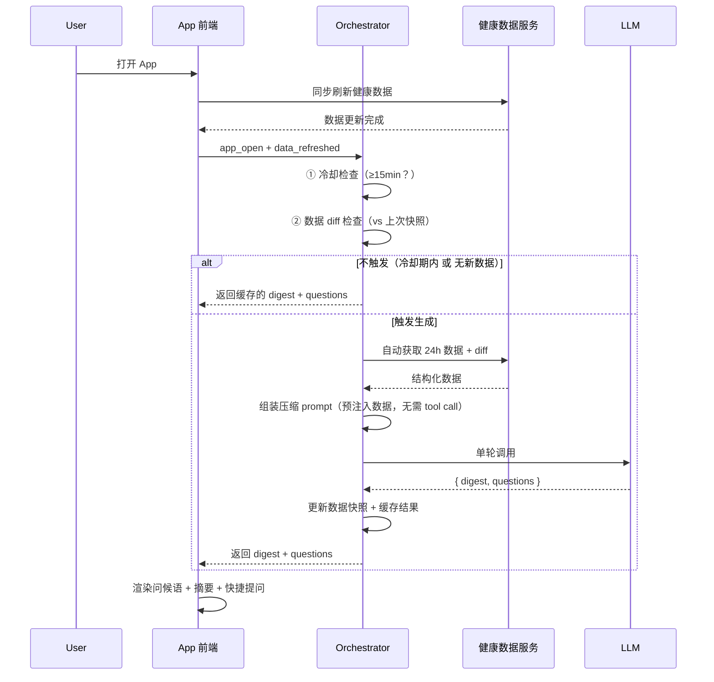
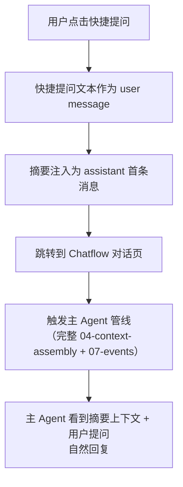

# 首页智能摘要 (Homepage Smart Digest) PRD

> 文档版本：v1.0 | 创建日期：2026-04-09
> 状态：**正式 PRD**
> 所属模块：Agent Chatflow · 首页轻量交互层

---

## 一、功能定义

### 1.1 核心定义

每次用户打开 App 并完成数据刷新后，系统自动触发一次**轻量级 LLM 调用**（独立于主 Agent 管线），生成两项内容：

1. **智能摘要（Digest）**：首页问候语下方一行副标题，突出数据中最值得关注的异常值或趋势，配合当前时段给出一句轻松的评价或调侃
2. **快捷提问（Quick Questions）**：输入框上方 3 个推荐提问按钮，覆盖数据下钻分析、术语解读、改善建议等方向

### 1.2 与现有架构的关系

| 维度 | 主 Agent Chatflow | Smart Digest |
|:---|:---|:---|
| 定位 | 完整对话引擎 | 首页轻量触点 |
| System Prompt | 4 层拼接（身份+速览+样式+场景） | 单层压缩 |
| 工具 | 9 个 tool definitions | 无（数据由 orchestrator 预注入） |
| 对话轮次 | 多轮 Agent Loop | 单次调用，固定 JSON 输出 |
| 触发方式 | 事件状态机（07-events） | 数据更新 + 冷却期 |

**关键衔接**：Smart Digest 的输出（摘要 + 快捷提问）在用户进入对话时，注入为 Chatflow 的上下文首条消息，主 Agent 能自然衔接摘要内容回复。

### 1.3 设计理念

| 原则 | 说明 |
|:---|:---|
| **数据优先，不说废话** | 摘要必须锚定在数据变化上，不生成空洞的鸡汤或通用问候 |
| **调侃不建议** | 摘要只做评价、观察、调侃，不给具体行动建议——建议留给快捷提问引导到 Chatflow |
| **会心一笑** | 像一个看过你数据的损友说的一句话，不是医生的诊断书 |
| **高频低成本** | 单次轻量调用，15 分钟冷却，控制成本和延迟 |

---

## 二、触发逻辑

### 2.1 触发时序



### 2.2 触发条件

同时满足以下 **全部条件** 时触发 LLM 生成：

| # | 条件 | 说明 |
|:---:|:---|:---|
| 1 | `app_open` + `data_refreshed` | 用户打开 App 且健康数据已完成同步 |
| 2 | `has_new_data == true` | 当前数据与上次生成摘要时的快照存在差异 |
| 3 | `minutes_since_last_digest >= 15` | 距离上次成功生成摘要不少于 15 分钟 |

### 2.3 不触发的情况

| 场景 | 表现 |
|:---|:---|
| 冷却期内（< 15 分钟再次打开） | 展示缓存的摘要和快捷提问 |
| 无新数据（数据与快照一致） | 展示缓存的摘要和快捷提问 |
| 新用户/无任何历史数据 | 仅展示问候大字，摘要区域为空，不展示快捷提问 |
| LLM 调用失败/超时 | 仅展示问候大字，摘要区域为空，不展示快捷提问 |

### 2.4 数据快照机制

- **写入时机**：每次 LLM 成功生成摘要后，保存当前所有健康指标的快照 + 生成时间戳
- **对比逻辑**：下次触发时，逐指标对比当前值与快照，任一指标变化超过阈值即视为 `has_new_data`
- **存储位置**：本地持久化存储，随 App 缓存策略管理
- **快照格式**：与输入数据规格一致（见第三节）

**变化阈值参考**：

| 指标 | 最小有意义变化 |
|:---|:---|
| `total_min`（睡眠时长） | Δ ≥ 30 min |
| `deep_pct` / `rem_pct`（睡眠结构） | Δ ≥ 3% |
| `efficiency`（睡眠效率） | Δ ≥ 3% |
| `bedtime` / `wake`（入睡/起床时间） | Δ ≥ 15 min |
| `resting_bpm`（静息心率） | Δ ≥ 3 bpm |
| `hrv_ms`（HRV） | Δ ≥ 5 ms |
| `steps`（步数） | Δ ≥ 1000 |
| `active_kcal`（活动消耗） | Δ ≥ 100 kcal |
| `high_energy_h` / `remaining_h`（高能时长） | Δ ≥ 0.5 h |
| 新数据类型出现（如首次同步睡眠） | 直接触发 |

---

## 三、输入数据规格

orchestrator 在触发时**自动收集**以下数据，直接拼接注入 prompt。不通过 LLM function call 获取。

### 3.1 当前时间

```json
{
  "current_time": "2026-04-09T08:30:00+08:00",
  "time_period": "morning",
  "day_of_week": "Wednesday"
}
```

时段划分：

| 时段标识 | 时间范围 | 中文标签 |
|:---|:---|:---|
| `early_morning` | 00:00–05:00 | 凌晨 |
| `morning` | 05:00–11:00 | 早上 |
| `midday` | 11:00–14:00 | 中午 |
| `afternoon` | 14:00–17:00 | 下午 |
| `evening` | 17:00–21:00 | 傍晚 |
| `night` | 21:00–00:00 | 夜晚 |

### 3.2 用户速览

复用现有记忆系统的 `# [summary]`（~80 tk），不额外拉取：

```
30岁男/产品经理/晚型人/独居 | 核心问题:睡前手机→上床晚→时长不足 | 阶段:干预中期,手机放客厅试跑有效 | 红线:咖啡,早起运动 | 沟通:数据驱动,不喜鸡汤,偶尔自嘲
```

### 3.3 过去 24 小时健康数据

orchestrator 自动调用数据接口获取，压缩为扁平 key-value 结构：

```yaml
sleep:
  total_min: 420          # 总睡眠时长
  deep_pct: 20            # 深睡占比 %
  rem_pct: 25             # REM 占比 %
  efficiency: 88          # 睡眠效率 %
  bedtime: "01:15"        # 入睡时间
  wake: "08:30"           # 起床时间
  latency_min: 12         # 入睡潜伏期（分钟）
  consistency_dev: 15     # 入睡偏差（分钟，vs 7日均值）

heart:
  resting_bpm: 62         # 静息心率
  hrv_ms: 45              # HRV (SDNN)

activity:
  active_kcal: 672        # 活动消耗
  steps: 8234             # 步数
  workout_min: 0          # 运动时长

energy:
  high_energy_h: 5.2      # 今日高能时长
  remaining_h: 3.8        # 剩余高能时长
  peak_windows:           # 高能时段
    - "09:30-11:45"
    - "14:00-16:30"
  sleep_window: "23:00"   # 推荐入睡时间

blood_oxygen:
  avg_pct: 96             # 平均血氧
  min_pct: 93             # 最低血氧
```

### 3.4 数据 diff（上次打开 vs 现在）

逐指标对比，仅列出有变化的字段：

```yaml
diff:
  new_data_types: ["sleep"]           # 全新出现的数据类型
  changes:
    - key: "deep_pct"
      prev: null
      curr: 20                         # 新增
      note: "昨夜深睡数据首次出现"
    - key: "resting_bpm"
      prev: 65
      curr: 62                         # Δ -3
    - key: "hrv_ms"
      prev: 42
      curr: 45                         # Δ +3
    - key: "remaining_h"
      prev: 5.2
      curr: 3.8                        # Δ -1.4
```

> **压缩策略**：只传有变化的字段 + delta 值，未变化的字段不出现在 diff 中。

---

## 四、Prompt 设计

### 4.1 Prompt 模板

```
你是 iSho 精力管家。根据用户的健康数据变化生成首页摘要。

规则：
1. digest: 一句话（≤50字）。前半句点出数据中最值得关注的变化或异常；后半句基于当前时段，给一句评价或轻松调侃。不给具体行动建议。风格：像一个看过你数据的朋友随口说的一句话，让人会心一笑。每次表达方式要有变化，不要重复套路。
2. questions: 3个推荐提问（每个≤20字）。方向参考：数据下钻分析、专业术语/概念解读、改善建议。基于 digest 内容和当前时间灵活生成。

用户：{user_summary}
时间：{current_time}（{time_period_label}，{day_of_week}）

24h数据：{last_24h_compact}

本次更新：{diff_compact}

输出严格 JSON：
{"digest":"...","questions":["...","...","..."]}
```

### 4.2 摘要风格规范

| 维度 | 要求 |
|:---|:---|
| **长度** | ≤ 50 字（一行展示，不换行） |
| **结构** | 数据洞察 + 时段化评价/调侃 |
| **禁止** | ❌ 具体建议（"建议你..."）、❌ 鸡汤（"相信自己"）、❌ 重复模板 |
| **语气** | 跟随用户速览中的沟通偏好（如「数据驱动,不喜鸡汤,偶尔自嘲」） |

### 4.3 风格示例

**早上（sleep 数据刚同步）**

| 数据情况 | 摘要示例 |
|:---|:---|
| 深睡达标 + HRV 上升 | 深睡 21% 回到线上，HRV 也涨了 3ms——今早的你可以嚣张一点 |
| 深睡偏低 + 入睡太晚 | 1:45 才躺下，深睡只捞到 15%，不过高能窗口 9:30 就开了，先干正事 |
| 睡眠时长不足 + 效率高 | 只睡了 6 小时但效率 92%，属于质量型选手——别靠这个当借口就行 |

**下午（energy 数据更新）**

| 数据情况 | 摘要示例 |
|:---|:---|
| 高能时段剩余多 | 还剩 4 小时高能，2-4 点是你的主场——那个需求文档该写了 |
| 高能已耗尽 | 高能额度已经刷完了，剩下的时间适合做不费脑的事 |

**晚上（activity 数据更新）**

| 数据情况 | 摘要示例 |
|:---|:---|
| 活动量偏低 | 今天只消耗了 320 大卡，步数也没过 3000——你的椅子比你更累 |
| 接近推荐入睡时间 | 静息心率已经降到 58 了，身体比你先表态——该准备收工了 |

### 4.4 快捷提问示例

| 摘要上下文 | 推荐提问 |
|:---|:---|
| 深睡重新达标 + HRV 上涨 | ① 深睡和 HRV 为什么经常同步变化？ ② 这三天的深睡趋势怎么样？ ③ 怎么把这个状态保持住？ |
| 入睡太晚 + 深睡偏低 | ① 入睡时间晚多少深睡就开始掉？ ② 什么是深睡占比，多少算正常？ ③ 今晚有什么能马上试的方法？ |
| 高能时段剩余多 | ① 高能时段具体是怎么算出来的？ ② 今天的高能窗口和昨天比有变化吗？ ③ 怎么在高能窗口里提升效率？ |

---

## 五、UI 集成

### 5.1 首页布局

```
┌─────────────────────────────────────────┐
│                                         │
│  早上好                                  │  ← 问候语（大字静态，按时段切换）
│  {digest}                               │  ← AI 智能摘要（副标题，一行）
│                                         │
│  ┌────┐  ┌────┐  ┌────┐                │
│  │睡眠│  │心率│  │消耗│                  │  ← 数据指标卡片
│  │ 92 │  │ 87 │  │672 │                  │
│  └────┘  └────┘  └────┘                │
│                                         │
│  ... 高能时段 / 入睡窗口 / 睡眠分析 ...   │  ← 其他首页模块
│                                         │
│  ┌─────────────────────────────────┐    │
│  │ 深睡和 HRV 为什么同步变化？      │    │  ← 快捷提问 ①
│  ├─────────────────────────────────┤    │
│  │ 这三天的深睡趋势怎么样？         │    │  ← 快捷提问 ②
│  ├─────────────────────────────────┤    │
│  │ 怎么把这个状态保持住？           │    │  ← 快捷提问 ③
│  └─────────────────────────────────┘    │
│  ┌─────────────────────────────────┐    │
│  │ ✨ 输入您的内容             ⬆   │    │  ← 输入框
│  └─────────────────────────────────┘    │
└─────────────────────────────────────────┘
```

### 5.2 问候语时段映射

| 时段 | 时间范围 | 问候语 |
|:---|:---|:---|
| 凌晨 | 00:00–05:00 | 夜深了 |
| 早上 | 05:00–11:00 | 早上好 |
| 中午 | 11:00–14:00 | 中午好 |
| 下午 | 14:00–17:00 | 下午好 |
| 傍晚 | 17:00–21:00 | 傍晚好 |
| 夜晚 | 21:00–00:00 | 晚上好 |

> 问候语由前端按时段静态生成，**不经过 LLM**。

### 5.3 各状态的 UI 表现

| 状态 | 问候语 | 摘要副标题 | 快捷提问 | 数据指标 |
|:---|:---|:---|:---|:---|
| ✅ 正常生成 | 展示 | AI 生成内容 | 3 个按钮 | 正常刷新 |
| 💾 展示缓存 | 展示 | 上次缓存内容 | 上次缓存 | 正常刷新 |
| 🆕 新用户/无数据 | 展示 | 空（不展示） | 不展示 | 正常刷新 |
| ❌ LLM 失败 | 展示 | 空（不展示） | 不展示 | 正常刷新 |
| ⏳ 加载中 | 展示 | 渐显 skeleton（可选） | 不展示 | 正常刷新 |

> **关键原则**：数据指标永远独立刷新，不受 LLM 状态影响。摘要为空时 UI 自然收缩，问候大字保持展示。

---

## 六、与 Chatflow 的衔接

### 6.1 摘要注入对话上下文

用户通过以下任一方式进入 Chatflow 对话时，摘要自动注入为对话首条 assistant 消息：

- 点击 3 个快捷提问之一
- 在输入框直接输入内容

```python
# 对话 messages 的组装
messages = [
    {
        "role": "assistant",
        "content": digest_text,                    # 摘要作为 agent 已说的话
        "metadata": {
            "type": "smart_digest",
            "generated_at": "2026-04-09T08:30:00+08:00"
        }
    },
    {
        "role": "user",
        "content": clicked_question_or_user_input   # 快捷提问文本 或 用户自由输入
    }
]
```

主 Agent 在对话中能看到自己"说过"的摘要，自然衔接回复，不会重复分析已提到的数据。

### 6.2 快捷提问的交互流程



> 快捷提问等同于用户输入文字——进入 Chatflow 后走标准的主 Agent 对话流程，享有完整的工具调用能力。

---

## 七、Prompt 工程细节

### 7.1 输出格式约束

LLM 输出严格 JSON，不包裹 markdown code block：

```json
{
  "digest": "深睡 21% 回到线上，HRV 也涨了 3ms——今早的你可以嚣张一点",
  "questions": [
    "深睡和 HRV 为什么经常同步变化？",
    "这三天的深睡趋势怎么样？",
    "怎么把这个状态保持住？"
  ]
}
```

### 7.2 输出校验规则

| 字段 | 校验要求 | 校验失败处理 |
|:---|:---|:---|
| JSON 整体 | 可正常解析 | 降级：不展示摘要和快捷提问 |
| `digest` | 非空字符串，≤ 50 字 | 降级：不展示摘要和快捷提问 |
| `questions` | 长度为 3 的字符串数组，每项 ≤ 20 字 | 降级：不展示摘要和快捷提问 |

### 7.3 防重复策略

prompt 中要求"每次表达方式要有变化，不要重复套路"。如果后续实测发现仍有重复，可追加以下措施：

| 策略 | 实现 | 复杂度 |
|:---|:---|:---|
| 注入上次摘要 | prompt 中追加 `上次摘要：{last_digest}`，要求不重复 | 低 |
| temperature 微调 | 设置 `temperature=0.8`（略高于主 Agent 的 0.7） | 低 |
| 后端去重校验 | 缓存最近 5 次摘要，余弦相似度 > 0.9 则重新生成 | 中 |

v1.0 先用策略 1 + 2，效果不够再加策略 3。

### 7.4 时段差异化生成策略

不同时段面对的数据更新类型不同，prompt 中的数据侧重点自然不同：

| 时段 | 典型数据更新 | 摘要侧重 |
|:---|:---|:---|
| 早上 (05-11) | 昨夜睡眠数据首次同步 | 睡眠质量 + 今日高能预测 |
| 中午 (11-14) | 上午活动数据累计 | 上午状态回顾 + 下午展望 |
| 下午 (14-17) | 高能时段剩余变化 | 剩余高能 + 当前窗口 |
| 傍晚 (17-21) | 全天活动数据 | 全天回顾 + 入睡准备 |
| 夜晚 (21-05) | 接近/进入入睡窗口 | 入睡状态 + 明日预测 |

---

## 八、性能与降级要求

| 指标 | 要求 |
|:---|:---|
| 模型选择 | Sonnet 级别（平衡质量与成本） |
| LLM 响应超时 | 3 秒未返回 → 降级为空摘要 |
| Streaming | 不需要，单次 JSON 返回，前端等待完整结果后渲染 |
| 重试 | 不重试（高频场景，下次打开再生成） |

