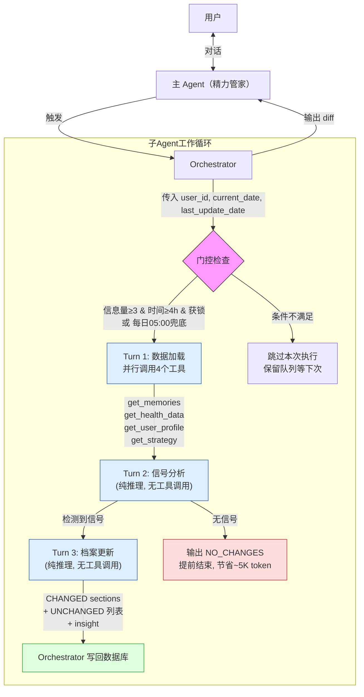

# 子 Agent 使用指南

> 本目录包含所有子 agent 的提示词模板和通用规则

## 架构概述

主 agent（精力管家）在对话中直接与用户交互。子 agent 在后台异步执行，不直接面对用户。

## 当前子 Agent 清单

| 子 Agent | 状态 | 触发时机 | 工具调用 | 输出 |
|----------|------|----------|---------|------|
| [memory-distiller](./memory-distiller/) | **启用** | 三重门控（信息量≥3条 + 时间≥4h + 锁门）/ 每日05:00兜底 | 有（get_memories 占位 + get_health_data + get_user_profile + get_strategy） | CHANGED/UNCHANGED diff + 可选 insight |

## 通用规则（所有子 agent 务必遵守）

### 隔离原则
- 子 agent 只能看到传入的数据，禁止访问主对话上下文
- 子 agent 之间禁止直接通信——通过 orchestrator 中转
- 子 agent 不持有状态——每次调用都是无状态的

### 输出规范
- 子 agent 的输出禁止直接展示给用户
- 输出格式务必严格遵循各自模板定义的结构
- 输出中禁止包含对用户的称呼或对话语气——子 agent 不是在和用户说话

### 触发门控
- 每个子 agent 必须定义触发门控条件，防止过度调用浪费 API
- 门控至少包含：信息量门（新信息是否足够多）+ 时间门（距上次执行是否足够久）
- 必须有兜底触发（如定时任务），确保即使门控未满足也不会无限期不执行
- orchestrator 需记录每次子 agent 执行的时间戳和输入摘要，用于门控判断

### 日期处理
- 所有子 agent 的输入必须包含 `current_date` 字段（YYYY-MM-DD 格式）
- 子 agent 输出中禁止出现相对时间词（"昨天""上周""最近""前几天"）
- 所有时间引用必须转为绝对日期（YYYY-MM-DD）或日期范围（YYYY-MM-DD~YYYY-MM-DD）

### 幂等性
- **语义幂等**：相同输入下，输出文档的信息内容应一致，但不要求字面相同（LLM 为非确定性模型）
- 如果输入中没有新信息，输出 `NO_CHANGES`，不输出原文档
- 禁止在没有新信息时"微调"或"润色"已有内容——这是 token 浪费
- 工程建议：子 agent 调用设 `temperature=0`；不要用字符串 diff 检测变更，用 section-level 结构化比较

### 错误处理
- 子 agent 执行失败时，orchestrator 应静默降级，禁止向用户暴露子 agent 的存在
- memory-distiller 失败 → 保留原文档不更新，新记忆保留在队列中等下次

### Token 预算

| 子 Agent | 单次总预算 | 无信号快速退出 | 说明 |
|----------|-----------|-------------|------|
| memory-distiller | ≤ 9500 tk（3 轮 loop） | Turn 2 输出 NO_CHANGES，节省 Turn 3 ~5K | 详见 `memory-distiller/00-overview.md` |

### 未来扩展预留
新增子 agent 时务必提供：
1. 触发门控条件说明（信息量门 + 时间门 + 兜底策略）
2. 输入/输出格式定义（含 current_date 字段）
3. 系统提示词模板
4. 错误降级策略
