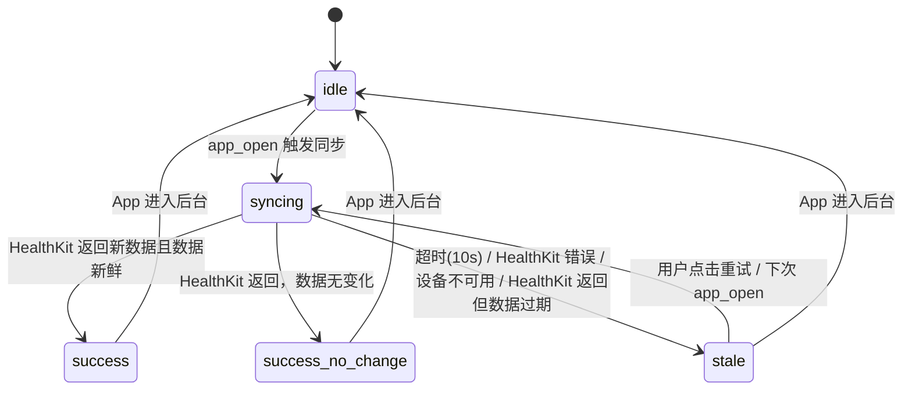
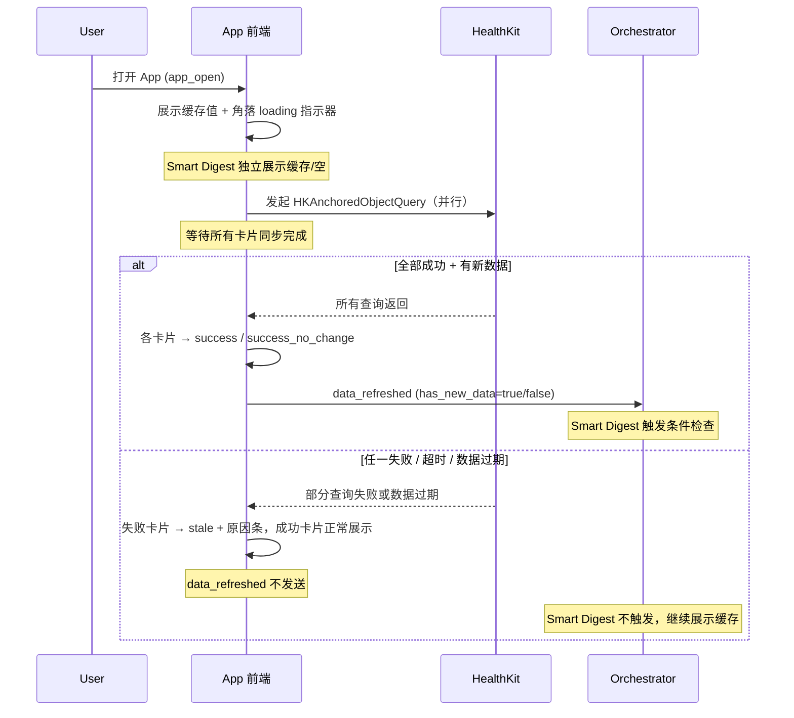
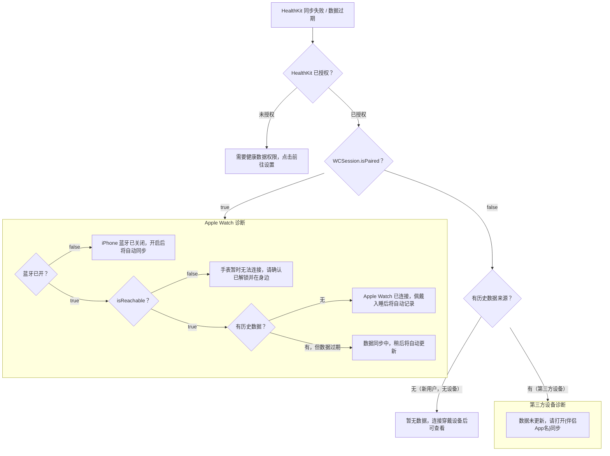
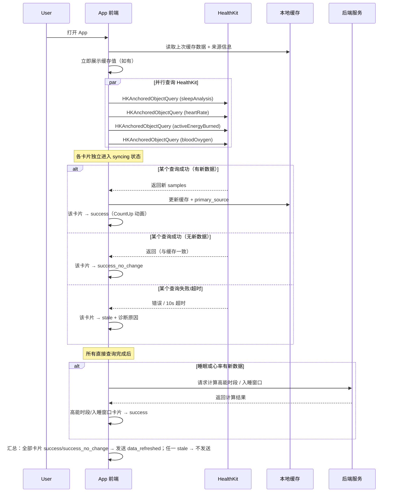

# 首页数据同步状态 (Homepage Data Sync Status) PRD

> 文档版本：v1.0 | 创建日期：2026-04-10
> 状态：**正式 PRD**
> 所属模块：首页 · 数据同步状态层

---

## 一、功能定义

### 1.1 核心定义

用户每次打开 App 时，系统自动从 HealthKit 同步最新健康数据。在同步过程中，首页数据区域（指标卡片、功能卡片）展示对应的视觉反馈：

1. **同步中**：数据区域显示上次缓存值 + 卡片角落小型 loading 指示器，用户可正常阅读旧数据
2. **同步成功**：数据平滑过渡到最新值（CountUp 动画），给用户明确的"已更新"感知
3. **同步失败/数据过期**：展示上次缓存值 + 原因提示条，告知用户为什么数据没更新、如何解决

### 1.2 与现有架构的关系

| 维度 | Smart Digest | 数据同步状态 |
|:---|:---|:---|
| 定位 | AI 洞察层（数据解读） | 数据管道层（数据新鲜度） |
| 数据依赖 | 依赖同步完成后的健康数据 | 监控同步过程本身 |
| 触发方式 | `data_refreshed` + 冷却期 + diff | `app_open` 即刻触发 |
| 失败表现 | 摘要为空，数据照常 | 数据区域显示状态指示 |
| 实现方式 | LLM 单轮调用 | 纯前端 + HealthKit API 状态检测 |
| Token 成本 | Sonnet 级别单次调用 | 零（无 LLM 参与） |

**关键衔接**：数据同步状态位于 Smart Digest 的**上游**。**所有卡片**同步成功后才发射 `data_refreshed` 事件触发 Smart Digest，确保首页数据和 AI 摘要基于同一套完整数据，避免信息不一致。任一卡片 stale 时不发送 `data_refreshed`，Smart Digest 展示上次缓存的摘要。

### 1.3 设计理念

| 原则 | 说明 |
|:---|:---|
| **透明不焦虑** | 告诉用户"在等什么"，而不是让页面空白令人困惑 |
| **归因到设备，不归因到 App** | 原因文案指向穿戴设备状态（未连接/未同步），不暗示 App 有 bug |
| **非阻塞** | 同步状态是信息层，不拦截用户浏览缓存数据或使用对话功能 |
| **自动消退** | 同步成功后状态指示器自动消失，无需用户操作 |
| **只说能确定的事** | 基于 Apple API 实际可检测的信息设计文案，不猜测无法确认的原因 |

---

## 二、同步状态机

### 2.1 状态定义

| 状态 | 标识 | 含义 |
|:---|:---|:---|
| `idle` | 空闲 | App 未在前台 / 未发起同步 |
| `syncing` | 同步中 | 正在从 HealthKit 拉取数据 |
| `success` | 同步成功 | 数据拉取完成，有新数据 |
| `success_no_change` | 同步成功无变化 | 数据拉取完成，但与缓存一致 |
| `stale` | 数据过期 | 同步失败、超时或数据不够新鲜（详见 5.2） |

### 2.2 状态转移



> **"数据过期"判定**：HealthKit 查询成功返回了数据，但所有 sample 中最新一条的 `endDate` 距当前时间超过 12 小时（见 5.2），视为整体 `stale`——查询本身没错，但数据不够新鲜。

### 2.3 按卡片粒度独立

每张数据卡片维护独立的同步状态。睡眠数据同步失败不影响心率卡片正常展示。

| 数据卡片 | HealthKit 数据类型 | 独立同步 |
|:---|:---|:---|
| 睡眠评分 | `HKCategorySample` (sleepAnalysis) | 是 |
| 心率 | `HKQuantitySample` (heartRate) | 是 |
| 消耗 | `HKQuantitySample` (activeEnergyBurned) | 是 |
| 高能时段 | 后端计算（依赖 sleep + heart rate） | 依赖上游卡片 |
| 入睡窗口 | 后端计算（依赖 sleep history） | 依赖上游卡片 |
| 睡眠分析 | `HKCategorySample` (sleepAnalysis) | 是 |

> 依赖后端计算的卡片（高能时段、入睡窗口），在上游数据到达 **且** 后端计算完成后才从 `syncing` 转为 `success`。

### 2.4 与 Smart Digest 的时序关系



---

## 三、数据来源识别与失败原因文案

### 3.1 多设备来源支持

用户的穿戴设备不一定是 Apple Watch，可能是小米手环、佳明手表、华为手环等第三方设备。不同设备的同步链路不同：

| 设备类型 | 同步链路 | 可检测能力 |
|:---|:---|:---|
| Apple Watch | Watch → HealthKit（系统原生同步） | WCSession 连接状态 + HealthKit 数据新鲜度 |
| 第三方设备 | 设备 → 伴侣 App（小米运动/Garmin Connect 等） → HealthKit | **仅** HealthKit 数据新鲜度（无法检测设备连接状态） |
| 无设备 | — | 无数据 |

### 3.2 来源判断方式

通过 `HKSample.sourceRevision.source.bundleIdentifier` 识别历史数据的写入来源：

```swift
// 常见来源标识
"com.apple.health"              // → Apple Watch
"com.xiaomi.mihealthapp"        // → 小米手环/手表
"com.garmin.connect.mobile"     // → 佳明手表
"com.huawei.health"             // → 华为手环/手表
// ... 其他第三方
```

- App 在用户首次产生数据后记录主要数据来源（`primary_source`）
- 后续按来源走不同的诊断分支
- 来源可能变化（用户换设备），每次同步成功时更新 `primary_source`

### 3.3 Apple 实际可检测能力

| 检测项 | Apple Watch | 第三方设备 | API |
|:---|:---:|:---:|:---|
| HealthKit 授权状态 | YES | YES | `HKHealthStore.authorizationStatus(for:)` |
| iPhone 蓝牙开关 | YES | — | `CBCentralManager.state == .poweredOff` |
| Watch 是否配对 | YES | — | `WCSession.default.isPaired` |
| Watch 是否可达 | YES（仅 bool） | — | `WCSession.default.isReachable`（不区分锁定/充电/超距） |
| 数据新鲜度 | YES | YES | 检查最近 `HKSample.endDate` 与当前时间差值 |
| Watch 锁定/充电/脱腕 | **NO** | — | 无公开 API |
| 第三方设备连接状态 | — | **NO** | 无法检测，需引导用户检查伴侣 App |

### 3.4 基于可检测能力的文案设计

#### 通用场景（所有设备适用）

| 优先级 | 检测条件 | 用户文案 | 可操作性 |
|:---:|:---|:---|:---|
| 1 | `authorizationStatus == .denied` | 需要健康数据权限，点击前往设置 | 点击跳转系统设置 |
| 2 | 查询成功但无数据（`results.isEmpty`，无历史来源） | 暂无数据，连接穿戴设备后可查看 | 新用户引导 |

#### Apple Watch 用户专属

| 优先级 | 检测条件 | 用户文案 | 可操作性 |
|:---:|:---|:---|:---|
| 3 | `WCSession.isPaired == false` | 未检测到 Apple Watch | 引导配对 |
| 4 | `CBCentralManager.state == .poweredOff` | iPhone 蓝牙已关闭，开启后将自动同步 | 提示开蓝牙 |
| 5 | `isReachable == false`（已配对 + 蓝牙已开） | 手表暂时无法连接，请确认已解锁并在身边 | 列出可能原因，不断言 |
| 5b | 已配对 + 可达 + 无历史数据（新用户首次配对） | Apple Watch 已连接，佩戴入睡后将自动记录 | 告知预期，减少焦虑 |

#### 第三方设备用户专属

| 优先级 | 检测条件 | 用户文案 | 可操作性 |
|:---:|:---|:---|:---|
| 3 | 整体数据过期（所有 sample 中最新一条 > 12h） | 数据未更新，请打开{伴侣App名}同步 | 引导打开伴侣 App |

#### 兜底（所有设备）

| 优先级 | 检测条件 | 用户文案 | 可操作性 |
|:---:|:---|:---|:---|
| 6 | 超时（10s 无结果，无明确错误） | 数据同步中，稍后将自动更新 | 自动重试 |

### 3.5 文案设计原则

| 原则 | 说明 |
|:---|:---|
| **格式** | `{现状描述}，{用户可做的事}` |
| **长度** | 不超过 25 字 |
| **禁止** | ❌ 技术术语（HealthKit、BLE、HKQuery）、❌ 归咎 App（"App 出错了"）、❌ 断言无法确认的原因 |
| **优先级** | 多个问题同时存在时，优先展示用户最可操作的一条（能跳设置 > 能开蓝牙 > 能检查设备 > 兜底） |
| **设备名称** | 第三方设备文案中使用实际的伴侣 App 名称（如"小米运动"），通过 `primary_source` 映射 |

### 3.6 诊断流程



---

## 四、UI 设计

### 4.1 首页布局集成

同步状态作用于数据区域，不影响问候语和 Smart Digest 的位置与逻辑：

```
┌─────────────────────────────────────────┐
│                                         │
│  早上好                                  │  ← 问候语（不受同步状态影响）
│  {digest or empty}                      │  ← Smart Digest（独立逻辑，不变）
│                                         │
│  ┌────┐  ┌────┐  ┌────┐                │
│  │睡眠│  │心率│  │消耗│                  │  ← 数据指标卡片（受同步状态影响）
│  │ ~~ │  │ 87 │  │ ~~ │                  │     syncing 时角落有 loading 指示器
│  └────┘  └────┘  └────┘                │
│                                         │
│  ┌──────── 同步状态条 ─────────┐         │  ← stale 时显示（小卡片下方）
│  │ ⌚ 手表暂时无法连接…    重试 │         │
│  └──────────────────────────┘         │
│                                         │
│  [高能时段] [入睡窗口] [睡眠分析]        │  ← 功能卡片（受同步状态影响）
│                                         │
│  [快捷提问 ①] [快捷提问 ②] [快捷提问 ③] │  ← Smart Digest 快捷提问（不变）
│  ┌─────────────────────────────────┐    │
│  │ ✨ 输入您的内容             ⬆   │    │  ← 输入框（不变）
│  └─────────────────────────────────┘    │
└─────────────────────────────────────────┘
```

### 4.2 各状态的 UI 表现

| 状态 | 数据指标卡片 | 功能卡片 | 同步状态条 |
|:---|:---|:---|:---|
| `syncing` | 显示缓存值（可读） + 角落 loading 指示器 | 显示缓存内容 + 角落 loading | 不显示 |
| `success` | 数值 CountUp 动画更新，loading 消失 | 内容淡入更新，loading 消失 | 不显示 |
| `success_no_change` | 静态显示当前值，loading 消失 | 静态显示，loading 消失 | 不显示 |
| `stale` | 缓存值 + 灰色更新时间（格式见 9.2），loading 消失 | 缓存 + 灰色标记，loading 消失 | 显示原因 + 重试按钮 |

> Smart Digest 在所有状态下均独立运行，不受本功能影响（详见 1.2）。无论同步成功还是失败，首页始终有数据可读（缓存值或最新值），不会出现空白页面。

### 4.3 Syncing 状态 Loading 指示器规格

| 属性 | 规格 |
|:---|:---|
| 位置 | 卡片右上角 |
| 样式 | 小型旋转圆环（UIActivityIndicatorView.Style.medium 或等效） |
| 尺寸 | 16pt × 16pt |
| 颜色 | 跟随系统主题色，透明度 60% |
| 出现 | app_open 后 < 100ms 展示 |
| 消失 | 同步完成后淡出（0.2s），无论 success 或 stale |

### 4.4 Success 过渡动画规格

| 场景 | 动画 |
|:---|:---|
| 数值更新（有旧值） | Loading 淡出(0.2s) → CountUp：旧值 → 新值，0.5s，ease-out |
| 首次出现（无旧值） | Loading 淡出(0.2s) → Fade-in：从 0 透明度渐入，0.3s |
| 功能卡片内容更新 | Loading 淡出(0.2s) → Crossfade：旧内容 → 新内容，0.4s |

### 4.5 Stale 状态条设计

| 属性 | 规格 |
|:---|:---|
| 位置 | 三个小卡片下方、功能卡片上方 |
| 样式 | 圆角条，浅灰色背景，左侧图标 + 文字 + 右侧"重试"文字按钮 |
| 高度 | 40pt，左右边距与卡片对齐 |
| 出现动画 | 从上滑入，0.3s ease-out |
| 可关闭 | 用户可点 × 关闭，下次 app_open 重新判断 |
| 多条原因 | 最多显示一条，不堆叠。优先展示**用户最可操作**的那条（按 3.4 优先级排序：可跳转设置 > 可开蓝牙 > 可检查设备 > 通用兜底） |
| 重试按钮行为 | 点击后：仅将当前处于 `stale` 的卡片重新 → `syncing`（已成功的卡片不受影响）。状态条立即消失，角落 loading 指示器出现。若重试仍失败，状态条重新出现（无重复出现动画，直接静态显示）。重试不受 5 分钟 app_open 防抖限制，但受 10 秒最小间隔约束 |

### 4.6 Stale 卡片数值标注

当卡片处于 `stale` 状态时：
- 数值仍显示上次缓存的值（不留空白）
- 数值下方增加灰色小字显示更新时间（格式见 9.2）
- 数值颜色降低透明度至 60%，与正常数值形成视觉区分

---

## 五、触发逻辑

### 5.1 触发时序



### 5.2 超时与数据新鲜度

以下两种情况均导致卡片进入 `stale`：

**a) 查询超时**：单个 HealthKit 查询 10 秒内未返回即视为超时，各卡片独立计算。

**b) 数据过期（整体判定）**：App 对 HealthKit 的数据拉取是统一发起的，因此新鲜度也按**整体**判定，不按单个数据类型单独设阈值。判定规则：

- 取本次所有 HealthKit 查询返回的 sample 中，**最新的一条**的 `endDate`
- 如果该时间距当前时间超过新鲜度阈值，则视为整体数据过期，**所有卡片**统一进入 `stale`
- 新鲜度阈值：与 Smart Digest 的快照 diff 窗口对齐，**暂定 12 小时**（覆盖"昨晚睡觉到今早打开 App"的正常间隔，超过则说明设备可能长时间未同步）

### 5.3 刷新触发方式

| 触发方式 | 说明 |
|:---|:---|
| **自动：app_open** | 每次 App 从后台回到前台时自动触发（如距上次同步 > 5 分钟） |
| **手动：下拉刷新** | 用户在首页下拉，强制重新同步所有数据类型 |
| **自动：网络恢复** | 监听 `NWPathMonitor`，网络恢复时自动重试**后端计算卡片**（高能时段/入睡窗口）。HealthKit 查询走本地数据库，不依赖网络，不受此触发 |

### 5.4 防抖策略

| 触发方式 | 防抖规则 |
|:---|:---|
| app_open（自动） | 距上次同步 < 5 分钟 → 不触发，展示上次结果 |
| 下拉刷新（手动） | 最小间隔 10 秒 → 10 秒内重复下拉忽略。不受 5 分钟防抖限制，用户主动下拉时立即触发 |

---

## 六、与 Smart Digest 共存规则

### 6.1 互不干扰原则

| 场景 | 数据同步状态 | Smart Digest | 备注 |
|:---|:---|:---|:---|
| 正常打开，同步成功 | syncing → success | 缓存 → 可能触发新生成 | 标准路径 |
| 正常打开，同步失败 | syncing → stale | 展示缓存 | digest 缓存仍有价值 |
| 冷却期内再次打开，同步成功 | syncing → success | 展示缓存（冷却期内） | 数据更新了但 digest 不重新生成 |
| 新用户，无数据 | stale（暂无数据文案） | 空（不展示） | 两者都为空态 |
| 部分同步（心率成功，睡眠失败） | 心率 success，睡眠 stale | 不触发，展示缓存 | 保证首页数据与摘要一致性 |

> 视觉层级和事件流时序见 4.1（首页布局）和 2.4（时序图），此处不重复。

---

## 七、边界情况

> 以下仅列出其他章节未充分覆盖的边缘场景。常规的同步状态转移、防抖策略、诊断文案等已在对应章节详述。

| # | 场景 | 处理方式 |
|:---:|:---|:---|
| 1 | 同步过程中用户切到后台 | 暂停同步状态 UI，回到前台时按 5.4 防抖规则判断是否重新触发 |
| 2 | 同步过程中用户点击数据卡片进入详情页 | 详情页使用缓存数据展示，不阻塞导航。后台同步继续，返回首页后更新 |
| 3 | Apple Health 后台同步已完成 | app_open 时 HealthKit 查询立即返回，loading 指示器闪现后直接 CountUp 过渡到 success |
| 4 | 连续 stale（用户反复打开都失败） | 不重复播放状态条出现动画，静态显示原因条即可 |
| 5 | 多个数据来源并存（Watch + iPhone 自带传感器） | 以最近一次写入的来源作为 `primary_source`，诊断文案基于该来源 |
| 6 | HealthKit 数据库不可用（极端情况） | 捕获 `HKError.errorDatabaseInaccessible`，走兜底文案 |
| 7 | 首次安装弹出 HealthKit 授权对话框 | 授权前数据卡片显示"--" + loading 指示器；用户授权后立即查询，拒绝后走 3.4 优先级 1 文案 |

---

## 八、性能要求

| 指标 | 要求 |
|:---|:---|
| Loading 指示器启动延迟 | < 100ms（app_open 后立即展示） |
| 缓存数据加载 | < 50ms（从本地存储读取上次缓存） |
| HealthKit 单个查询超时 | 10 秒 |
| CountUp 动画帧率 | ≥ 60fps |
| 状态条出现动画 | 0.3s ease-out |
| Loading → CountUp 过渡 | loading 淡出 0.2s + CountUp 0.5s |
| 内存开销 | 缓存完整数据快照，约 2KB |
| 重试策略 | 不自动重试（下次 app_open 或手动下拉触发），网络恢复自动重试除外 |
| 并行查询 | 所有 HealthKit 数据类型并行查询，不串行 |

---

## 九、数据缓存

### 9.1 缓存结构

每个数据类型独立维护缓存，记录值、时间戳、同步状态和失败原因：

```yaml
sync_cache:
  primary_source:
    bundle_id: "com.apple.health"
    display_name: "Apple Watch"
    last_updated: "2026-04-10T08:30:00+08:00"

  sleep:
    last_value:
      score: 92
      total_min: 420
      deep_pct: 20
    last_sync_success: "2026-04-10T08:15:00+08:00"
    last_sync_attempt: "2026-04-10T08:30:00+08:00"
    last_sync_status: "success"       # success | stale（success_no_change 归入 success，仅影响 UI 动画不影响缓存）
    stale_reason: null

  heart_rate:
    last_value:
      resting_bpm: 62
      hrv_ms: 45
    last_sync_success: "2026-04-10T08:30:00+08:00"
    last_sync_attempt: "2026-04-10T08:30:00+08:00"
    last_sync_status: "success"
    stale_reason: null

  activity:
    last_value:
      active_kcal: 672
      steps: 8234
    last_sync_success: "2026-04-09T22:00:00+08:00"
    last_sync_attempt: "2026-04-10T08:30:00+08:00"
    last_sync_status: "stale"
    stale_reason: "watch_unreachable"  # 原因标识
```

### 9.2 "上次更新" 显示逻辑

stale 状态下，数据卡片数值旁显示灰色小字：

| 条件 | 显示格式 | 示例 |
|:---|:---|:---|
| `last_sync_success` 在今天 | "HH:mm 更新" | "08:15 更新" |
| `last_sync_success` 在昨天 | "昨天 HH:mm" | "昨天 23:30" |
| `last_sync_success` 更早 | "N 天前" | "2 天前" |
| 从未成功同步 | 不显示时间，仅显示"--" | "--" |

### 9.3 缓存管理

| 策略 | 说明 |
|:---|:---|
| 存储位置 | 本地持久化存储（UserDefaults 或 Core Data） |
| 写入时机 | 每次同步成功后更新对应数据类型的缓存 |
| 清理策略 | 随 App 卸载清除；不主动过期（即使 30 天前的数据也展示，带时间标注） |
| 容量 | 约 2KB，不影响存储空间 |
